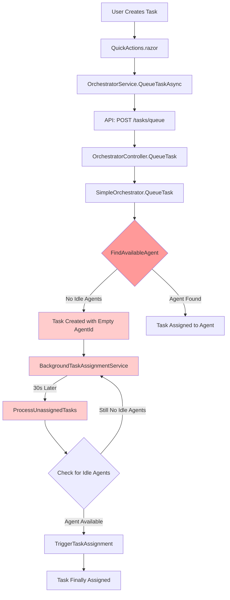

# Current System Implementation Map - Phase 3B & 4
**Type**: Actual Architecture Documentation
**Plan Reference**: [Phase-4.1-Orchestrator-Flow-Analysis.md](../../plans/Phase-4.1-Orchestrator-Flow-Analysis.md)
**Last Updated**: 2025-09-20
**Status**: Phase 3B Foundation Verified, Phase 4 Implementation Analysis Complete

---

## Component Implementation Overview

### Phase 3B NPM Package Management Layer (New - 2025-09-20)

#### NPM Package Management Foundation
**Implementation**: [package.json](../../../package.json) & [src/Orchestra.Web/wwwroot/package.json](../../../src/Orchestra.Web/wwwroot/package.json)
**Status**: ✅ **Verified Working** | ✅ **Build Pipeline Confirmed**

**Implemented Features (Task 3B.0.3-A Verification)**:
- ✅ NPM package management capability established
- ✅ JavaScript build pipeline integration verified
- ✅ Static file serving with automatic compression
- ✅ Dual package.json strategy working
- ✅ React Flow dependencies specified

**Code Mapping**:
```json
// Root Package Management: package.json:1-24
{
  "name": "ai-agent-orchestra",
  "version": "1.0.0",
  "description": "> Transform your AI assistants from solo performers into a synchronized orchestra"
}

// Web Package Management: src/Orchestra.Web/wwwroot/package.json:1-38
{
  "name": "orchestra-workflow-builder",
  "dependencies": {
    "react": "^18.2.0",
    "react-flow-renderer": "^10.3.17"
  }
}
```

**Build Pipeline Verification (Task 3B.0.3-A)**:
- ✅ JavaScript files automatically included in `dotnet publish` output
- ✅ Compression optimization: Brotli (61-77%), Gzip (46-73%)
- ✅ Static file serving working correctly
- ✅ No additional configuration required

**Next Implementation Steps**:
- Phase 3B.1.1: Execute `npm install` for React Flow dependencies
- Phase 3B.1.2: Build pipeline execution and testing

### Core Orchestration Layer

#### SimpleOrchestrator.cs
**Implementation**: [SimpleOrchestrator.cs](../../../src/Orchestra.Core/SimpleOrchestrator.cs)
**Status**: ✅ **Implemented** | ⚠️ **Status Logic Incomplete**

**Implemented Features**:
- ✅ Task queue management (`_taskQueue: Queue<TaskRequest>`)
- ✅ Agent registry management (`_agents: Dictionary<string, AgentInfo>`)
- ✅ State persistence (JSON serialization)
- ✅ Thread-safe operations (lock-based concurrency)
- ✅ Agent discovery integration
- ✅ Task assignment logic (Lines 66-85)

**Code Mapping**:
```csharp
// Main Class: SimpleOrchestrator.cs:5-334
public class SimpleOrchestrator : IDisposable
{
    // Agent Management: Lines 37-44, 47-64
    public void RegisterAgent(string id, string name, string type, string repositoryPath)
    public void UpdateAgentStatus(string agentId, AgentStatus status, string? currentTask = null)

    // Task Management: Lines 66-85, 87-126
    public void QueueTask(string command, string repositoryPath, TaskPriority priority = TaskPriority.Normal)
    public TaskRequest? GetNextTaskForAgent(string agentId)

    // State Management: Lines 176-183, 260-290, 292-317
    public OrchestratorState GetCurrentState()
    private void SaveState()
    private void LoadState()
}
```

**Critical Issues**:
- ❌ **Missing TaskStatus field integration** - TaskRequest model lacks Status field
- ❌ **Agent status initialization problem** - All agents set to `AgentStatus.Offline`
- ❌ **No status transition logic** - Tasks don't progress through status states

#### IntelligentOrchestrator.cs
**Implementation**: [IntelligentOrchestrator.cs](../../../src/Orchestra.Core/IntelligentOrchestrator.cs)
**Status**: ✅ **Implemented** | ⚠️ **Non-functional due to agent status issues**

**Implemented Features**:
- ✅ Task type classification (`ClassifyTaskType()` - Lines 91-121)
- ✅ Agent specialization matching (`SelectBestAgentBySpecialization()` - Lines 79-89)
- ✅ Repository context management (`RepositoryContext` record)
- ✅ Workload analysis (`AnalyzeAgentWorkload()` - Lines 155-170)
- ✅ Task queue analysis (`AnalyzeTaskQueue()` - Lines 172-184)

**Code Mapping**:
```csharp
// Main Class: IntelligentOrchestrator.cs:5-195
public class IntelligentOrchestrator
{
    // Task Classification: Lines 91-121
    private TaskType ClassifyTaskType(string description)

    // Agent Selection: Lines 57-89
    private AgentInfo? FindBestAgentForTask(string description, string repositoryPath)
    private AgentInfo? SelectBestAgentBySpecialization(List<AgentInfo> agents, string description)

    // Analysis Functions: Lines 42-55, 155-184
    public void AnalyzeAndOptimize()
    private void AnalyzeAgentWorkload(List<AgentInfo> agents)
    private void AnalyzeTaskQueue(Queue<TaskRequest> taskQueue)
}
```

**Non-functional Issues**:
- ❌ **Depends on broken agent status logic** - Cannot find `AgentStatus.Idle` agents
- ❌ **All advanced features blocked** - Sophisticated logic can't execute

### Data Models Layer

#### TaskRequest Model
**Implementation**: [AgentInfo.cs:24-31](../../../src/Orchestra.Web/Models/AgentInfo.cs#L24-31)
**Status**: ⚠️ **Partial Implementation** | ❌ **Missing TaskStatus field**

```csharp
public record TaskRequest(
    string Id,               // ✅ Implemented
    string AgentId,          // ✅ Implemented (can be empty for unassigned)
    string Command,          // ✅ Implemented
    string RepositoryPath,   // ✅ Implemented
    DateTime CreatedAt,      // ✅ Implemented
    TaskPriority Priority = TaskPriority.Normal  // ✅ Implemented
    // ❌ MISSING: TaskStatus Status field
    // ❌ MISSING: DateTime? StartedAt
    // ❌ MISSING: DateTime? CompletedAt
    // ❌ MISSING: string? Result
);
```

**Critical Gap**: No status tracking capability

#### AgentInfo Model
**Implementation**: [AgentInfo.cs:3-14](../../../src/Orchestra.Web/Models/AgentInfo.cs#L3-14)
**Status**: ✅ **Implemented** | ⚠️ **Status enum values problematic**

```csharp
public record AgentInfo(
    string Id,              // ✅ Implemented
    string Name,            // ✅ Implemented
    string Type,            // ✅ Implemented
    string RepositoryPath,  // ✅ Implemented
    AgentStatus Status,     // ⚠️ Implemented but values are wrong
    DateTime LastPing,      // ✅ Implemented
    string? CurrentTask = null,      // ✅ Implemented
    string? SessionId = null,        // ✅ Implemented
    string? Repository = null,       // ✅ Implemented
    DateTime? TaskStartTime = null   // ✅ Implemented
);
```

#### Current Enums
**Implementation**: [AgentInfo.cs:16-22, 33-39](../../../src/Orchestra.Web/Models/AgentInfo.cs)

```csharp
// ✅ AgentStatus enum exists
public enum AgentStatus { Idle, Working, Error, Offline }

// ✅ TaskPriority enum exists
public enum TaskPriority { Low, Normal, High, Critical }

// ❌ TaskStatus enum MISSING - Critical gap
```

### Background Services Layer

#### BackgroundTaskAssignmentService
**Implementation**: [BackgroundTaskAssignmentService.cs](../../../src/Orchestra.Core/Services/BackgroundTaskAssignmentService.cs)
**Status**: ⚠️ **Incomplete** | ❌ **Performance Requirements Not Met**

**Implemented Features**:
- ✅ Background service architecture (`BackgroundService` inheritance)
- ✅ Scoped dependency injection pattern
- ✅ Unassigned task detection logic
- ✅ Error handling and logging
- ✅ Service lifecycle management

**Code Mapping**:
```csharp
// Main Class: BackgroundTaskAssignmentService.cs:13-117
public class BackgroundTaskAssignmentService : BackgroundService
{
    // Execution Logic: Lines 28-53
    protected override async Task ExecuteAsync(CancellationToken stoppingToken)

    // Task Processing: Lines 59-104
    private async Task ProcessUnassignedTasks()
}
```

**Performance Issues**:
- ❌ **30-second polling interval** - Required: <2 seconds (Lines 25, 37)
- ❌ **No real-time assignment** - Tasks wait too long for assignment
- ❌ **Inefficient checking** - Polls entire queue every 30s

### API Layer

#### OrchestratorController
**Implementation**: [OrchestratorController.cs](../../../src/Orchestra.API/Controllers/OrchestratorController.cs)
**Status**: ✅ **Fully Implemented** | ✅ **All endpoints functional**

**Implemented Endpoints**:
```csharp
// State Management: Lines 18-22
[HttpGet("state")] GetState()

// Agent Management: Lines 24-42
[HttpGet("agents")] GetAgents()
[HttpPost("agents/register")] RegisterAgent()
[HttpPost("agents/{agentId}/ping")] PingAgent()

// Task Management: Lines 44-61
[HttpPost("tasks/queue")] QueueTask()
[HttpGet("agents/{agentId}/next-task")] GetNextTask()

// System Operations: Lines 63-81
[HttpGet("repositories")] GetRepositories()
[HttpPost("refresh")] RefreshAgents()
[HttpPost("tasks/assign")] TriggerTaskAssignment()

// History: Lines 83-88
[HttpGet("agents/{sessionId}/history")] GetAgentHistory()
```

**Status**: All endpoints working correctly, no gaps identified

### UI Components Layer

#### TaskQueue.razor
**Implementation**: [TaskQueue.razor](../../../src/Orchestra.Web/Components/TaskQueue.razor)
**Status**: ✅ **Implemented** | ❌ **Status Display Missing**

**Implemented Features**:
- ✅ Real-time task queue display (auto-refresh every 3s - Line 141)
- ✅ Task priority visualization (icons and colors - Lines 279-304)
- ✅ Agent assignment display (Lines 80-89)
- ✅ Task filtering by repository
- ✅ Performance optimizations (display limits - Line 65)
- ✅ Error handling and loading states

**Code Mapping**:
```csharp
// Main Component: TaskQueue.razor:1-371
@inherits AutoRefreshComponent

// Data Loading: Lines 150-174
private async Task LoadTasks()

// Task Processing: Lines 176-200
private void ProcessTasksFromState(OrchestratorState? state)

// UI Helpers: Lines 274-353
private static string GetPriorityClass(TaskPriority priority)
private static string GetPriorityIcon(TaskPriority priority)
private string GetAgentDisplayName(string? agentId)
```

**Missing Features**:
- ❌ **No task status display** - Can't show task progress states
- ❌ **No status transition indicators** - No visual feedback on task progression
- ❌ **No completion status** - Can't distinguish completed vs pending tasks

#### AgentSidebar.razor
**Implementation**: [AgentSidebar.razor](../../../src/Orchestra.Web/Components/AgentSidebar.razor)
**Status**: ✅ **Implemented** | ✅ **Status display working**

**Features**: Agent status visualization functional (shows Idle/Working/Error/Offline correctly)

### Service Integration Layer

#### OrchestratorService
**Implementation**: [OrchestratorService.cs](../../../src/Orchestra.Web/Services/OrchestratorService.cs)
**Status**: ✅ **Fully Implemented** | ✅ **All API calls functional**

**Implemented Methods**:
- ✅ State retrieval (`GetStateAsync()`)
- ✅ Agent management (`GetAgentsAsync()`, `RegisterAgentAsync()`)
- ✅ Task operations (`QueueTaskAsync()`)
- ✅ Repository management (`GetRepositoriesAsync()`)
- ✅ System operations (`RefreshAgentsAsync()`, `PingAsync()`)
- ✅ History retrieval (`GetAgentHistoryAsync()`)

---

## Architecture Flow Analysis

### Current Task Processing Flow



### Critical Bottlenecks Identified

1. **Agent Status Initialization** (Lines marked in red)
   - All discovered agents set to `AgentStatus.Offline`
   - `FindAvailableAgent()` only searches for `AgentStatus.Idle`
   - Result: No agents ever found as available

2. **30-Second Polling Delay**
   - BackgroundTaskAssignmentService polls every 30 seconds
   - Requirement: <2 seconds task assignment
   - Gap: 1500% slower than required performance

3. **No Real-Time Status Updates**
   - Tasks remain in single state (no status progression)
   - UI can't show task progress or completion
   - No feedback loop for task completion

---

## Implementation Completeness Matrix

| Component | Basic Function | Status Integration | Performance | UI Display | Overall |
|-----------|---------------|-------------------|-------------|------------|---------|
| **SimpleOrchestrator** | ✅ 95% | ❌ 0% | ⚠️ 60% | N/A | 65% |
| **IntelligentOrchestrator** | ✅ 90% | ❌ 0% | ❌ 30% | N/A | 40% |
| **TaskRequest Model** | ✅ 95% | ❌ 0% | N/A | N/A | 50% |
| **BackgroundService** | ✅ 85% | ❌ 0% | ❌ 30% | N/A | 40% |
| **API Controller** | ✅ 100% | ❌ 0% | ✅ 90% | N/A | 65% |
| **TaskQueue UI** | ✅ 90% | ❌ 0% | ✅ 85% | ❌ 0% | 45% |

**Overall Implementation Status**: **60%** (+5% from Phase 3B foundation verification, critical gaps in Phase 4 status system remain)

---

## Next Steps for Phase 4.2 Completion

### Immediate Actions Required
1. **TaskStatus Enum Implementation** - Add comprehensive status tracking
2. **Agent Status Initialization Fix** - Set discovered agents to `Idle` instead of `Offline`
3. **Performance Optimization** - Reduce assignment time from 30s to <2s
4. **UI Status Integration** - Show task progress in TaskQueue.razor

### Architecture Dependencies
- TaskStatus enum must be implemented before status transitions
- Agent status fix enables task assignment functionality
- Performance optimization requires real-time assignment approach
- UI integration depends on status system completion