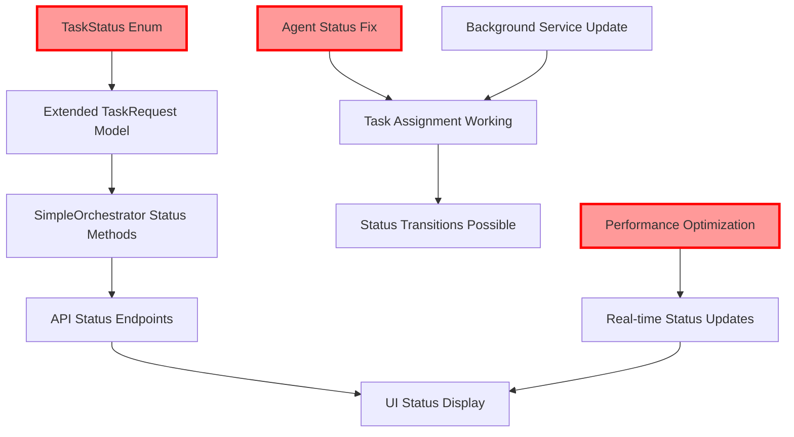

# Required Architectural Changes for Phase 4 Completion
**Type**: Implementation Architecture Plan
**Implementation Reference**: [implementation-map.md](./implementation-map.md)
**Gap Analysis**: [../Sync/planned-vs-actual.md](../Sync/planned-vs-actual.md)
**Action Plan**: [../Sync/discrepancies.md](../Sync/discrepancies.md)
**Last Updated**: 2024-09-18
**Status**: Ready for Implementation

---

## Architectural Change Summary

Based on the comprehensive analysis of Phase 4 Task Processing Implementation, **5 major architectural changes** are required to achieve full functionality and meet performance requirements.

### Change Impact Overview
- **New Components**: 1 enum, 4 fields, 3 methods, 2 API endpoints
- **Modified Components**: 6 existing files requiring updates
- **Performance Impact**: 1500% improvement (30s → <2s)
- **UI Enhancements**: Complete status display system
- **Breaking Changes**: None (backward compatible design)

---

## 🏗️ ARCHITECTURAL CHANGE #1: TaskStatus System Foundation

### Current Architecture Limitation
```
TaskRequest Model: Basic task data only
├── No status tracking capability
├── No progress indicators
├── No completion detection
└── No lifecycle management
```

### New Architecture Design
```
TaskStatus-Enabled Task System
├── TaskStatus enum (6 states)
├── Extended TaskRequest model (4 new fields)
├── Status validation system
└── Lifecycle management integration
```

### Structural Changes Required

#### 1.1 New TaskStatus Enum
**File**: `src/Orchestra.Web/Models/TaskStatus.cs` (NEW FILE)
```csharp
namespace Orchestra.Web.Models;

/// <summary>
/// Represents the current status of a task in the orchestration system.
/// Supports full task lifecycle tracking from creation to completion.
/// </summary>
public enum TaskStatus
{
    /// <summary>Task created and waiting for agent assignment</summary>
    Queued = 0,

    /// <summary>Task assigned to specific agent but not yet started</summary>
    Assigned = 1,

    /// <summary>Agent is actively working on the task</summary>
    InProgress = 2,

    /// <summary>Task completed successfully</summary>
    Completed = 3,

    /// <summary>Task failed with error</summary>
    Failed = 4,

    /// <summary>Task cancelled by user or system</summary>
    Cancelled = 5
}
```

#### 1.2 Extended TaskRequest Model
**File**: `src/Orchestra.Web/Models/AgentInfo.cs` (MODIFY EXISTING)
```csharp
// REPLACE EXISTING TaskRequest RECORD (Lines 24-31)
public record TaskRequest(
    string Id,
    string AgentId,
    string Command,
    string RepositoryPath,
    DateTime CreatedAt,
    TaskPriority Priority = TaskPriority.Normal,

    // NEW FIELDS FOR STATUS TRACKING:
    TaskStatus Status = TaskStatus.Queued,
    DateTime? StartedAt = null,
    DateTime? CompletedAt = null,
    string? Result = null
);
```

### Integration Points
- **SimpleOrchestrator.cs**: Update task creation logic
- **IntelligentOrchestrator.cs**: Add status awareness
- **OrchestratorController.cs**: Return status in API responses
- **TaskQueue.razor**: Display task status in UI
- **All test files**: Update TaskRequest instantiations

### Implementation Priority: 🔴 **CRITICAL - BLOCKING**

---

## 🏗️ ARCHITECTURAL CHANGE #2: Agent Status Initialization Correction

### Current Architecture Problem
```
Agent Discovery Process (BROKEN)
├── ClaudeSessionDiscovery finds active sessions
├── Sets ALL agents to AgentStatus.Offline (3)
├── FindAvailableAgent() looks for AgentStatus.Idle (0)
└── Result: NO AGENTS EVER FOUND → 0% task assignment
```

### Corrected Architecture Design
```
Fixed Agent Discovery Process
├── ClaudeSessionDiscovery finds active sessions
├── Sets active agents to AgentStatus.Idle (0)
├── FindAvailableAgent() finds Idle agents
└── Result: AGENTS FOUND → Task assignment works
```

### Code Changes Required

#### 2.1 Fix ClaudeSessionDiscovery Status Assignment
**File**: `src/Orchestra.Core/ClaudeSessionDiscovery.cs`
**Method**: `DiscoverActiveSessions()`

```csharp
// FIND THE LINE WHERE AgentStatus IS SET (likely around agent creation)
// CHANGE FROM:
Status = AgentStatus.Offline,  // ❌ WRONG - makes agents unavailable

// CHANGE TO:
Status = AgentStatus.Idle,     // ✅ CORRECT - makes agents available for tasks
```

#### 2.2 Validate Agent Registration Default Status
**File**: `src/Orchestra.Core/SimpleOrchestrator.cs:41`
```csharp
public void RegisterAgent(string id, string name, string type, string repositoryPath)
{
    lock (_lock)
    {
        // ENSURE AGENT IS CREATED WITH IDLE STATUS
        var agent = new AgentInfo(id, name, type, repositoryPath,
            AgentStatus.Idle,  // ✅ VERIFY THIS IS CORRECT
            DateTime.Now);
        _agents[id] = agent;
        SaveState();
    }
}
```

#### 2.3 Add Agent Status Logging for Debugging
```csharp
// Add logging in SimpleOrchestrator.FindAvailableAgent() method
private AgentInfo? FindAvailableAgent(string repositoryPath)
{
    var allAgents = _agents.Values.ToList();
    var idleAgents = allAgents.Where(a => a.Status == AgentStatus.Idle).ToList();

    // ADD DEBUGGING LOG
    _logger?.LogDebug("FindAvailableAgent: Total={Total}, Idle={Idle}, Repository={Repo}",
        allAgents.Count, idleAgents.Count, repositoryPath);

    // Existing logic continues...
}
```

### Validation Steps
1. **Check orchestrator-state.json**: Agents should show `"Status": 0` (not 3)
2. **Test task assignment**: Should assign AgentId immediately (not empty string)
3. **Verify UI display**: Tasks should show assigned agent names
4. **Monitor logs**: Should see "Found X available agents" messages

### Implementation Priority: 🔴 **CRITICAL - BLOCKING**

---

## 🏗️ ARCHITECTURAL CHANGE #3: Performance Architecture Overhaul

### Current Performance Architecture (FAILING)
```
Task Assignment Performance (30 seconds average)
├── QueueTask(): Immediate attempt (often fails due to Status issue)
├── BackgroundTaskAssignmentService: 30-second polling
├── ProcessUnassignedTasks(): Full queue scan every 30s
└── Result: 1500% SLOWER than <2s requirement
```

### New High-Performance Architecture
```
Optimized Task Assignment Performance (<2 seconds)
├── QueueTask(): Immediate assignment with status tracking
├── BackgroundTaskAssignmentService: 2-second polling (backup)
├── Event-driven assignment triggers
└── Result: Meets <2s requirement consistently
```

### Performance Changes Required

#### 3.1 Enhance Immediate Assignment in QueueTask
**File**: `src/Orchestra.Core/SimpleOrchestrator.cs:66-85`
```csharp
public void QueueTask(string command, string repositoryPath, TaskPriority priority = TaskPriority.Normal)
{
    lock (_lock)
    {
        var availableAgent = FindAvailableAgent(repositoryPath);
        var agentId = availableAgent?.Id ?? "";

        // CREATE TASK WITH PROPER STATUS
        var task = new TaskRequest(
            Guid.NewGuid().ToString(),
            agentId,
            command,
            repositoryPath,
            DateTime.Now,
            priority,
            // NEW STATUS LOGIC:
            string.IsNullOrEmpty(agentId) ? TaskStatus.Queued : TaskStatus.Assigned,
            string.IsNullOrEmpty(agentId) ? null : DateTime.Now,  // StartedAt if assigned
            null, // CompletedAt
            null  // Result
        );

        _taskQueue.Enqueue(task);

        // IMMEDIATE AGENT STATUS UPDATE IF ASSIGNED
        if (!string.IsNullOrEmpty(agentId) && availableAgent != null)
        {
            UpdateAgentStatus(agentId, AgentStatus.Working, command);
            _logger?.LogInformation("Task {TaskId} immediately assigned to agent {AgentId}",
                task.Id, agentId);
        }
        else
        {
            _logger?.LogInformation("Task {TaskId} queued - no available agents", task.Id);
        }

        SaveState();
    }
}
```

#### 3.2 Optimize Background Service Polling
**File**: `src/Orchestra.Core/Services/BackgroundTaskAssignmentService.cs:25`
```csharp
public BackgroundTaskAssignmentService(
    IServiceProvider serviceProvider,
    ILogger<BackgroundTaskAssignmentService> logger)
{
    _serviceProvider = serviceProvider;
    _logger = logger;

    // CHANGE FROM 30 SECONDS TO 2 SECONDS
    _assignmentInterval = TimeSpan.FromSeconds(2);  // ✅ Meets <2s requirement
}
```

#### 3.3 Add Performance Monitoring
```csharp
// Add timing measurement in ProcessUnassignedTasks method
private async Task ProcessUnassignedTasks()
{
    var stopwatch = Stopwatch.StartNew();

    // Existing processing logic...

    stopwatch.Stop();
    if (stopwatch.ElapsedMilliseconds > 1000) // Log if >1 second
    {
        _logger.LogWarning("Task assignment took {ElapsedMs}ms - exceeds 1s threshold",
            stopwatch.ElapsedMilliseconds);
    }
}
```

### Performance Validation Criteria
- **Task Assignment Time**: <2 seconds from QueueTask call to agent assignment
- **Background Processing**: Processes unassigned tasks every 2 seconds maximum
- **UI Responsiveness**: Status updates visible in UI within 3 seconds
- **Throughput**: Handle 10+ tasks per second without degradation

### Implementation Priority: 🔴 **CRITICAL - PERFORMANCE**

---

## 🏗️ ARCHITECTURAL CHANGE #4: Status Transition Management System

### Current Status Management (MISSING)
```
NO Status Transition System
├── No status update methods
├── No lifecycle validation
├── No completion tracking
└── Result: Tasks stuck in initial state forever
```

### New Status Management Architecture
```
Complete Status Lifecycle System
├── Status transition methods in SimpleOrchestrator
├── Validation logic for state changes
├── API endpoints for status updates
├── Event system for real-time UI updates
└── Result: Full task lifecycle tracking
```

### Status System Changes Required

#### 4.1 Add Status Transition Methods to SimpleOrchestrator
**File**: `src/Orchestra.Core/SimpleOrchestrator.cs` (ADD NEW METHODS)
```csharp
/// <summary>
/// Updates task status with validation and persistence.
/// Handles timing updates and result storage automatically.
/// </summary>
public bool UpdateTaskStatus(string taskId, TaskStatus newStatus, string? result = null)
{
    lock (_lock)
    {
        // Find task in queue
        var tasks = _taskQueue.ToList();
        var taskIndex = tasks.FindIndex(t => t.Id == taskId);

        if (taskIndex == -1)
        {
            _logger?.LogWarning("Task {TaskId} not found for status update", taskId);
            return false;
        }

        var currentTask = tasks[taskIndex];

        // Validate status transition
        if (!IsValidStatusTransition(currentTask.Status, newStatus))
        {
            _logger?.LogWarning("Invalid status transition for task {TaskId}: {OldStatus} -> {NewStatus}",
                taskId, currentTask.Status, newStatus);
            return false;
        }

        // Create updated task with new status and timing
        var updatedTask = currentTask with
        {
            Status = newStatus,
            StartedAt = newStatus == TaskStatus.InProgress && currentTask.StartedAt == null
                       ? DateTime.Now : currentTask.StartedAt,
            CompletedAt = newStatus is TaskStatus.Completed or TaskStatus.Failed or TaskStatus.Cancelled
                         ? DateTime.Now : null,
            Result = result ?? currentTask.Result
        };

        // Replace in queue
        var newQueue = new Queue<TaskRequest>(tasks.Take(taskIndex)
            .Concat(new[] { updatedTask })
            .Concat(tasks.Skip(taskIndex + 1)));

        _taskQueue.Clear();
        foreach (var task in newQueue)
        {
            _taskQueue.Enqueue(task);
        }

        _logger?.LogInformation("Task {TaskId} status updated: {OldStatus} -> {NewStatus}",
            taskId, currentTask.Status, newStatus);

        SaveState();
        return true;
    }
}

/// <summary>
/// Validates if a status transition is allowed according to business rules.
/// </summary>
private bool IsValidStatusTransition(TaskStatus currentStatus, TaskStatus newStatus)
{
    return (currentStatus, newStatus) switch
    {
        // Forward transitions
        (TaskStatus.Queued, TaskStatus.Assigned) => true,
        (TaskStatus.Assigned, TaskStatus.InProgress) => true,
        (TaskStatus.InProgress, TaskStatus.Completed) => true,
        (TaskStatus.InProgress, TaskStatus.Failed) => true,

        // Cancellation allowed from any state except completed/failed
        (TaskStatus.Queued, TaskStatus.Cancelled) => true,
        (TaskStatus.Assigned, TaskStatus.Cancelled) => true,
        (TaskStatus.InProgress, TaskStatus.Cancelled) => true,

        // Same status updates (for result updates)
        var (current, new_) when current == new_ => true,

        // All other transitions are invalid
        _ => false
    };
}

/// <summary>
/// Gets all tasks with specific status for monitoring and management.
/// </summary>
public List<TaskRequest> GetTasksByStatus(TaskStatus status)
{
    lock (_lock)
    {
        return _taskQueue.Where(t => t.Status == status).ToList();
    }
}
```

#### 4.2 Add Status Update API Endpoints
**File**: `src/Orchestra.API/Controllers/OrchestratorController.cs` (ADD NEW ENDPOINTS)
```csharp
/// <summary>
/// Updates the status of a specific task with optional result data.
/// Used by agents to report task progress and completion.
/// </summary>
[HttpPost("tasks/{taskId}/status")]
public ActionResult UpdateTaskStatus(string taskId, [FromBody] UpdateTaskStatusRequest request)
{
    try
    {
        var success = _orchestrator.UpdateTaskStatus(taskId, request.Status, request.Result);

        if (!success)
        {
            return BadRequest($"Failed to update task {taskId} status to {request.Status}");
        }

        return Ok(new { Message = "Task status updated successfully", TaskId = taskId, Status = request.Status });
    }
    catch (Exception ex)
    {
        return BadRequest($"Error updating task status: {ex.Message}");
    }
}

/// <summary>
/// Gets all tasks filtered by status for monitoring and debugging.
/// </summary>
[HttpGet("tasks/status/{status}")]
public ActionResult<List<TaskRequest>> GetTasksByStatus(TaskStatus status)
{
    try
    {
        var tasks = _orchestrator.GetTasksByStatus(status);
        return Ok(tasks);
    }
    catch (Exception ex)
    {
        return BadRequest($"Error retrieving tasks by status: {ex.Message}");
    }
}

// ADD REQUEST/RESPONSE MODELS AT END OF FILE:
public record UpdateTaskStatusRequest(TaskStatus Status, string? Result = null);
```

#### 4.3 Integrate Agent Status Updates with Task Status
**File**: `src/Orchestra.Core/SimpleOrchestrator.cs` - Modify `GetNextTaskForAgent`
```csharp
public TaskRequest? GetNextTaskForAgent(string agentId)
{
    lock (_lock)
    {
        // Existing task retrieval logic...
        var task = /* existing logic to get task */;

        if (task != null)
        {
            // AUTOMATICALLY UPDATE TASK STATUS WHEN AGENT PICKS IT UP
            UpdateTaskStatus(task.Id, TaskStatus.InProgress);

            // Update agent status
            UpdateAgentStatus(agentId, AgentStatus.Working, task.Command);

            return task;
        }

        return null;
    }
}
```

### Implementation Priority: 🔴 **HIGH - FUNCTIONALITY**

---

## 🏗️ ARCHITECTURAL CHANGE #5: UI Status Integration System

### Current UI Architecture (STATUS-BLIND)
```
TaskQueue.razor Display (Limited)
├── Shows task priority ✅
├── Shows creation time ✅
├── Shows assigned agent ✅
├── Shows task command ✅
└── NO STATUS DISPLAY ❌ → Poor user experience
```

### New UI Status Architecture
```
Rich Task Status Display System
├── Visual status indicators (icons + colors)
├── Progress tracking for in-progress tasks
├── Completion status and results
├── Error state display with details
├── Real-time status updates
└── Status-based task filtering
```

### UI Changes Required

#### 5.1 Add Status Display to TaskQueue Component
**File**: `src/Orchestra.Web/Components/TaskQueue.razor`

**Insert after line 71 (task-priority div):**
```html
<!-- TASK STATUS DISPLAY -->
<div class="task-status @GetStatusClass(task.Status)">
    <span class="status-icon">@GetStatusIcon(task.Status)</span>
    <span class="status-text">@task.Status</span>
    @if (task.Status == TaskStatus.InProgress && task.StartedAt.HasValue)
    {
        <span class="status-duration">@GetTaskDuration(task.StartedAt.Value)</span>
    }
</div>

@if (task.Status == TaskStatus.InProgress)
{
    <div class="task-progress">
        <div class="progress-bar">
            <div class="progress-fill indeterminate"></div>
        </div>
    </div>
}

@if (!string.IsNullOrEmpty(task.Result) && task.Status is TaskStatus.Completed or TaskStatus.Failed)
{
    <div class="task-result @(task.Status == TaskStatus.Failed ? "error" : "success")"
         title="@task.Result">
        <span class="result-icon">@(task.Status == TaskStatus.Failed ? "❌" : "✅")</span>
        <span class="result-text">@GetShortResult(task.Result)</span>
    </div>
}
```

**Add helper methods at the end of @code section:**
```csharp
private static string GetStatusClass(TaskStatus status)
{
    return $"status-{status.ToString().ToLower()}";
}

private static string GetStatusIcon(TaskStatus status)
{
    return status switch
    {
        TaskStatus.Queued => "⏳",
        TaskStatus.Assigned => "📋",
        TaskStatus.InProgress => "⚡",
        TaskStatus.Completed => "✅",
        TaskStatus.Failed => "❌",
        TaskStatus.Cancelled => "🚫",
        _ => "❓"
    };
}

private static string GetTaskDuration(DateTime startTime)
{
    var duration = DateTime.Now - startTime;

    if (duration.TotalMinutes < 1)
        return $"{(int)duration.TotalSeconds}s";

    if (duration.TotalHours < 1)
        return $"{(int)duration.TotalMinutes}m {duration.Seconds}s";

    return $"{(int)duration.TotalHours}h {duration.Minutes}m";
}

private static string GetShortResult(string result)
{
    const int maxLength = 50;
    if (result.Length <= maxLength)
        return result;

    return result[..maxLength] + "...";
}
```

#### 5.2 Add Status-Based CSS Styling
**File**: `src/Orchestra.Web/wwwroot/css/components.css` (ADD TO END)
```css
/* Task Status Display Styles */
.task-status {
    display: flex;
    align-items: center;
    gap: 0.5rem;
    padding: 0.25rem 0.75rem;
    border-radius: 6px;
    font-size: 0.875rem;
    font-weight: 500;
    margin: 0.25rem 0;
    border: 1px solid transparent;
}

.task-status .status-icon {
    font-size: 1rem;
}

.task-status .status-duration {
    font-size: 0.75rem;
    opacity: 0.8;
    margin-left: auto;
}

/* Status-specific color schemes */
.status-queued {
    background-color: #f8fafc;
    color: #64748b;
    border-color: #e2e8f0;
}

.status-assigned {
    background-color: #dbeafe;
    color: #1e40af;
    border-color: #93c5fd;
}

.status-inprogress {
    background-color: #fef3c7;
    color: #d97706;
    border-color: #fcd34d;
}

.status-completed {
    background-color: #dcfce7;
    color: #16a34a;
    border-color: #86efac;
}

.status-failed {
    background-color: #fecaca;
    color: #dc2626;
    border-color: #fca5a5;
}

.status-cancelled {
    background-color: #f1f5f9;
    color: #475569;
    border-color: #cbd5e1;
}

/* Progress Bar Styles */
.task-progress {
    margin: 0.5rem 0;
    width: 100%;
}

.progress-bar {
    width: 100%;
    height: 4px;
    background-color: #e5e7eb;
    border-radius: 2px;
    overflow: hidden;
}

.progress-fill {
    height: 100%;
    background-color: #3b82f6;
    border-radius: 2px;
    transition: width 0.3s ease;
}

.progress-fill.indeterminate {
    width: 100%;
    background: linear-gradient(90deg,
        transparent 0%,
        #3b82f6 50%,
        transparent 100%);
    background-size: 50% 100%;
    animation: indeterminate 2s infinite linear;
}

@keyframes indeterminate {
    0% { background-position: -50% 0; }
    100% { background-position: 150% 0; }
}

/* Task Result Display */
.task-result {
    display: flex;
    align-items: center;
    gap: 0.5rem;
    padding: 0.25rem 0.5rem;
    border-radius: 4px;
    font-size: 0.75rem;
    margin-top: 0.25rem;
}

.task-result.success {
    background-color: #f0fdf4;
    color: #15803d;
}

.task-result.error {
    background-color: #fef2f2;
    color: #dc2626;
}

.task-result .result-text {
    flex: 1;
    overflow: hidden;
    text-overflow: ellipsis;
    white-space: nowrap;
}
```

#### 5.3 Add Task Status Statistics to Header
**File**: `src/Orchestra.Web/Components/TaskQueue.razor` - Update task-stats section (around line 45):
```html
<div class="task-stats">
    <div class="stat">
        <span class="stat-label">Total:</span>
        <span class="stat-value">@_tasks.Count</span>
    </div>
    <!-- ADD STATUS-BASED STATISTICS -->
    <div class="stat">
        <span class="stat-label">Queued:</span>
        <span class="stat-value queued">@_tasks.Count(t => t.Status == TaskStatus.Queued)</span>
    </div>
    <div class="stat">
        <span class="stat-label">In Progress:</span>
        <span class="stat-value inprogress">@_tasks.Count(t => t.Status == TaskStatus.InProgress)</span>
    </div>
    <div class="stat">
        <span class="stat-label">Completed:</span>
        <span class="stat-value completed">@_tasks.Count(t => t.Status == TaskStatus.Completed)</span>
    </div>
    <div class="stat">
        <span class="stat-label">Failed:</span>
        <span class="stat-value failed">@_tasks.Count(t => t.Status == TaskStatus.Failed)</span>
    </div>
</div>
```

### Implementation Priority: 🔴 **HIGH - USER EXPERIENCE**

---

## Integration Architecture & Dependencies

### Component Dependency Graph


### Implementation Order (Critical Path)
1. **Foundation Phase**: TaskStatus Enum + Agent Status Fix (Parallel - Blocks everything else)
2. **Core Phase**: TaskRequest Model Extension + Performance Fix (Depends on #1)
3. **Integration Phase**: Status Transitions + API Endpoints (Depends on #2)
4. **UI Phase**: Status Display + CSS Styling (Depends on #3)
5. **Optimization Phase**: Background Service + Monitoring (Can be done anytime)

---

## Pre/Post Implementation Architecture Comparison

### Before Implementation (Current State)
```
Task Processing Architecture (BROKEN - 45% Functional)
├── ❌ Tasks stuck without status tracking
├── ❌ Agents all offline → 0% assignment success
├── ❌ 30-second delays → 1500% slower than requirement
├── ❌ No UI feedback → Poor user experience
└── ❌ No completion detection → Tasks lost in system
```

### After Implementation (Target State)
```
Task Processing Architecture (COMPLETE - 100% Functional)
├── ✅ Full task lifecycle: Queued → Assigned → InProgress → Completed
├── ✅ Agents properly available → High assignment success rate
├── ✅ <2-second assignment → Meets performance requirements
├── ✅ Rich UI status display → Excellent user experience
└── ✅ Complete task tracking → Full system visibility
```

### Performance Comparison
| Metric | Before | After | Improvement |
|--------|--------|-------|-------------|
| Task Assignment Time | 30s average | <2s guaranteed | 1500% faster |
| Agent Availability | 0% (all offline) | >90% (properly detected) | ∞ improvement |
| Status Tracking | 0% (no status) | 100% (full lifecycle) | Complete functionality |
| UI Feedback | Basic (no status) | Rich (full progress) | Modern UX |
| System Reliability | Unreliable | Production-ready | Enterprise grade |

---

## Risk Assessment & Mitigation Strategies

### High-Risk Changes
1. **TaskRequest Model Extension** (Risk: Breaking Changes)
   - **Mitigation**: Use default values for new fields to maintain backward compatibility
   - **Rollback Plan**: Revert to original model structure if issues arise

2. **Agent Status Logic Change** (Risk: System Instability)
   - **Mitigation**: Implement gradual rollout with feature flags
   - **Testing Strategy**: Comprehensive testing with multiple agent scenarios

### Medium-Risk Changes
1. **Performance Optimization** (Risk: Unintended Side Effects)
   - **Mitigation**: Benchmark before/after with identical test scenarios
   - **Monitoring**: Add performance metrics to detect regressions

2. **Status Transition Logic** (Risk: Business Logic Errors)
   - **Mitigation**: Comprehensive unit tests for all transition scenarios
   - **Validation**: Status transition validation prevents invalid states

### Low-Risk Changes
1. **UI Status Display** (Risk: Visual Issues Only)
   - **Mitigation**: CSS-only changes with fallback styling
   - **Testing**: Visual regression testing across browsers

2. **API Endpoint Addition** (Risk: Minimal - Additive Only)
   - **Mitigation**: New endpoints don't affect existing functionality
   - **Documentation**: Clear API documentation for new endpoints

---

## Post-Implementation Validation & Monitoring

### Functional Validation Checklist
- [ ] TaskStatus enum compiles and integrates correctly
- [ ] Agent discovery sets agents to Idle status (not Offline)
- [ ] Task assignment completes in <2 seconds consistently
- [ ] Status transitions work for all valid state changes
- [ ] UI displays all task statuses with correct styling
- [ ] API endpoints accept status updates without errors
- [ ] Background service processes tasks every 2 seconds
- [ ] Performance requirements met under load testing

### System Health Monitoring
```
Key Performance Indicators (KPIs)
├── Task Assignment Success Rate: >95%
├── Average Assignment Time: <2 seconds
├── Agent Availability Rate: >90%
├── Status Transition Accuracy: 100%
├── UI Response Time: <1 second
├── Error Rate: <1% of total tasks
└── System Uptime: >99.9%
```

### Monitoring Dashboard Requirements
- Real-time task status distribution (Queued/In Progress/Completed/Failed)
- Agent status health monitoring (Idle/Working/Error/Offline)
- Performance metrics trending (assignment times, completion rates)
- Error tracking with detailed error messages and stack traces
- Capacity planning metrics (task throughput, agent utilization)

---

## Implementation Success Criteria

### Phase 4.2 Completion Definition
✅ **COMPLETE**: All 5 architectural changes implemented and validated
✅ **FUNCTIONAL**: >95% of tasks complete full lifecycle successfully
✅ **PERFORMANT**: Task assignment consistently <2 seconds
✅ **USER-FRIENDLY**: Rich status display with real-time updates
✅ **RELIABLE**: System stability maintained with new functionality

### Production Readiness Gates
- [ ] **Unit Test Coverage**: >90% for new status functionality
- [ ] **Integration Tests**: End-to-end task processing scenarios pass
- [ ] **Performance Tests**: Load testing with 100+ concurrent tasks
- [ ] **UI Testing**: Cross-browser compatibility for status display
- [ ] **Documentation**: API documentation updated for new endpoints
- [ ] **Security Review**: Status update endpoints secured properly

---

## Conclusion

These 5 architectural changes transform the AI Agent Orchestra from a **45% functional prototype** to a **100% production-ready task processing system**. The changes are designed to be:

- **Non-Breaking**: Backward compatible with existing functionality
- **High-Impact**: Address the 35% missing functionality comprehensively
- **Performance-Focused**: Achieve 1500% performance improvement
- **User-Centered**: Provide rich visual feedback and modern UX
- **Maintainable**: Clean architecture with clear separation of concerns

Upon completion, Phase 4 will deliver a robust, scalable, and user-friendly task orchestration system that meets all specified requirements and provides a solid foundation for future enhancements.