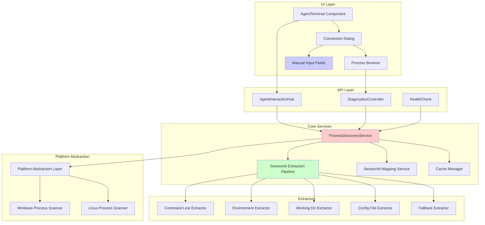
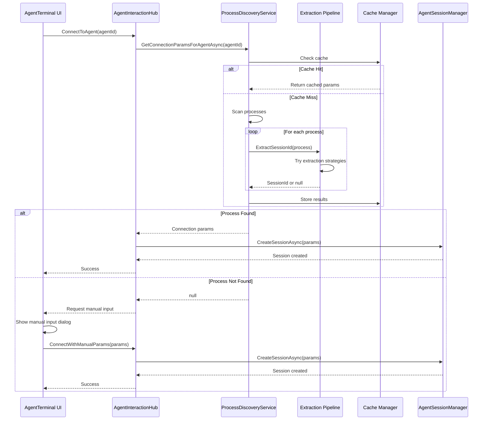
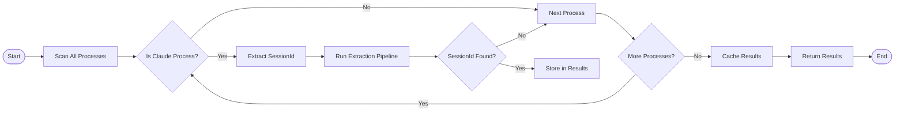
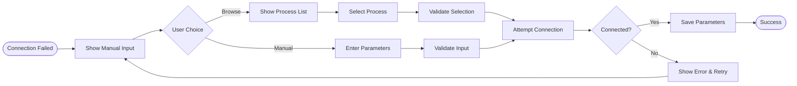

# ProcessDiscoveryService Fix - Architecture Documentation

## Overview

This document describes the planned architectural improvements to the ProcessDiscoveryService system to fix process discovery failures and add fallback mechanisms.

## Current Architecture Issues

### Problem Statement
The ProcessDiscoveryService cannot reliably find Claude Code processes despite them being running, causing connection failures in the Agent Terminal feature.

### Root Causes
1. **Rigid SessionId Extraction**: Single regex pattern misses various command-line formats
2. **Limited Process Detection**: Only checks for node.exe/claude patterns
3. **No Fallback Mechanism**: UI has no way to manually specify connection parameters
4. **Stale Cache**: 2-minute cache may contain outdated process information
5. **Platform Differences**: Windows WMI vs Linux /proc handling inconsistencies

## Proposed Architecture

### Component Diagram



### Sequence Diagram: Connection Flow



## Key Architectural Components

### 1. SessionId Extraction Pipeline

**Purpose**: Flexible, extensible system for extracting SessionIds from processes

**Design Pattern**: Chain of Responsibility

**Components**:
```csharp
public interface ISessionIdExtractor
{
    string? ExtractSessionId(ProcessInfo process);
    int Priority { get; }
}

public class SessionIdExtractionPipeline
{
    private readonly List<ISessionIdExtractor> _extractors;

    public string? ExtractSessionId(ProcessInfo process)
    {
        foreach (var extractor in _extractors.OrderBy(e => e.Priority))
        {
            var sessionId = extractor.ExtractSessionId(process);
            if (!string.IsNullOrEmpty(sessionId))
            {
                return sessionId;
            }
        }
        return null;
    }
}
```

**Extractors**:
1. **CommandLineExtractor**: Regex patterns for command-line arguments
2. **EnvironmentExtractor**: Check process environment variables
3. **WorkingDirectoryExtractor**: Parse working directory path
4. **ConfigFileExtractor**: Read from .claude config files
5. **FallbackExtractor**: Heuristic-based guessing

### 2. Platform Abstraction Layer

**Purpose**: Abstract platform-specific process discovery mechanisms

**Implementation**:
```csharp
public interface IProcessScanner
{
    Task<IEnumerable<ProcessInfo>> ScanProcessesAsync();
    Task<string?> GetCommandLineAsync(int processId);
    Task<Dictionary<string, string>> GetEnvironmentAsync(int processId);
}

public class WindowsProcessScanner : IProcessScanner
{
    // WMI-based implementation
}

public class LinuxProcessScanner : IProcessScanner
{
    // /proc filesystem implementation
}

public class PlatformProcessScanner : IProcessScanner
{
    private readonly IProcessScanner _scanner;

    public PlatformProcessScanner()
    {
        _scanner = RuntimeInformation.IsOSPlatform(OSPlatform.Windows)
            ? new WindowsProcessScanner()
            : new LinuxProcessScanner();
    }
}
```

### 3. Smart Cache Manager

**Purpose**: Intelligent caching with invalidation on process changes

**Features**:
- Per-SessionId cache entries
- Sliding expiration
- Process change detection
- Manual invalidation

**Implementation**:
```csharp
public class ProcessCacheManager
{
    private readonly IMemoryCache _cache;
    private readonly IProcessMonitor _monitor;

    public async Task<T?> GetOrCreateAsync<T>(
        string key,
        Func<Task<T>> factory,
        CacheEntryOptions options)
    {
        if (_cache.TryGetValue(key, out T cached))
        {
            return cached;
        }

        var value = await factory();

        var entry = _cache.CreateEntry(key);
        entry.Value = value;
        entry.SlidingExpiration = options.SlidingExpiration;

        // Register for process change notifications
        _monitor.RegisterForChanges(key, () => _cache.Remove(key));

        return value;
    }
}
```

### 4. Manual Input UI Components

**Purpose**: Fallback mechanism for manual connection parameter input

**Components**:

```razor
<!-- ProcessBrowser.razor -->
<div class="process-browser">
    <h5>Available Claude Processes</h5>
    @if (_processes.Any())
    {
        <table class="table">
            <thead>
                <tr>
                    <th>PID</th>
                    <th>SessionId</th>
                    <th>Status</th>
                    <th>Action</th>
                </tr>
            </thead>
            <tbody>
                @foreach (var process in _processes)
                {
                    <tr>
                        <td>@process.ProcessId</td>
                        <td>@(process.SessionId ?? "Unknown")</td>
                        <td>@process.Status</td>
                        <td>
                            <button @onclick="() => SelectProcess(process)">
                                Select
                            </button>
                        </td>
                    </tr>
                }
            </tbody>
        </table>
    }
    else
    {
        <p>No Claude processes found. Enter manually below.</p>
    }

    <div class="manual-input">
        <h6>Manual Input</h6>
        <input type="number" @bind="_processId" placeholder="Process ID" />
        <input type="text" @bind="_socketPath" placeholder="Socket/Pipe Path" />
        <button @onclick="UseManualInput">Connect</button>
    </div>
</div>
```

## Data Flow

### Process Discovery Flow



### Manual Fallback Flow



## Error Handling Strategy

### Graceful Degradation

1. **Primary**: Auto-discovery via ProcessDiscoveryService
2. **Secondary**: Process browser with manual selection
3. **Tertiary**: Full manual input of parameters
4. **Quaternary**: Load from saved successful connections

### Error Categories

| Error Type | Handling Strategy | User Experience |
|------------|------------------|-----------------|
| Process Not Found | Show manual input | "Process not found. Please enter manually or browse." |
| Access Denied | Request elevation | "Administrator access required. Run as admin or enter manually." |
| SessionId Not Found | Try all extractors | "SessionId not detected. Trying alternative methods..." |
| Connection Failed | Retry with backoff | "Connection failed. Retrying... (attempt 2/3)" |
| Cache Stale | Invalidate and refresh | "Refreshing process list..." |

## Performance Considerations

### Optimization Strategies

1. **Lazy Process Scanning**: Only scan when needed, not on startup
2. **Parallel Extraction**: Run extractors in parallel for multiple processes
3. **Incremental Updates**: Only rescan changed processes
4. **Smart Caching**: Cache with sliding expiration and change detection
5. **Async Operations**: All I/O operations are async

### Performance Targets

| Operation | Target | Maximum |
|-----------|--------|---------|
| Process Scan | 500ms | 2000ms |
| SessionId Extraction | 50ms/process | 200ms/process |
| Cache Lookup | 1ms | 10ms |
| Total Discovery | 1000ms | 3000ms |
| Manual Input Response | 100ms | 500ms |

## Security Considerations

### Process Access

- Run with minimum required privileges
- Request elevation only when necessary
- Sanitize process command-line data
- Validate ProcessIds before use

### Data Protection

- Don't log sensitive command-line arguments
- Sanitize SessionIds in logs (show partial)
- Encrypt cached connection parameters
- Clear sensitive data on disconnect

## Testing Strategy

### Unit Testing

```csharp
[TestClass]
public class SessionIdExtractionPipelineTests
{
    [TestMethod]
    public void ExtractSessionId_CommandLineFormat_ReturnsSessionId()
    {
        // Arrange
        var pipeline = new SessionIdExtractionPipeline();
        var process = new ProcessInfo
        {
            CommandLine = "node claude-code --session-id=abc-123-def"
        };

        // Act
        var sessionId = pipeline.ExtractSessionId(process);

        // Assert
        Assert.AreEqual("abc-123-def", sessionId);
    }
}
```

### Integration Testing

- Test with real Claude Code processes
- Test cross-platform behavior
- Test UI fallback flows
- Test connection persistence

### Performance Testing

- Load test with 100+ processes
- Measure extraction pipeline performance
- Test cache efficiency
- Benchmark UI responsiveness

## Migration Path

### Phase 1: Diagnostic Implementation
- Add enhanced logging
- Create diagnostics endpoint
- Deploy for data collection

### Phase 2: Core Fixes
- Implement extraction pipeline
- Add platform abstraction
- Deploy with feature flag

### Phase 3: UI Fallback
- Add manual input UI
- Implement process browser
- Enable for beta users

### Phase 4: General Availability
- Remove feature flags
- Deprecate old behavior
- Full production rollout

## Configuration

### AppSettings Configuration

```json
{
  "ProcessDiscovery": {
    "CacheExpirationMinutes": 2,
    "EnableAutoDiscovery": true,
    "MaxProcessScanTime": 3000,
    "ExtractorPipeline": {
      "EnableCommandLine": true,
      "EnableEnvironment": true,
      "EnableWorkingDir": true,
      "EnableConfigFile": false,
      "EnableFallback": true
    },
    "Logging": {
      "LogProcessDetails": false,
      "LogSessionIds": false,
      "LogPerformanceMetrics": true
    }
  }
}
```

## Monitoring & Observability

### Metrics to Track

1. **Discovery Success Rate**: Percentage of successful auto-discoveries
2. **Fallback Usage**: How often manual input is used
3. **Extraction Strategy Success**: Which extractors work best
4. **Connection Time**: Time from request to connected
5. **Cache Hit Rate**: Efficiency of caching layer

### Health Checks

```csharp
public class ProcessDiscoveryHealthCheck : IHealthCheck
{
    public async Task<HealthCheckResult> CheckHealthAsync(
        HealthCheckContext context,
        CancellationToken cancellationToken)
    {
        try
        {
            // Check process access
            var processes = Process.GetProcesses();

            // Check cache functionality
            var cache = _serviceProvider.GetService<IMemoryCache>();

            // Check extraction pipeline
            var pipeline = _serviceProvider.GetService<SessionIdExtractionPipeline>();

            return HealthCheckResult.Healthy("Process discovery operational");
        }
        catch (Exception ex)
        {
            return HealthCheckResult.Unhealthy("Process discovery failed", ex);
        }
    }
}
```

## Future Enhancements

1. **Process Pool Management**: Pre-spawn Claude processes for instant connection
2. **Connection Pooling**: Reuse existing connections
3. **Process Health Monitoring**: Track process health and auto-restart
4. **Multi-Session Support**: Connect to multiple Claude instances
5. **Remote Process Discovery**: Discover processes on remote machines
6. **Process Lifecycle Management**: Start/stop Claude processes from UI