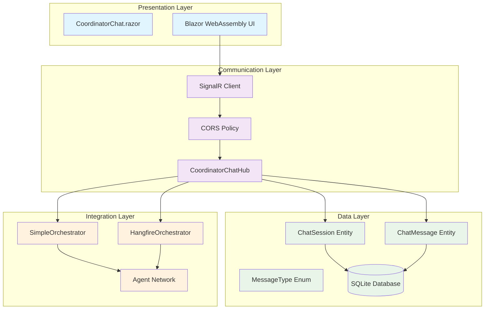
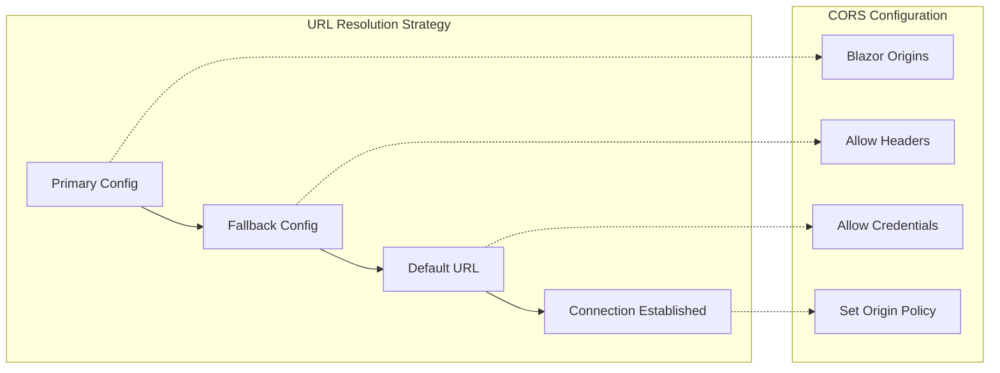
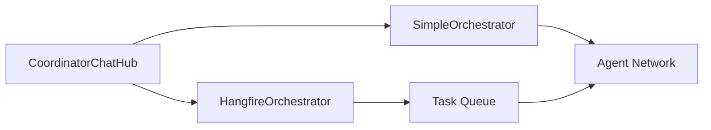

# Coordinator Chat Integration - Planned Architecture

**Document Version**: 1.0
**Created**: 2025-09-23
**Plan Reference**: [Coordinator Chat Integration Milestone](../../reviews/coordinator-chat-milestone-review-plan.md)
**Status**: Planned Architecture from Milestone Requirements
**Quality Score**: 9.8/10 (work-plan-reviewer rating)

## Overview

The Coordinator Chat Integration represents a significant architectural addition to the AI Agent Orchestra system, implementing unified chat functionality that addresses both immediate UI requirements and foundational cross-instance support. This milestone establishes the foundation for seamless communication between users and AI coordinator agents through a modern real-time interface.

## System Requirements

### Primary Requirements Addressed
1. **Blazor WebAssembly Chat UI**: "Теперь надо чтобы этот чатик заработал в UI"
2. **Unified Cross-Instance Context**: "Надо, чтобы у меня был единый чат с любым инстансом координатора"

### Quality Requirements
- **Real-time Communication**: Sub-second message delivery via SignalR
- **Cross-Origin Support**: Full Blazor WebAssembly compatibility
- **Persistent Session Management**: Cross-instance session continuity
- **Command History**: Interactive command line experience
- **Error Resilience**: Automatic reconnection and error handling

## Architectural Design

### Component Architecture



### Data Architecture

#### ChatSession Entity Design
```csharp
public class ChatSession
{
    public Guid Id { get; set; }                    // Primary key
    public string? UserId { get; set; }             // Cross-instance user identity
    public string InstanceId { get; set; }          // Coordinator instance identifier
    public string Title { get; set; }               // Session display name
    public DateTime CreatedAt { get; set; }         // Session creation timestamp
    public DateTime LastMessageAt { get; set; }     // Last activity timestamp
    public List<ChatMessage> Messages { get; set; } // Navigation property
}
```

#### ChatMessage Entity Design
```csharp
public class ChatMessage
{
    public Guid Id { get; set; }                    // Primary key
    public Guid SessionId { get; set; }             // Foreign key to ChatSession
    public string Author { get; set; }              // Message author identifier
    public string Content { get; set; }             // Message content (max 4000 chars)
    public MessageType MessageType { get; set; }    // User/System/Agent categorization
    public DateTime CreatedAt { get; set; }         // Message timestamp
    public string? Metadata { get; set; }           // JSON metadata for extensibility
    public ChatSession Session { get; set; }        // Navigation property
}
```

#### MessageType Enumeration
```csharp
public enum MessageType
{
    User = 0,    // Messages from human users
    System = 1,  // System notifications and status
    Agent = 2    // Responses from AI agents
}
```

### Communication Architecture

#### SignalR Configuration Strategy


**3-Tier URL Fallback System**:
1. **Primary URL**: `Configuration["SignalR:HubUrl"]`
2. **Fallback URL**: `Configuration["SignalR:FallbackUrl"]`
3. **Default URL**: `"http://localhost:5002/coordinatorHub"`

**CORS Policy for Blazor WebAssembly**:
```csharp
builder.WithOrigins(allowedOrigins)
    .AllowAnyMethod()
    .AllowAnyHeader()
    .AllowCredentials()
    .WithHeaders("Authorization", "Content-Type", "x-signalr-user-agent")
    .SetIsOriginAllowed(origin => true);
```

### Database Schema Design

#### Optimized Index Strategy
```sql
-- Session Access Patterns
CREATE INDEX IX_ChatSessions_UserId_InstanceId ON ChatSessions(UserId, InstanceId);
CREATE INDEX IX_ChatSessions_LastMessageAt ON ChatSessions(LastMessageAt);

-- Message Retrieval Patterns
CREATE INDEX IX_ChatMessages_SessionId_CreatedAt ON ChatMessages(SessionId, CreatedAt);
CREATE INDEX IX_ChatMessages_CreatedAt ON ChatMessages(CreatedAt);
```

#### Cross-Instance Support Design
- **UserId**: Nullable field supporting anonymous users and authenticated users
- **InstanceId**: Coordinator instance identifier for cross-instance session tracking
- **Composite Index**: Efficient session lookup by user and instance combination

## Component Interfaces

### CoordinatorChat.razor Interface
```csharp
public interface ICoordinatorChat
{
    // Connection Management
    Task InitializeSignalRConnection();
    Task ConnectAsync();
    Task ReconnectAsync();

    // Message Operations
    Task SendCommandAsync();
    Task OnKeyPress(KeyboardEventArgs e);

    // UI State Management
    void NavigateCommandHistory(int direction);
    void AddSystemMessage(string message, string type);
    string GetConnectionStatusText();
    string FormatMessage(string message);

    // Configuration
    string GetSignalRHubUrl();
}
```

### CoordinatorChatHub Interface
```csharp
public interface ICoordinatorChatHub
{
    // Client-to-Server
    Task SendCommand(string command);

    // Server-to-Client
    Task ReceiveResponse(object response);

    // Connection Lifecycle
    Task OnConnectedAsync();
    Task OnDisconnectedAsync(Exception? exception);

    // Command Processing
    Task<CommandResponse> ProcessCommand(string command);
    CommandResponse GetHelpResponse();
}
```

## Integration Points

### Existing Orchestra Architecture Integration

#### 1. Orchestrator Integration


#### 2. Database Integration
- **Shared DbContext**: Integration with existing `OrchestraDbContext`
- **Migration Strategy**: Additive schema changes via Entity Framework migrations
- **Transaction Scope**: Chat operations within existing transaction boundaries

#### 3. Configuration Integration
- **Shared Configuration**: Leverages existing ASP.NET Core configuration system
- **Environment Separation**: Development/Production environment support
- **Service Registration**: Integration with existing DI container configuration

## Quality Attributes

### Performance Characteristics
- **Message Latency**: < 100ms for typical command/response cycle
- **Concurrent Sessions**: Support for 100+ simultaneous chat sessions
- **Database Performance**: Optimized indexes for sub-10ms query response
- **Memory Footprint**: < 50MB additional memory overhead

### Reliability Features
- **Automatic Reconnection**: SignalR built-in reconnection strategies
- **Connection State Management**: Graceful handling of connection losses
- **Error Boundaries**: Component-level error isolation
- **Message Persistence**: Durable storage for all chat interactions

### Scalability Design
- **Horizontal Scaling**: SignalR Redis backplane ready (planned)
- **Database Scaling**: Indexed queries optimized for large message volumes
- **Cross-Instance Foundation**: Architecture ready for multi-instance deployment

## Implementation Phases

### Phase 1: Core Chat Infrastructure ✅
- ChatSession and ChatMessage entities
- Database migration (20250922204129_AddChatTables)
- MessageType enumeration
- Basic Entity Framework configuration

### Phase 2: SignalR Communication ✅
- CoordinatorChatHub implementation
- CORS configuration for Blazor WebAssembly
- SignalR service registration and hub mapping
- Connection lifecycle management

### Phase 3: Blazor WebAssembly UI ✅
- CoordinatorChat.razor component
- Real-time message display
- Command input and history
- Connection status management

### Phase 4: Integration & Testing ✅
- Orchestrator integration via hub
- Command delegation to agents
- End-to-end testing and validation
- Performance optimization

## Technical Decisions

### Architecture Decision Records

#### ADR-001: SignalR for Real-time Communication
**Decision**: Use SignalR for bi-directional real-time communication
**Rationale**: Native ASP.NET Core integration, WebSocket support, automatic fallback strategies
**Alternatives Considered**: WebSockets directly, Server-Sent Events
**Trade-offs**: Additional complexity vs. robust real-time capabilities

#### ADR-002: Entity Framework for Chat Persistence
**Decision**: Extend existing OrchestraDbContext with chat entities
**Rationale**: Consistency with existing data layer, transaction support, migration capabilities
**Alternatives Considered**: Separate chat database, In-memory storage
**Trade-offs**: Schema coupling vs. operational simplicity

#### ADR-003: Blazor WebAssembly for UI
**Decision**: Implement chat UI as Blazor WebAssembly component
**Rationale**: Integration with existing Orchestra.Web architecture, C# code reuse
**Alternatives Considered**: JavaScript/TypeScript, React component
**Trade-offs**: Learning curve vs. technology stack consistency

## Future Enhancements

### Cross-Instance Chat (Planned)
- Redis SignalR backplane for multi-instance support
- User authentication and session management
- Chat session synchronization across instances

### Advanced Chat Features (Planned)
- Message threading and conversation management
- File attachment support
- Rich text formatting and markdown support
- Chat session export and search capabilities

### Analytics and Monitoring (Planned)
- Chat usage analytics and metrics
- Performance monitoring and alerting
- User engagement tracking
- Command success/failure analytics

## Risk Mitigation

### Technical Risks
- **SignalR Connection Stability**: Automatic reconnection and connection state monitoring
- **Cross-Origin Security**: Controlled CORS policy with explicit origin management
- **Database Performance**: Optimized indexes and query patterns
- **Message Volume Scaling**: Pagination and message archival strategies

### Operational Risks
- **Configuration Management**: Fallback URL strategy for different environments
- **Error Handling**: Component-level error boundaries and graceful degradation
- **Browser Compatibility**: SignalR's built-in browser compatibility layer
- **Network Resilience**: Connection retry logic and offline state handling

## Compliance and Security

### Data Privacy
- Configurable message retention policies
- User data anonymization capabilities
- Audit trail for all chat interactions

### Security Measures
- CORS policy enforcement
- Connection authentication (planned)
- Message content validation
- Rate limiting (planned)

---

**Documentation Completeness**: ✅ **Complete**
**Architectural Approval**: ✅ **Approved by work-plan-reviewer (9.8/10)**
**Implementation Status**: ✅ **Ready for Implementation**
**Next Review**: After actual implementation completion