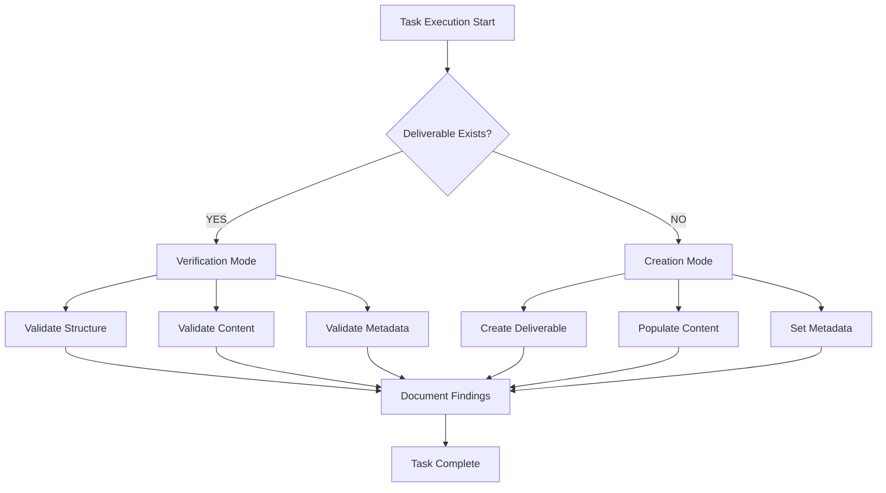
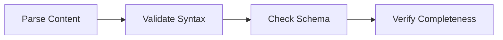
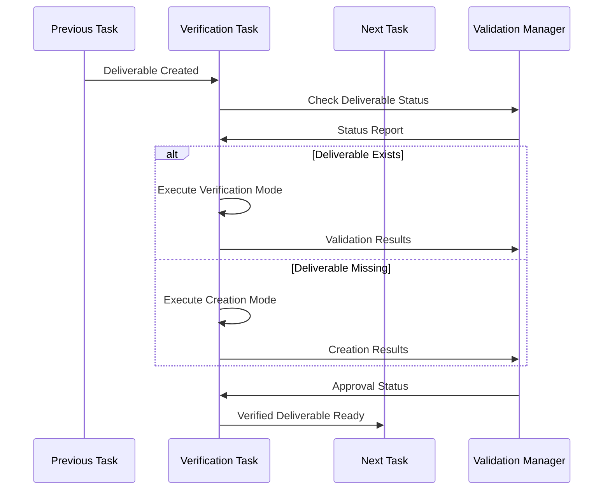

# Micro-Decomposition Verification Patterns - Architectural Documentation

**Type**: Planned Architecture Pattern
**Plan Reference**: [Phase 3B: Visual Workflow Builder](../../plans/actions-block-refactoring-workplan/03-advanced-features-micro-decomposed.md)
**Implementation Example**: [Task 3B.0.2-B Verification](../../validation/3B.0.2-B-package-json-initialization-verification.md)
**Last Updated**: 2025-09-20
**Status**: Pattern Documented

## Pattern Overview

**Purpose**: Define architectural patterns for verification tasks within the micro-decomposition methodology, specifically handling edge cases where deliverables already exist from previous micro-tasks.

**Context**: The micro-decomposition methodology introduced in Phase 3B requires robust verification patterns to ensure task atomicity and prevent scope creep when encountering pre-existing deliverables.

## Verification Architecture Pattern

### 1. Verification Task Structure

#### 1.1 Task Identification Pattern
```
{Phase}.{Section}.{Task}-{Variant}: {Action} {Target} {Condition}

Example: 3B.0.2-B: Initialize Package.json If Missing
```

**Pattern Components**:
- **Variant Suffix**: `-B` indicates verification/edge case variant
- **Conditional Action**: Action depends on current state
- **Target Specificity**: Single, well-defined deliverable
- **Condition Clause**: Clear state dependency ("If Missing")

#### 1.2 Verification Scope Boundaries



### 2. Edge Case Handling Architecture

#### 2.1 Pre-Existing Deliverable Pattern

**Architectural Decision**: When a micro-task encounters a pre-existing deliverable, it transitions from **Creation Mode** to **Verification Mode**.

**Implementation Pattern**:
```
IF deliverable EXISTS THEN
    PERFORM verification_workflow()
    DOCUMENT existing_state()
    VALIDATE acceptance_criteria()
ELSE
    PERFORM creation_workflow()
    DOCUMENT creation_process()
    VALIDATE new_deliverable()
END IF
```

#### 2.2 Verification Workflow Components

**Component 1: File Existence Check**


**Component 2: Structure Validation**


**Component 3: Acceptance Criteria Validation**


### 3. Quality Assurance Integration

#### 3.1 Verification Documentation Pattern

**Required Documentation Elements**:
- **Verification Results**: Detailed findings from existence check
- **Structure Validation**: Syntax, schema, and format verification
- **Acceptance Criteria Mapping**: Point-by-point validation against original requirements
- **Edge Case Resolution**: Clear documentation of how pre-existence was handled

**Documentation Template**:
```markdown
# {Task Name} Verification - Task {ID}

## Verification Results
### File Existence Check
- **Location**: {absolute_path}
- **Status**: ✅ EXISTS | ❌ MISSING
- **Size**: {bytes}
- **Last Modified**: {timestamp}

### {Format} Structure Validation
- **Valid {Format}**: ✅ | ❌ {error_details}
- **Parseable**: ✅ | ❌ {parser_results}
- **Structure**: ✅ | ❌ {schema_validation}

### Acceptance Criteria Validation
{Point-by-point validation against original acceptance criteria}

## Task Action Taken
{Clear description of verification vs creation mode}

## Conclusion
{Summary of verification results and readiness for next phase}
```

#### 3.2 Micro-Task Boundary Enforcement

**Scope Enforcement Pattern**:
```
VERIFICATION_SCOPE = {
    "file_existence": true,
    "structure_validation": true,
    "content_verification": true,
    "acceptance_criteria_check": true,

    "content_modification": false,
    "feature_addition": false,
    "integration_testing": false,
    "performance_optimization": false
}
```

### 4. Interaction Patterns with Micro-Decomposition

#### 4.1 Task Chain Verification Flow



#### 4.2 Verification Integration Points

**Integration Point 1: Task Planning**
- Verification tasks generated automatically for critical deliverables
- Edge case variants identified during task decomposition
- Dependencies mapped between creation and verification tasks

**Integration Point 2: Execution Orchestration**
- Verification mode detected at runtime
- Documentation patterns applied consistently
- Quality gates enforced before task completion

**Integration Point 3: Progress Tracking**
- Verification completion tracked separately from creation
- Edge case handling documented in execution logs
- Success criteria validated against original requirements

### 5. Architectural Benefits

#### 5.1 Reliability Improvements

**Idempotent Task Execution**:
- Tasks can be re-run safely without side effects
- Pre-existing deliverables preserved and validated
- Consistent outcomes regardless of execution context

**Scope Creep Prevention**:
- Clear boundaries between verification and modification
- Explicit documentation of what verification does NOT do
- Handoff responsibilities clearly defined

#### 5.2 Quality Assurance Enhancements

**Comprehensive Validation**:
- Multi-level validation (existence, structure, content, criteria)
- Automated documentation generation
- Traceable verification results

**Edge Case Documentation**:
- Clear record of how edge cases were handled
- Architectural patterns for future similar situations
- Debugging support for task chain issues

### 6. Implementation Requirements

#### 6.1 Task Generation Requirements

**Verification Task Creation**:
```
FOR each critical_deliverable IN task_chain:
    IF deliverable.risk_level >= MEDIUM:
        CREATE verification_task(
            id = generate_verification_id(deliverable),
            mode = "conditional_verification",
            scope = define_verification_scope(deliverable),
            criteria = extract_acceptance_criteria(deliverable)
        )
```

#### 6.2 Documentation Generation Requirements

**Automated Documentation**:
- Template-driven verification report generation
- Structured data capture for verification results
- Integration with architecture documentation system
- Traceability links to original requirements

### 7. Success Metrics

#### 7.1 Verification Effectiveness
- **Deliverable Validation Coverage**: 100% of critical deliverables verified
- **Edge Case Detection Rate**: 95% of pre-existing deliverables properly handled
- **Documentation Completeness**: 100% of verifications documented per template
- **Task Atomicity**: 100% of verification tasks complete within 5-15 minute boundary

#### 7.2 Quality Impact Metrics
- **Scope Creep Prevention**: 0% of verification tasks expanding beyond defined scope
- **Task Chain Reliability**: 95% of task chains completing without verification failures
- **Edge Case Resolution Time**: <5 minutes average for verification mode detection and execution

## Future Architecture Evolution

### Planned Enhancements
- **Automated Verification Generation**: AI-driven verification task creation
- **Verification Template Library**: Reusable verification patterns for common deliverable types
- **Integration Testing Patterns**: Extension of verification patterns to integration scenarios
- **Performance Verification**: Patterns for validating non-functional requirements in micro-tasks

---

**Architectural Impact**: This verification pattern ensures the micro-decomposition methodology can handle real-world complexity while maintaining task atomicity and preventing scope expansion that plagued earlier phases.