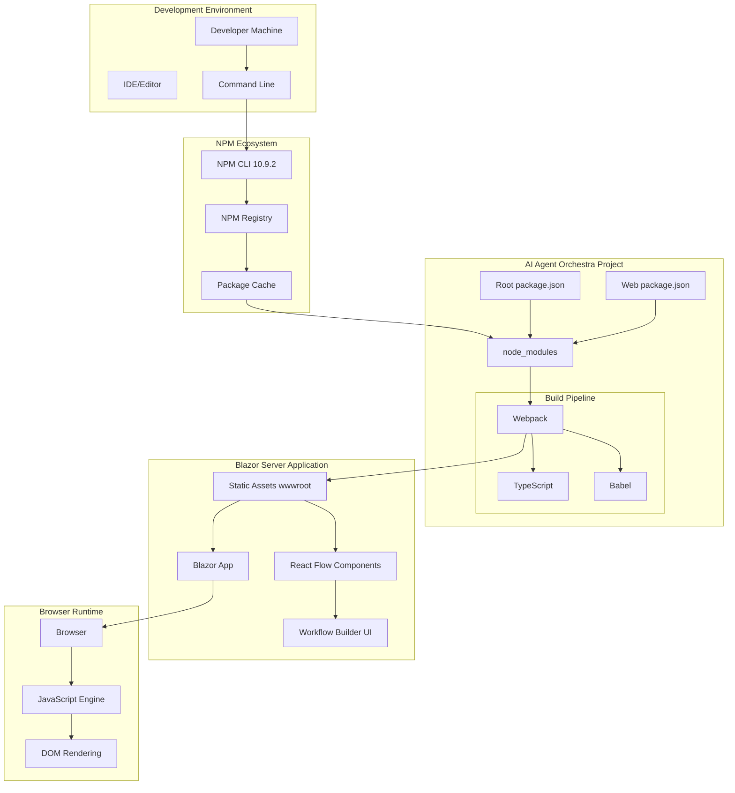
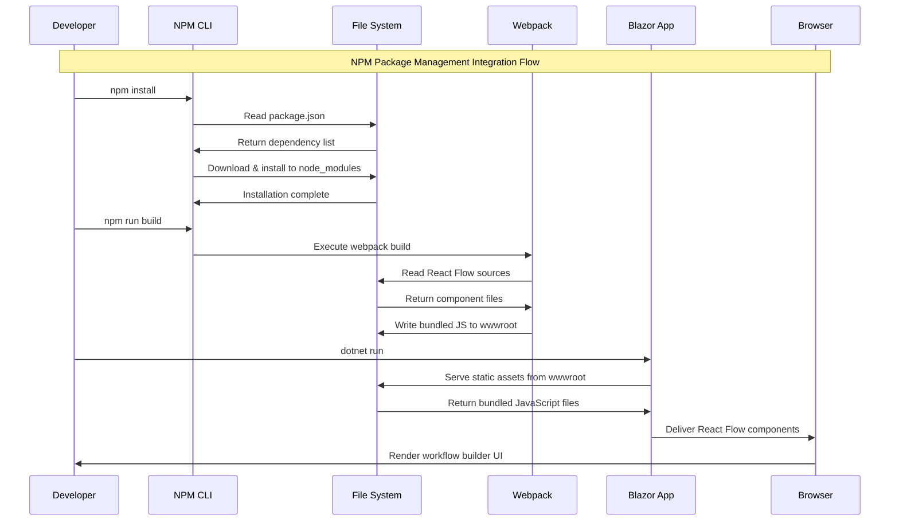
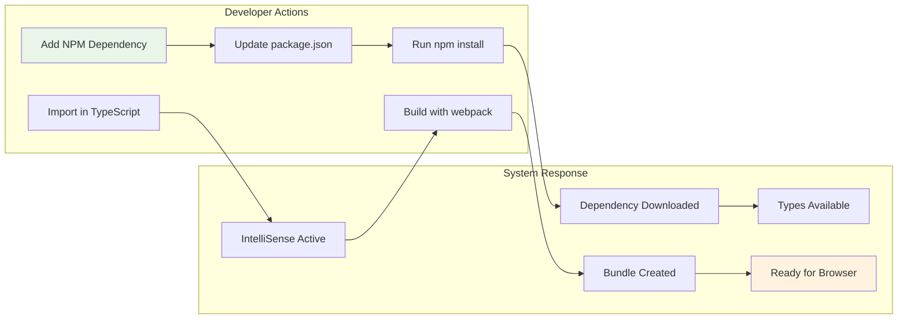
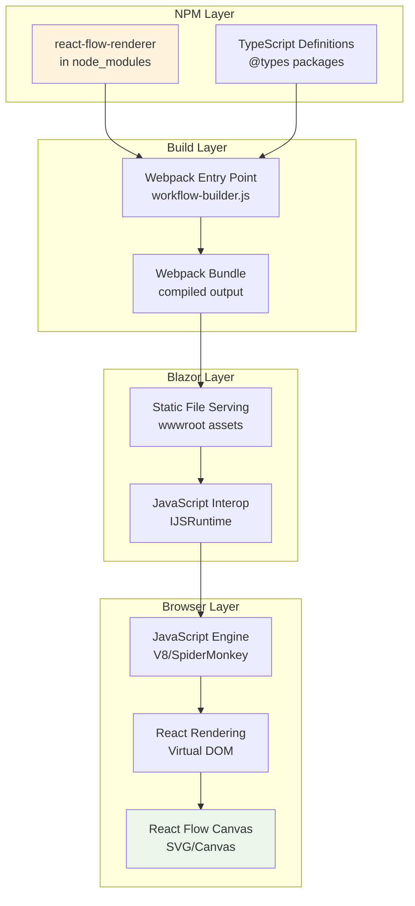
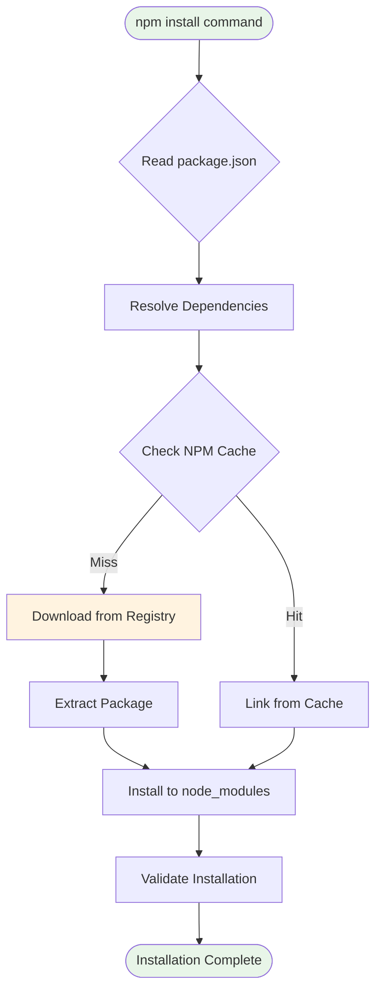
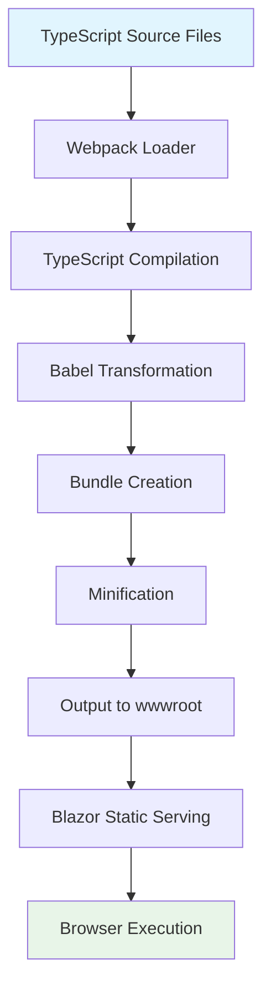
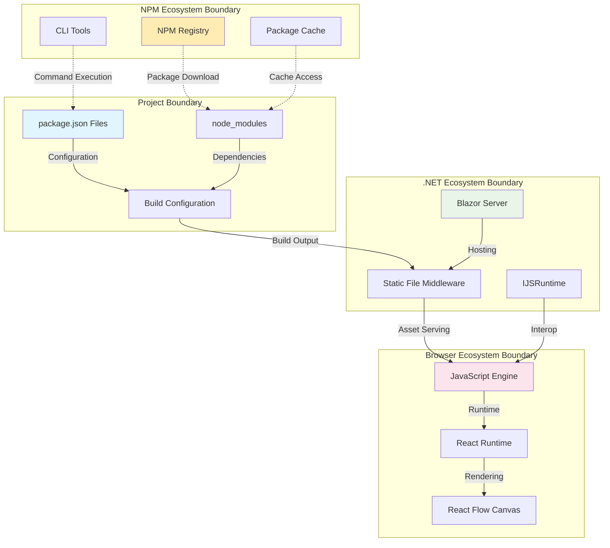
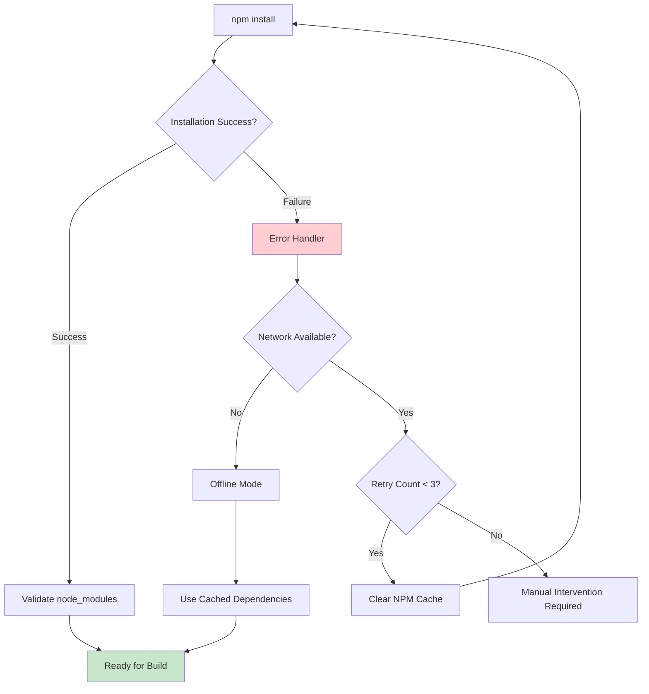
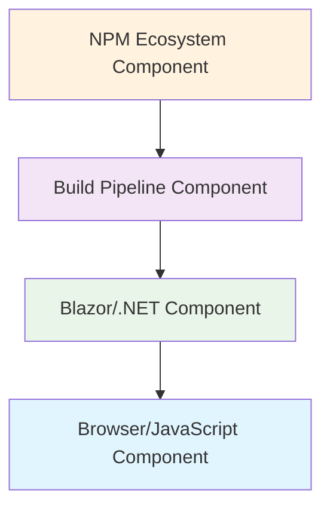

# NPM Integration Component Diagrams

**Type**: Planned Architecture Diagrams
**Plan Reference**: [Phase 3B NPM Package Management](../npm-package-management-architecture.md)
**Last Updated**: 2025-09-20
**Status**: Foundation Phase Architecture

## System-Level NPM Integration Architecture



## Package Management Layer Architecture

```mermaid
graph TD
    subgraph "Package.json Configuration Layer"
        ROOT_PKG[Root package.json<br/>Project Coordination]
        WEB_PKG[Web package.json<br/>Frontend Dependencies]
    end

    subgraph "Dependency Resolution Layer"
        NPM_CLI[NPM CLI<br/>Package Manager]
        LOCK[package-lock.json<br/>Version Lock]
        NODE_MOD[node_modules<br/>Installed Packages]
    end

    subgraph "React Flow Ecosystem"
        REACT[react ^18.2.0]
        REACT_DOM[react-dom ^18.2.0]
        REACT_FLOW[react-flow-renderer ^10.3.17]
        TYPES_REACT[@types/react ^18.2.0]
        TYPES_FLOW[@types/react-flow-renderer ^1.0.0]
    end

    subgraph "Build Tool Ecosystem"
        WEBPACK[webpack ^5.88.0]
        WEBPACK_CLI[webpack-cli ^5.1.0]
        BABEL_LOADER[babel-loader ^9.1.0]
        BABEL_CORE[@babel/core ^7.22.0]
        BABEL_REACT[@babel/preset-react ^7.22.0]
        BABEL_ENV[@babel/preset-env ^7.22.0]
        TYPESCRIPT[typescript ^5.1.0]
        TS_LOADER[ts-loader ^9.4.0]
    end

    ROOT_PKG --> NPM_CLI
    WEB_PKG --> NPM_CLI
    NPM_CLI --> LOCK
    NPM_CLI --> NODE_MOD

    NODE_MOD --> REACT
    NODE_MOD --> REACT_DOM
    NODE_MOD --> REACT_FLOW
    NODE_MOD --> TYPES_REACT
    NODE_MOD --> TYPES_FLOW

    NODE_MOD --> WEBPACK
    NODE_MOD --> WEBPACK_CLI
    NODE_MOD --> BABEL_LOADER
    NODE_MOD --> BABEL_CORE
    NODE_MOD --> BABEL_REACT
    NODE_MOD --> BABEL_ENV
    NODE_MOD --> TYPESCRIPT
    NODE_MOD --> TS_LOADER

    style ROOT_PKG fill:#e1f5fe
    style WEB_PKG fill:#e1f5fe
    style REACT_FLOW fill:#fff3e0
    style WEBPACK fill:#f3e5f5
```

## Build Pipeline Integration Flow



## Component Interaction Patterns

### Pattern 1: Development Workflow Integration



### Pattern 2: React Flow Component Loading



## Data Flow Architecture

### NPM Dependency Resolution Flow



### Build Asset Flow



## Integration Boundary Architecture



## Error Handling & Fallback Patterns

### NPM Installation Error Flow



## Legend



**Color Coding:**
- 🟡 **NPM Ecosystem** (#fff3e0): Package management, registry, CLI
- 🟣 **Build Pipeline** (#f3e5f5): Webpack, TypeScript, Babel
- 🟢 **Blazor/.NET** (#e8f5e8): Server application, static serving
- 🔵 **Browser/JavaScript** (#e1f5fe): Runtime, React, React Flow

---

These diagrams provide comprehensive visualization of NPM package management integration within the AI Agent Orchestra architecture, showing clear interaction patterns and data flows between all system components.