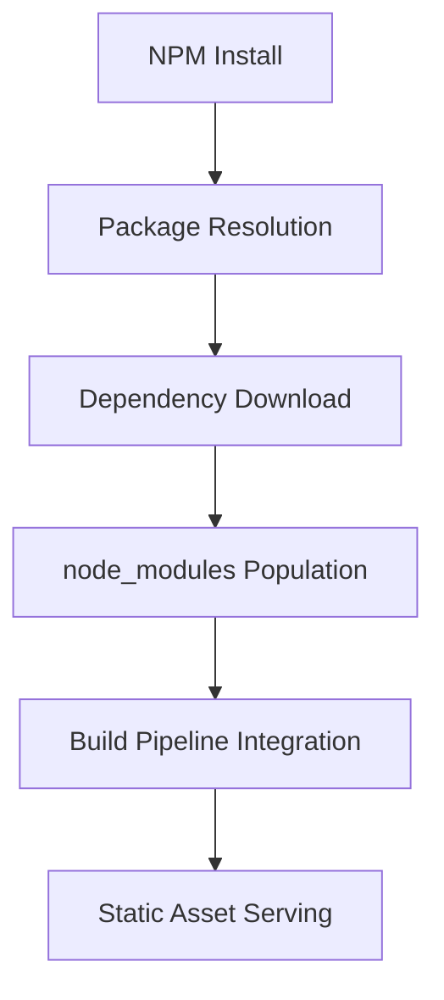
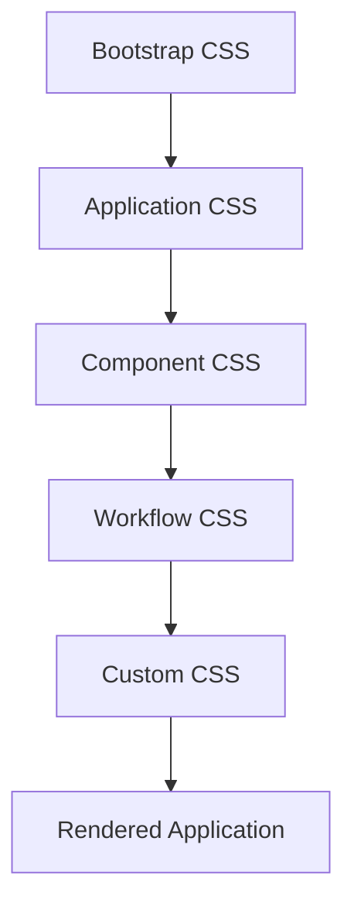
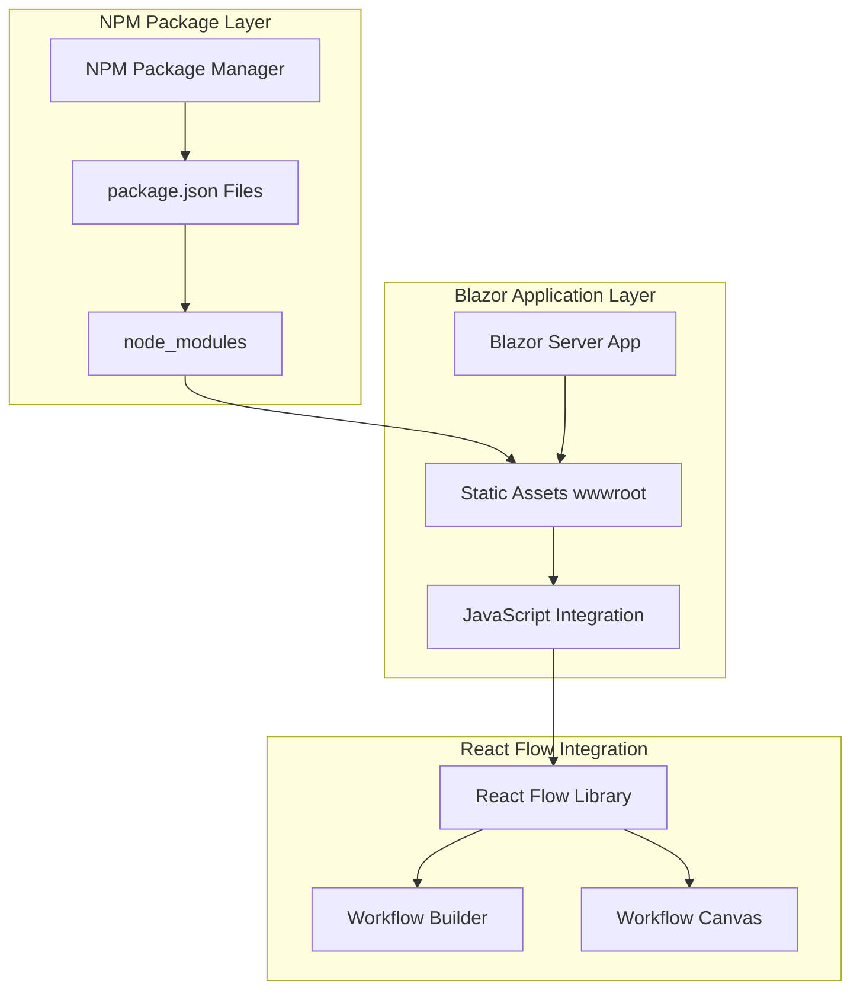
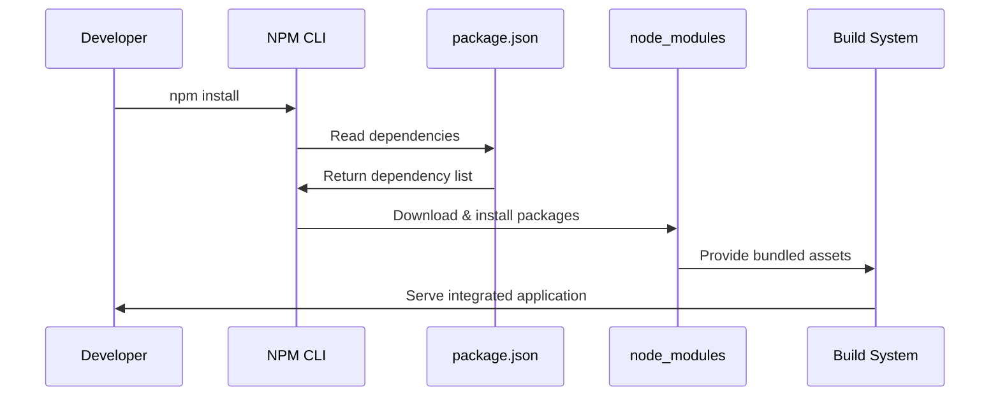
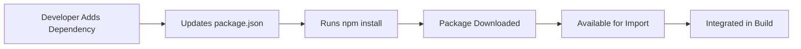
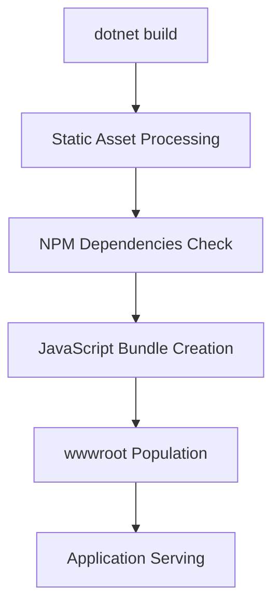

# NPM Package Management Architecture - Planned

**Type**: Planned Architecture
**Plan Reference**: [Phase 3B: Visual Workflow Builder](../../plans/actions-block-refactoring-workplan/03-advanced-features-micro-decomposed.md#3b02-a-validate-npm-package-management)
**Last Updated**: 2025-09-21
**Status**: Foundation Phase Completed with CSS Framework Compatibility Verified

## Component Overview

**Purpose**: Establish NPM package management capability as foundation for React Flow integration and JavaScript dependency management in the AI Agent Orchestra project.

## Planned Architecture Components

### 1. Package Management Layer

#### 1.1 Root-Level Package Management
**File**: `package.json` (project root)
**Purpose**: Project-wide dependency coordination and metadata management

```json
{
  "name": "ai-agent-orchestra",
  "version": "1.0.0",
  "description": "Transform your AI assistants from solo performers into a synchronized orchestra",
  "directories": {
    "test": "tests"
  },
  "scripts": {
    "test": "echo \"Error: no test specified\" && exit 1"
  }
}
```

#### 1.2 Web Application Package Management
**File**: `src/Orchestra.Web/wwwroot/package.json`
**Purpose**: Frontend-specific dependency management for React Flow and workflow builder

```json
{
  "name": "orchestra-workflow-builder",
  "version": "1.0.0",
  "description": "React Flow integration for AI Agent Orchestra workflow builder",
  "main": "js/workflow-builder.js",
  "dependencies": {
    "react": "^18.2.0",
    "react-dom": "^18.2.0",
    "react-flow-renderer": "^10.3.17"
  },
  "devDependencies": {
    "webpack": "^5.88.0",
    "typescript": "^5.1.0"
  }
}
```

### 2. Package Management Integration Points

#### 2.1 Build Pipeline Integration
**Integration Point**: ASP.NET Core Build Process
**Purpose**: Ensure JavaScript dependencies are included in build artifacts



#### 2.2 Development Workflow Integration
**Integration Point**: Development Environment Setup
**Purpose**: Streamlined developer experience for JavaScript dependencies

### 3. Dependency Management Strategy

#### 3.1 React Flow Ecosystem
**Primary Dependencies**:
- `react-flow-renderer`: ^10.3.17 (Core workflow canvas)
- `@types/react-flow-renderer`: ^1.0.0 (TypeScript definitions)

#### 3.2 Build Tools
**Development Dependencies**:
- `webpack`: ^5.88.0 (Module bundling)
- `typescript`: ^5.1.0 (Type safety)
- `babel-loader`: ^9.1.0 (JavaScript transpilation)

### 4. CSS Framework Integration

#### 4.1 CSS Framework Compatibility Layer
**Purpose**: Ensure custom CSS integrates properly with existing Bootstrap framework
**File**: `src/Orchestra.Web/wwwroot/css/test-styles.css`
**Loading Order**: Bootstrap → App → Components → Workflow → Custom

```css
.test-css-verification {
    background-color: #e8f5e8;
    border: 1px solid #4caf50;
    padding: 10px;
    border-radius: 4px;
    margin: 10px 0;
}
```

#### 4.2 CSS Loading Strategy


### 5. Integration Architecture

#### 5.1 Blazor Server + NPM Hybrid Architecture



#### 4.2 Package Resolution Flow



## Public Interface Definitions

### 4.3 NPM Command Interface
```bash
# Package installation
npm install [package-name]

# Dependency management
npm list
npm outdated
npm update

# Build integration
npm run build
npm run dev
```

### 4.4 Build Script Interface
```json
{
  "scripts": {
    "build": "webpack --mode production",
    "dev": "webpack --mode development --watch",
    "install-deps": "npm install"
  }
}
```

## Dependencies

### Input Dependencies
- **Node.js Runtime**: Required for NPM execution
- **NPM CLI**: Version 10.9.2+ for package management
- **File System Access**: For package.json and node_modules management

### Output Dependencies
- **React Flow Library**: Provides workflow visualization capability
- **Build Pipeline**: Integrates with ASP.NET Core static asset serving
- **JavaScript Runtime**: Browser-based execution environment

## Interaction Patterns

### 5.1 Development Workflow Pattern


### 5.2 Build Integration Pattern


## Architectural Decisions

### AD-001: Dual Package.json Strategy
**Decision**: Maintain separate package.json files for root and web application
**Rationale**:
- Root package.json for project-wide coordination
- Web-specific package.json for frontend dependencies
- Clear separation of concerns

### AD-002: NPM over Yarn/PNPM
**Decision**: Use NPM as package manager
**Rationale**:
- Native Node.js package manager
- Widest compatibility with existing tooling
- Simpler setup for .NET developers

### AD-003: React Flow 10.x Version Target
**Decision**: Target React Flow renderer v10.3.17
**Rationale**:
- Stable version with extensive documentation
- Good TypeScript support
- Compatible with React 18.x

## Validation Criteria

### Foundation Validation
- [x] NPM CLI accessible and functional
- [x] Package.json files valid and parseable
- [x] Basic npm commands execute without errors
- [ ] Node_modules directory created successfully

### Integration Validation
- [x] Static assets served correctly from wwwroot
- [x] CSS framework compatibility verified with Bootstrap
- [x] CSS loading order established and working
- [x] Build pipeline includes CSS dependencies
- [ ] JavaScript modules importable in browser
- [ ] Build pipeline includes NPM dependencies
- [ ] Development workflow supports hot reload

## Migration Path

### Phase 1: Foundation (COMPLETED)
- ✅ NPM installation verification
- ✅ Package.json creation
- ✅ Basic command functionality
- ✅ CSS framework compatibility verification (Task 3B.0.3-B)
- ✅ Bootstrap integration confirmed working
- ✅ CSS loading order established

### Phase 2: React Flow Integration (PLANNED)
- Install React Flow dependencies
- Configure webpack bundling
- Create workflow canvas integration
- Test React component rendering

### Phase 3: Production Integration (FUTURE)
- Optimize bundle size
- Configure production builds
- Implement caching strategies
- Add dependency security scanning

## Risk Assessment

### Low Risk
- NPM package conflicts (resolved by version pinning)
- Build performance impact (mitigated by caching)

### Medium Risk
- React/Blazor integration complexity
- JavaScript/C# interop challenges

### High Risk
- Security vulnerabilities in NPM packages
- Breaking changes in React Flow versions

## Success Metrics

- **Package Resolution**: <30 seconds for fresh install
- **Build Integration**: Zero additional build time overhead
- **Developer Experience**: Single command setup (npm install)
- **Dependency Currency**: All packages within 6 months of latest

## Future Architecture Evolution

### Planned Expansions
- **Workflow Serialization**: JSON-based workflow persistence
- **Template System**: NPM-based workflow template distribution
- **Plugin Architecture**: NPM package-based extensions
- **Testing Framework**: Jest integration for JavaScript testing

---

**Next Integration**: This NPM foundation enables Phase 3B React Flow setup and visual workflow builder implementation.