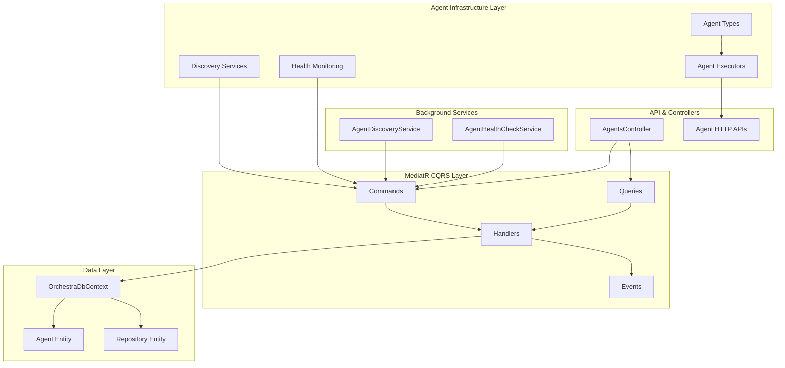
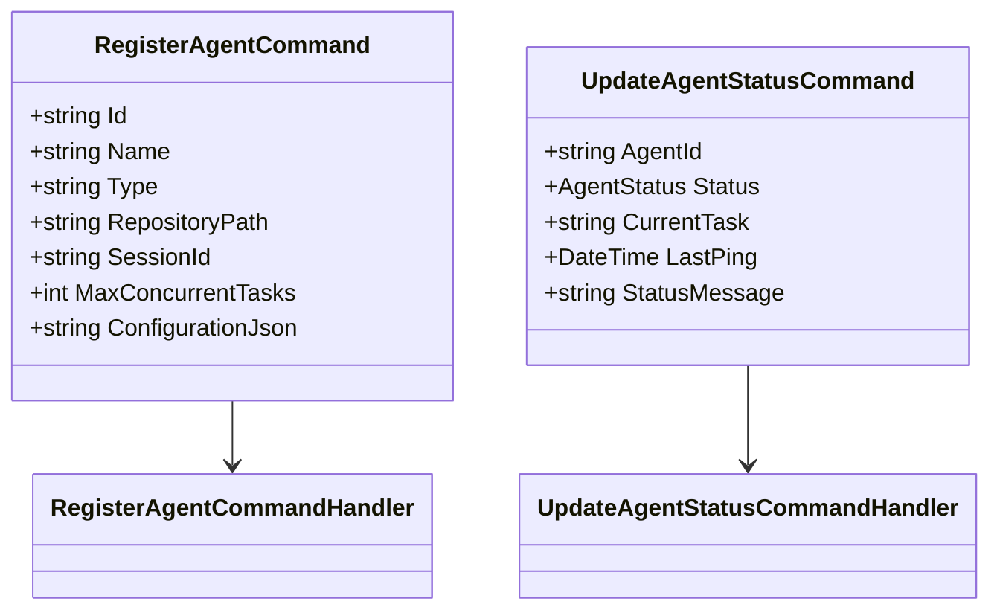
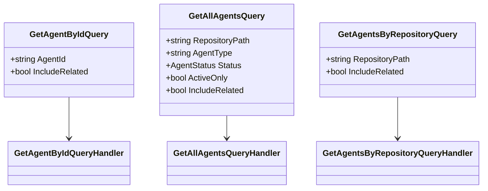
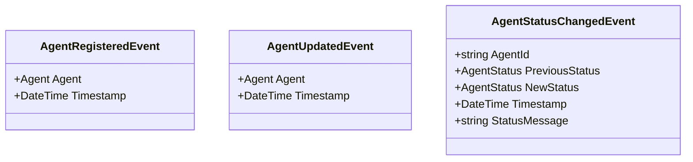
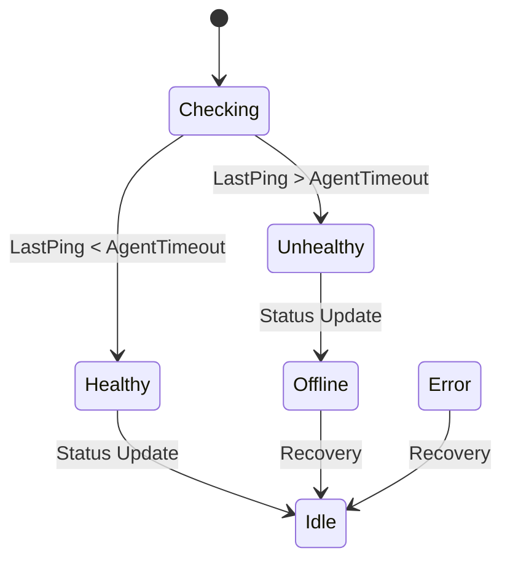
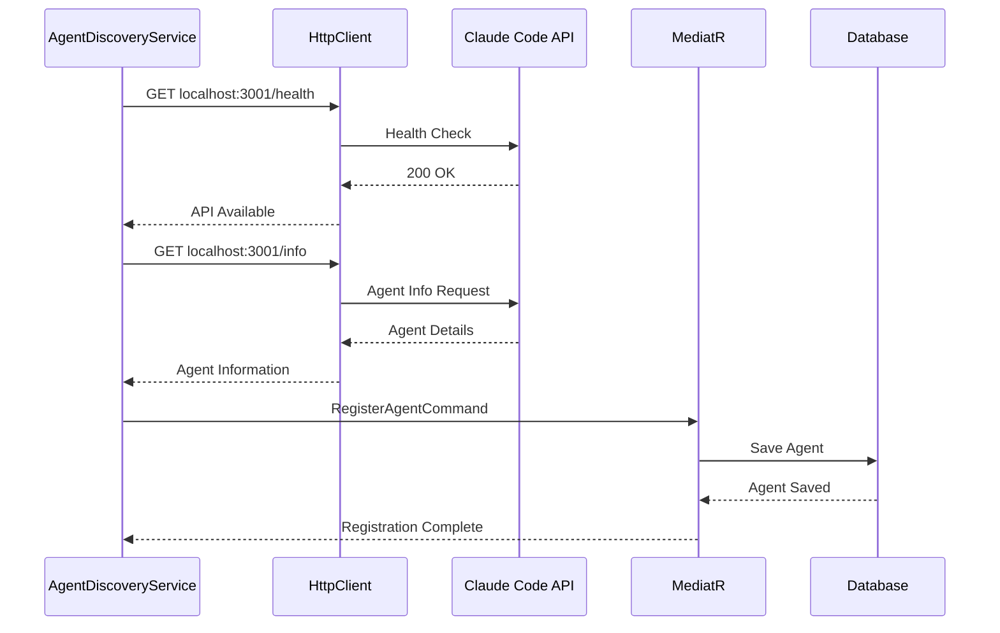
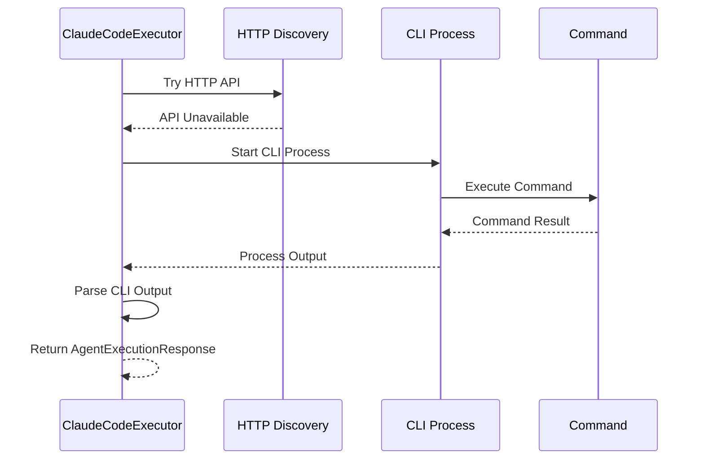
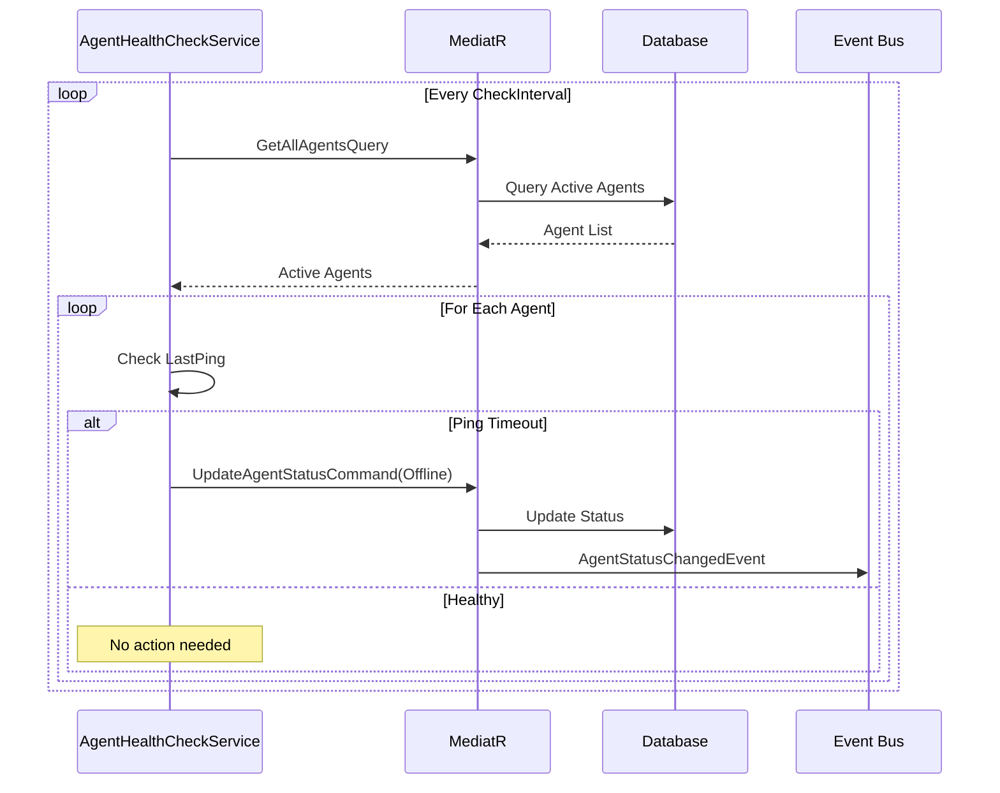
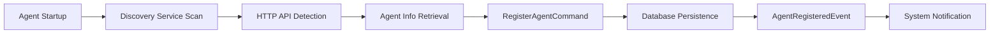
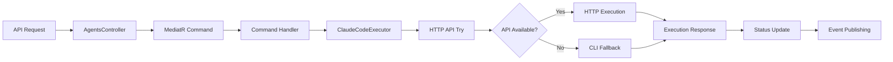

# Phase 2 Agent Infrastructure Architecture
**Document Type**: Planned Architecture
**Plan Reference**: [Phase 2 Agent Infrastructure Integration](../../plans/phase2-agent-infrastructure.md)
**Last Updated**: 2025-09-27
**Status**: Implemented
**Implementation**: [Phase 2 Agent Infrastructure Implementation](../Actual/phase2-agent-infrastructure-implementation.md)

## Executive Summary

Phase 2 implements a comprehensive agent infrastructure for AI Agent Orchestra, providing automated agent discovery, registration, health monitoring, and command execution through a unified MediatR CQRS architecture. The system supports multiple agent types with intelligent HTTP API discovery and CLI fallback mechanisms.

## High-Level Architecture



## Core Components

### 1. Agent Execution Layer

#### ClaudeCodeExecutor
**Type**: Planned Implementation
**Purpose**: Execute commands on Claude Code agents with HTTP/CLI fallback
**Interface**: `IAgentExecutor`

```csharp
public interface IAgentExecutor
{
    string AgentType { get; }
    Task<AgentExecutionResponse> ExecuteCommandAsync(
        string command,
        string workingDirectory,
        CancellationToken cancellationToken = default);
}
```

**Key Features**:
- **Dual Execution Model**: HTTP API primary, CLI fallback
- **Port Discovery**: Scans ports 3001, 3000, 8080, 55001
- **Concurrency Control**: SemaphoreSlim(3,3) for execution limiting
- **Error Handling**: Comprehensive exception management
- **Metadata Tracking**: Execution method, timing, configuration

### 2. MediatR CQRS Architecture

#### Commands


#### Queries


#### Events


### 3. Background Services

#### AgentDiscoveryService
**Type**: Planned Background Service
**Purpose**: Automatic agent discovery and registration

**Discovery Mechanisms**:
1. **HTTP API Discovery**: Claude Code port scanning
2. **Process Discovery**: System process detection
3. **Copilot Discovery**: VS Code extension detection

**Configuration**:
```csharp
public class AgentDiscoveryOptions
{
    public TimeSpan ScanInterval { get; set; } = TimeSpan.FromMinutes(2);
    public TimeSpan StartupDelay { get; set; } = TimeSpan.FromSeconds(10);
    public TimeSpan ConnectionTimeout { get; set; } = TimeSpan.FromSeconds(5);
    public int[] ClaudeCodePorts { get; set; } = { 3001, 3000, 8080, 55001 };
    public bool EnableProcessScanning { get; set; } = true;
    public string[] ProcessNamesToScan { get; set; } = { "claude", "claude-desktop", "code", "cursor" };
}
```

#### AgentHealthCheckService
**Type**: Planned Background Service
**Purpose**: Monitor agent health and status transitions

**Health Check Logic**:


### 4. Data Model

#### Agent Entity
**Type**: Planned Entity
**Purpose**: Core agent representation in system

```csharp
public class Agent : ITimestamped
{
    public string Id { get; set; }                    // Unique identifier
    public string Name { get; set; }                  // Display name
    public string Type { get; set; }                  // Agent type (claude-code, copilot, etc.)
    public string RepositoryPath { get; set; }        // Working repository
    public AgentStatus Status { get; set; }           // Current status
    public DateTime LastPing { get; set; }            // Last activity
    public string? CurrentTask { get; set; }          // Active task
    public string? SessionId { get; set; }            // Session identifier
    public int MaxConcurrentTasks { get; set; }       // Concurrency limit
    public string? ConfigurationJson { get; set; }    // Agent configuration

    // Performance Metrics
    public int TotalTasksCompleted { get; set; }
    public int TotalTasksFailed { get; set; }
    public TimeSpan TotalExecutionTime { get; set; }
    public double AverageExecutionTime { get; set; }

    // Navigation Properties
    public Repository? Repository { get; set; }
    public ICollection<TaskRecord> AssignedTasks { get; set; }
    public ICollection<PerformanceMetric> PerformanceMetrics { get; set; }
}
```

#### AgentStatus Enumeration
**Type**: Planned Enumeration
**Purpose**: Unified agent status management

```csharp
public enum AgentStatus
{
    Unknown = 0,    // Initial/unknown state
    Idle = 1,       // Ready for work
    Busy = 2,       // Executing task
    Offline = 3,    // Not responding
    Error = 4       // Error state
}
```

## Integration Patterns

### 1. HTTP API Discovery Pattern



### 2. CLI Fallback Pattern



### 3. Health Monitoring Pattern



## Component Interactions

### Agent Registration Flow


### Command Execution Flow


## Configuration Architecture

### Service Registration
```csharp
// Background Services
services.AddHostedService<AgentDiscoveryService>();
services.AddHostedService<AgentHealthCheckService>();

// Configuration Options
services.Configure<AgentDiscoveryOptions>(configuration.GetSection("AgentDiscovery"));
services.Configure<AgentHealthCheckOptions>(configuration.GetSection("AgentHealthCheck"));
services.Configure<ClaudeCodeConfiguration>(configuration.GetSection("ClaudeCode"));

// Agent Executors
services.AddScoped<IAgentExecutor, ClaudeCodeExecutor>();

// MediatR Registration
services.AddMediatR(typeof(RegisterAgentCommand).Assembly);
```

### Configuration Schema
```json
{
  "AgentDiscovery": {
    "ScanInterval": "00:02:00",
    "StartupDelay": "00:00:10",
    "ConnectionTimeout": "00:00:05",
    "ClaudeCodePorts": [3001, 3000, 8080, 55001],
    "EnableProcessScanning": true,
    "ProcessNamesToScan": ["claude", "claude-desktop", "code", "cursor"]
  },
  "AgentHealthCheck": {
    "CheckInterval": "00:01:00",
    "AgentTimeout": "00:05:00",
    "RecoveryTimeout": "00:02:00",
    "EnableVerboseLogging": false
  },
  "ClaudeCode": {
    "DefaultCliPath": "claude",
    "DefaultTimeout": "00:05:00",
    "OutputFormat": "json",
    "EnableVerboseLogging": false
  }
}
```

## Performance Requirements

### Discovery Performance
- **Agent Discovery**: Complete scan in <10 seconds
- **Registration**: New agent registration in <2 seconds
- **Health Check**: All agents checked in <30 seconds

### Execution Performance
- **HTTP API**: Command execution in <5 seconds
- **CLI Fallback**: Command execution in <15 seconds
- **Concurrent Execution**: Support up to 3 simultaneous executions

### Memory and Resources
- **Background Services**: <50MB RAM footprint
- **Database Connections**: Efficient connection pooling
- **Event Publishing**: Asynchronous event handling

## Security Considerations

### Agent Authentication
- **Agent Identity**: Unique ID generation and validation
- **Session Management**: Secure session token handling
- **Repository Access**: Path validation and sandboxing

### Communication Security
- **HTTP API**: Local network communication only
- **CLI Execution**: Process isolation and timeout controls
- **Data Validation**: Input sanitization and validation

## Extensibility Points

### New Agent Types
1. Implement `IAgentExecutor` interface
2. Add agent type to discovery service
3. Configure agent-specific settings
4. Register in DI container

### Custom Discovery Mechanisms
1. Extend `AgentDiscoveryService`
2. Add new discovery method
3. Configure discovery options
4. Update background service registration

### Event Handling Extensions
1. Implement `INotificationHandler<TEvent>`
2. Register event handler in DI
3. Configure event-specific logic
4. Enable/disable via configuration

## Quality Attributes

### Reliability
- **Error Handling**: Comprehensive exception management
- **Retry Logic**: Built-in retry mechanisms for transient failures
- **Graceful Degradation**: CLI fallback for HTTP API failures

### Maintainability
- **Separation of Concerns**: Clear layer separation
- **SOLID Principles**: Interface-based design
- **Testability**: Dependency injection throughout

### Performance
- **Async Operations**: Non-blocking service operations
- **Concurrency Control**: Proper semaphore usage
- **Resource Management**: Efficient disposal patterns

### Scalability
- **Background Services**: Scalable service architecture
- **Database Design**: Optimized entity relationships
- **Event-Driven**: Decoupled event publishing

## Migration Strategy

### Phase 2 Implementation Steps
1. **Core Infrastructure**: Agent entity and status enum
2. **MediatR Commands**: Registration and status management
3. **Background Services**: Discovery and health monitoring
4. **API Controllers**: Agent management endpoints
5. **Integration Testing**: End-to-end validation

### Deployment Considerations
- **Database Migrations**: Agent table creation
- **Service Registration**: Background service startup
- **Configuration**: Environment-specific settings
- **Monitoring**: Health check endpoints

## Success Criteria

### Functional Requirements
- ✅ **Agent Discovery**: Automatic detection of Claude Code agents
- ✅ **Agent Registration**: Successful agent registration via MediatR
- ✅ **Status Monitoring**: Real-time agent status tracking
- ✅ **Command Execution**: HTTP API with CLI fallback
- ✅ **Event Publishing**: Agent state change notifications

### Technical Requirements
- ✅ **CQRS Architecture**: Clean command/query separation
- ✅ **Background Services**: Reliable service execution
- ✅ **Database Integration**: Proper entity relationships
- ✅ **API Design**: RESTful agent management endpoints
- ✅ **Error Handling**: Comprehensive exception management

### Quality Requirements
- ✅ **Performance**: Sub-second response times
- ✅ **Reliability**: 99% uptime for background services
- ✅ **Maintainability**: Clean, testable architecture
- ✅ **Extensibility**: Easy addition of new agent types

---

**Implementation Reference**: [Phase 2 Agent Infrastructure Implementation](../Actual/phase2-agent-infrastructure-implementation.md)
**Integration Points**: [Agent Infrastructure Integration Diagrams](../Sync/phase2-agent-infrastructure-integration.md)
**Code References**: [Phase 2 Agent Infrastructure Code Index](../Actual/phase2-agent-infrastructure-code-index.md)