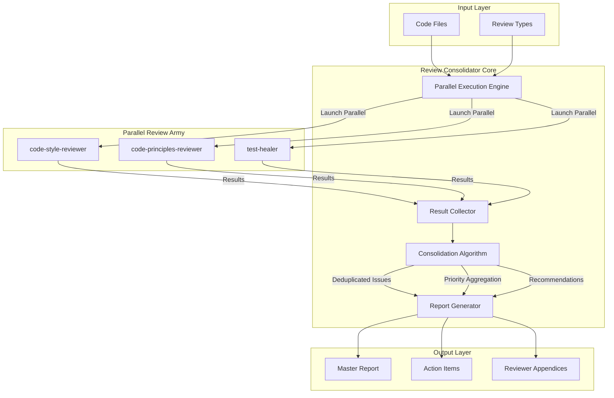
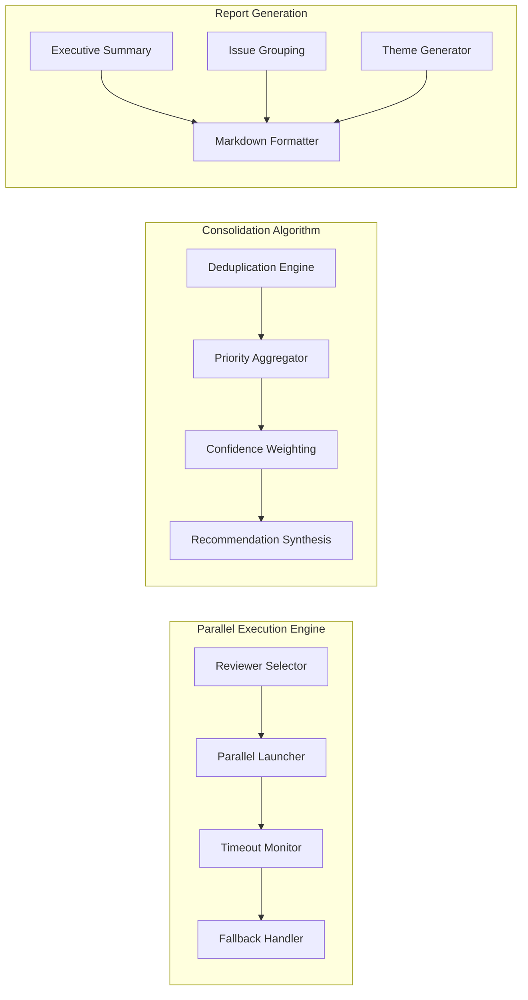
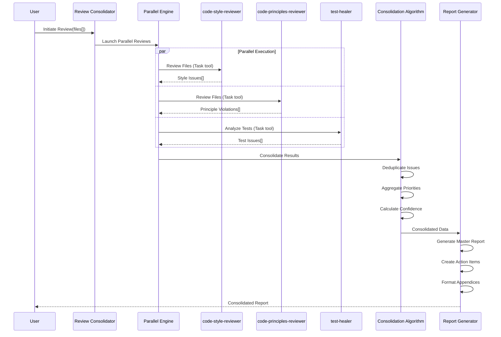
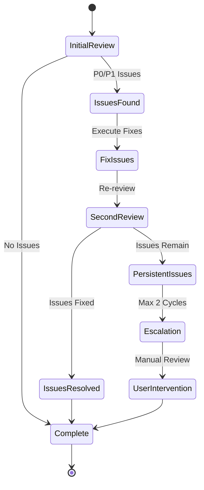
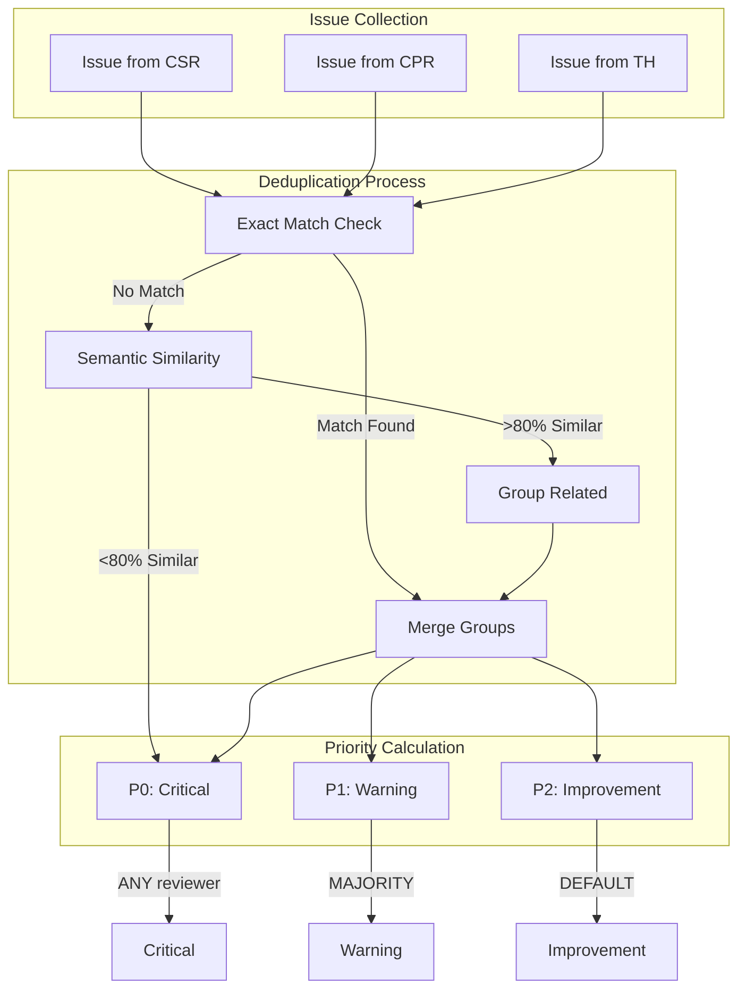
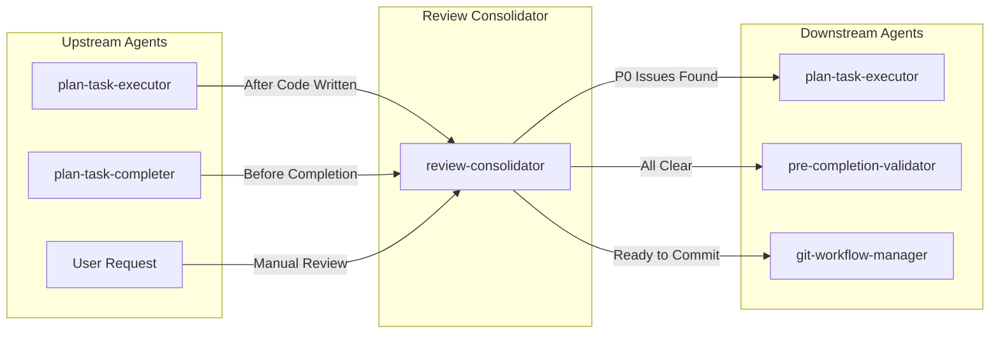
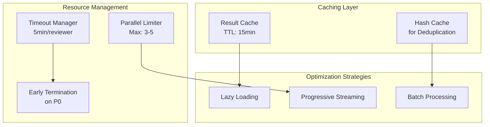
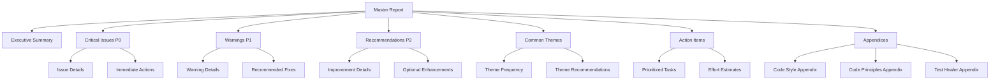
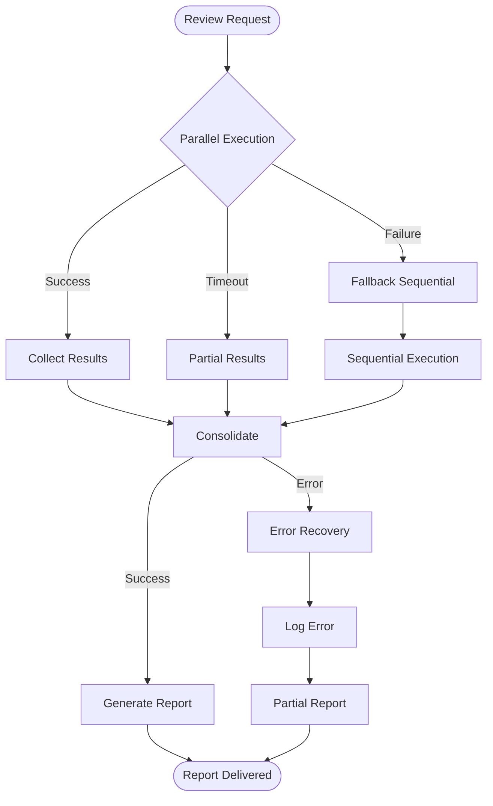

# Review Consolidator - Architecture Diagram

## High-Level Architecture

## Detailed Component Architecture

## Data Flow Architecture

## Cycle Protection Architecture

## Issue Deduplication Flow

## Integration Points

## Performance Optimization Architecture

## Report Structure Hierarchy

## Dependencies Between Plan Sections

### Phase Dependencies
- Phase 1 (Foundation) → Phase 2 (Parallel Execution): Agent specs required for implementation
- Phase 2 → Phase 3 (Consolidation): Need results to consolidate
- Phase 3 → Phase 4 (Report Generation): Consolidated data required for reporting
- Phase 4 → Phase 5 (Cycle Protection): Report format needed for cycle tracking
- Phase 5 → Phase 6 (Testing): Complete system needed for integration tests

### Cross-Component Dependencies
- Parallel Execution Engine ← Individual Reviewer Specifications
- Consolidation Algorithm ← Result Collection Framework
- Report Generator ← Consolidation Algorithm + Report Templates
- Cycle Protection ← All Core Components

### External Dependencies
- Task tool (Claude Code infrastructure)
- Existing review rules (*.mdc files)
- AGENTS_ARCHITECTURE.md standards
- common-plan-generator.mdc guidelines

## Error Handling & Recovery

## Scalability Considerations

### Current Design (v1.0)
- **Files**: Up to 100 files per review
- **Reviewers**: 3-5 parallel reviewers
- **Issues**: Up to 1000 issues before consolidation
- **Performance**: <6 minutes total review time

### Future Scalability (v2.0)
- **Files**: 1000+ files with progressive loading
- **Reviewers**: 10+ with queue management
- **Issues**: 10,000+ with streaming consolidation
- **Performance**: <10 minutes with caching

### Bottleneck Mitigation
- Parallel execution prevents sequential bottleneck
- Caching reduces repeated analysis
- Early termination on critical issues
- Progressive report streaming for large results