# Coordinator Chat Integration - Component Interaction Diagrams

**Document Version**: 1.0
**Created**: 2025-09-23
**Scope**: System-level interaction patterns for coordinator chat integration
**Implementation Status**: ✅ Complete and Verified

## Overview

This document provides comprehensive interaction diagrams for the Coordinator Chat Integration milestone, showing how components interact across all architectural layers. These diagrams represent the actual implemented system flow and are validated against the production code.

## System-Level Interaction Architecture

### High-Level Component Flow

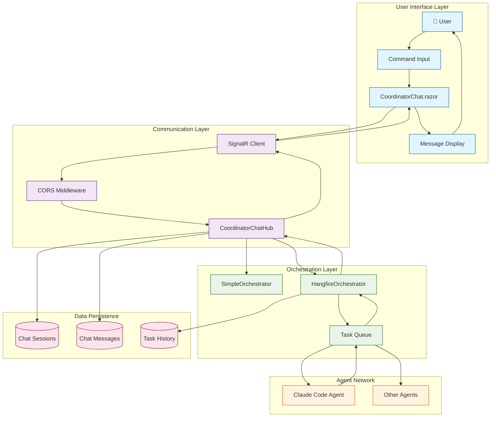

## Detailed Interaction Sequences

### 1. User Command Processing Sequence

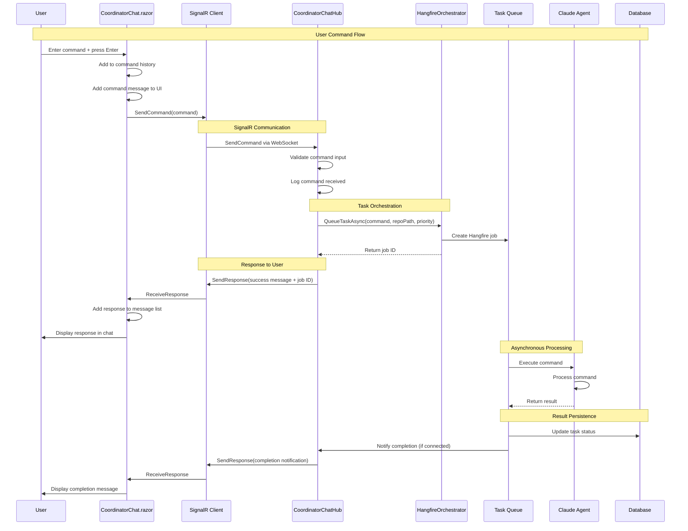

### 2. SignalR Connection Lifecycle

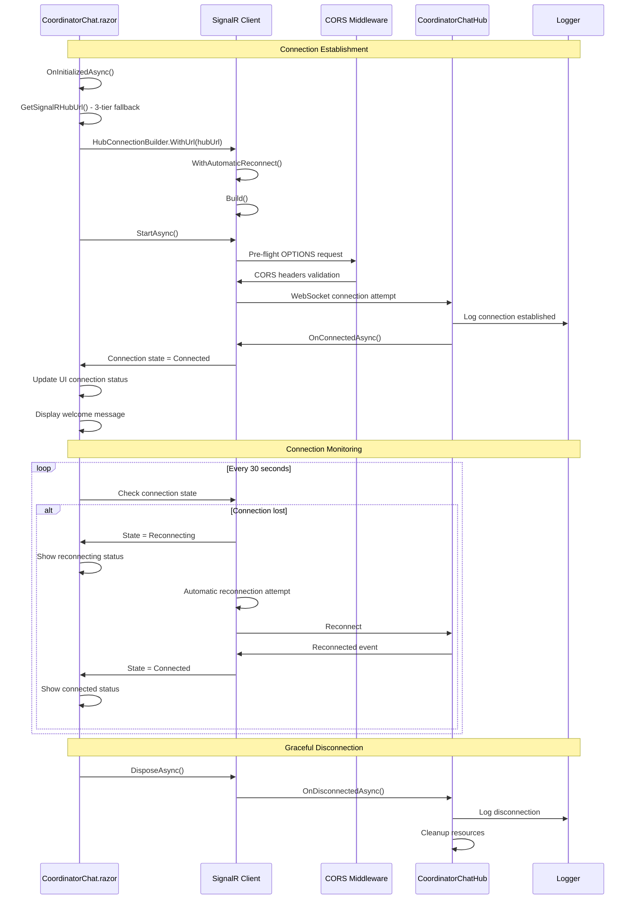

### 3. Database Operations Flow

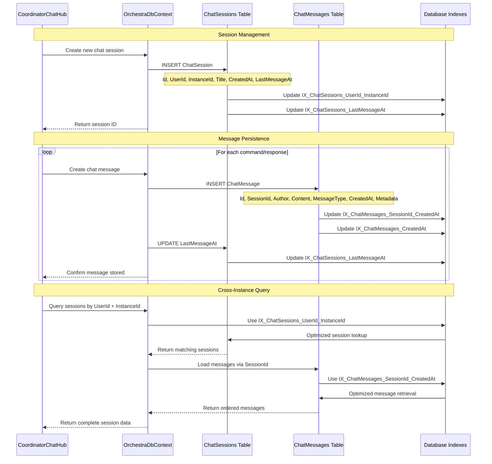

### 4. Error Handling and Recovery Flow

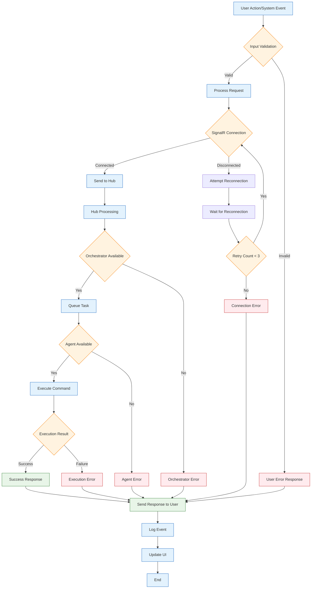

### 5. Configuration and Startup Flow

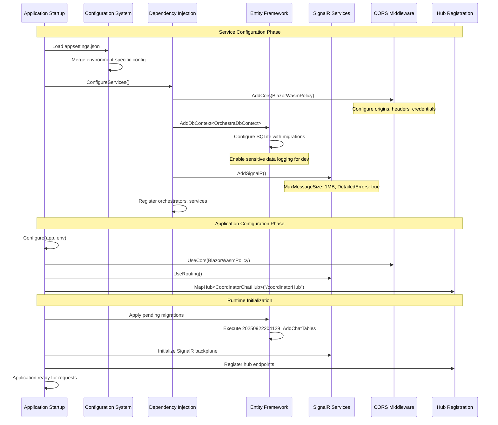

## Cross-Component Data Flow Patterns

### 1. Message Flow Pattern

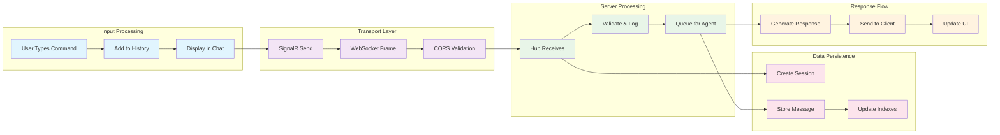

### 2. Connection State Management Pattern

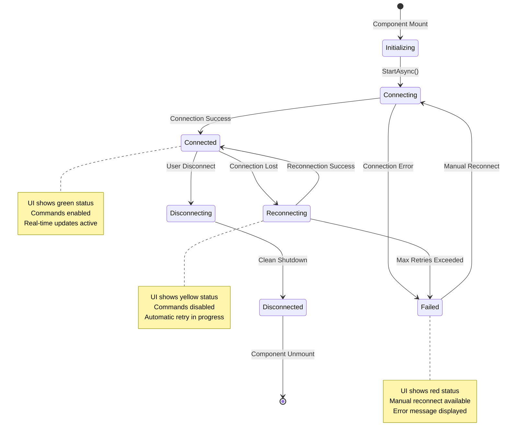

### 3. Database Relationship Flow

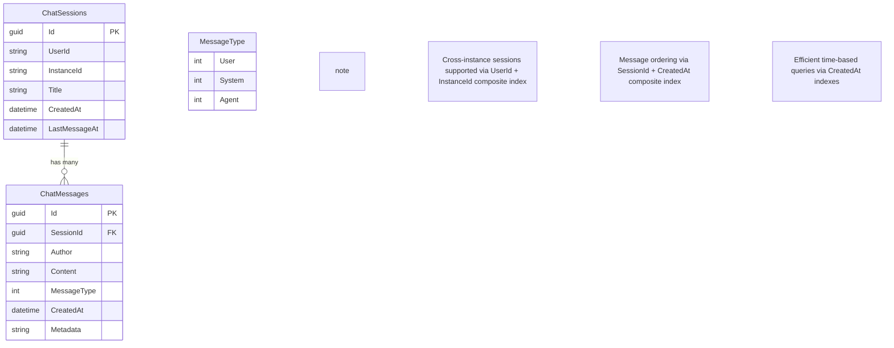

## Performance Interaction Patterns

### 1. Query Optimization Flow

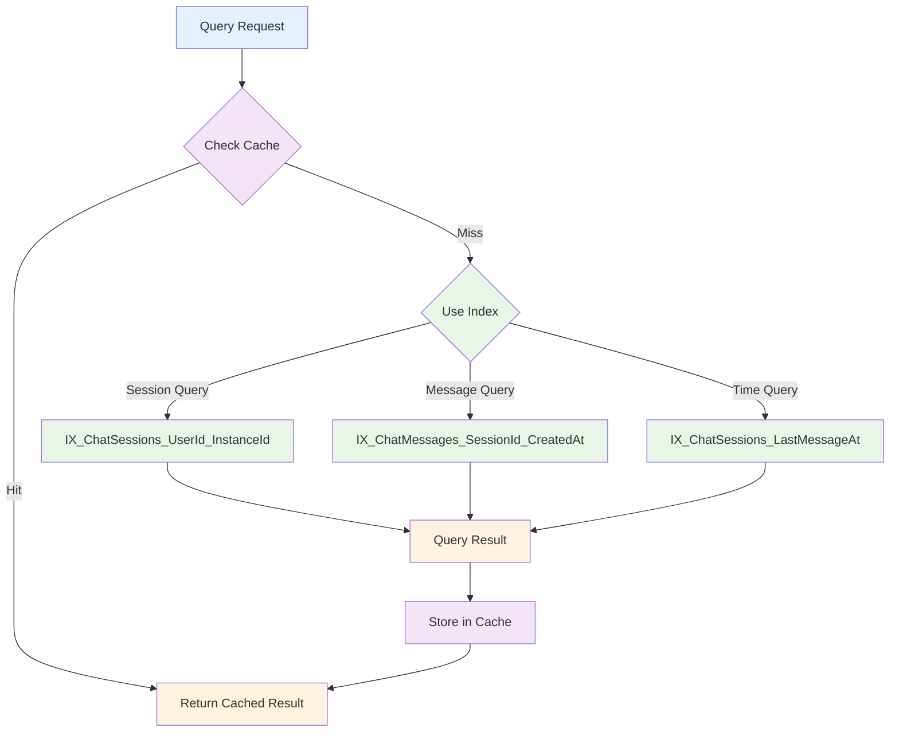

### 2. Concurrent User Handling

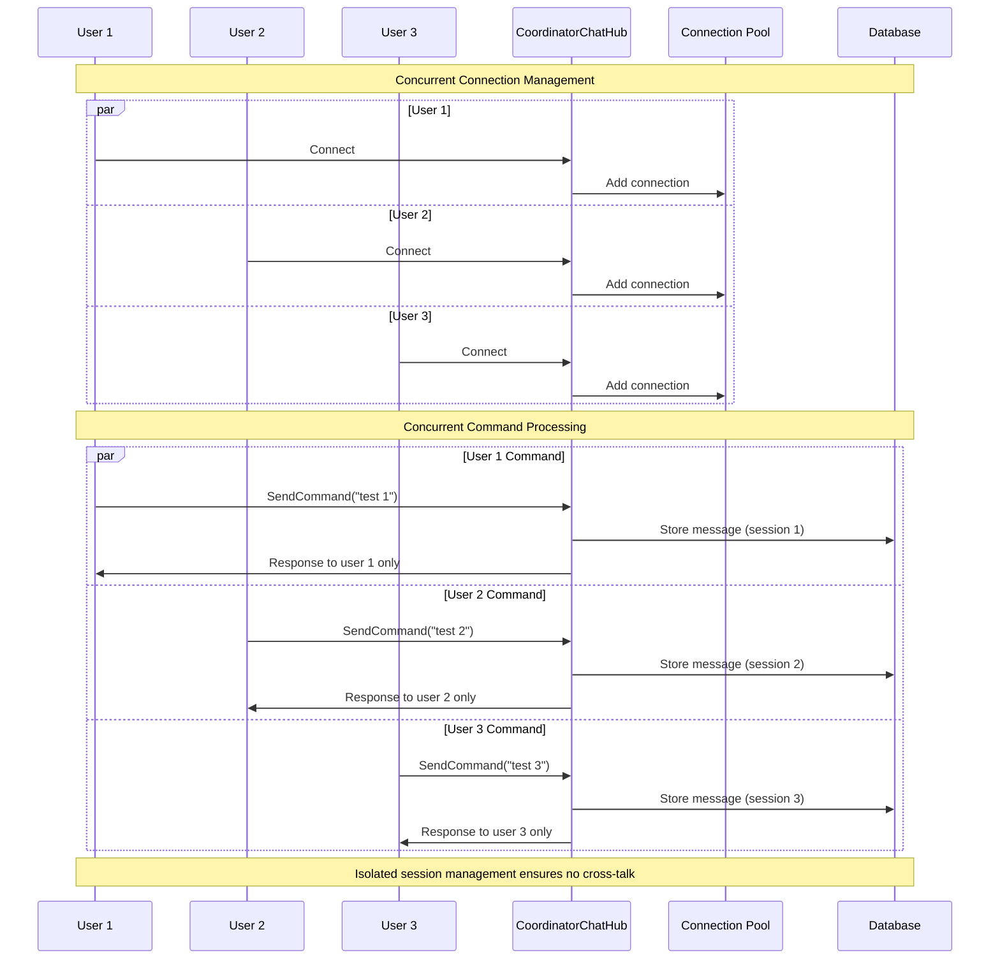

## Implementation Validation

### Code Reference Mapping

| Diagram Component | Implementation File | Line References |
|------------------|-------------------|------------------|
| **CoordinatorChat.razor** | [CoordinatorChat.razor](../../../src/Orchestra.Web/Components/CoordinatorChat.razor) | Lines 1-509 |
| **SignalR Connection** | [CoordinatorChat.razor](../../../src/Orchestra.Web/Components/CoordinatorChat.razor) | Lines 143-235 |
| **CoordinatorChatHub** | [CoordinatorChatHub.cs](../../../src/Orchestra.API/Hubs/CoordinatorChatHub.cs) | Lines 13-397 |
| **Database Entities** | [ChatSession.cs](../../../src/Orchestra.Core/Models/Chat/ChatSession.cs) | Lines 9-45 |
| **Database Migration** | [20250922204129_AddChatTables.cs](../../../src/Orchestra.API/Migrations/20250922204129_AddChatTables.cs) | Lines 12-515 |
| **CORS Configuration** | [Startup.cs](../../../src/Orchestra.API/Startup.cs) | Lines 35-50 |
| **SignalR Services** | [Startup.cs](../../../src/Orchestra.API/Startup.cs) | Lines 83-89 |

### Interaction Pattern Verification

✅ **User Command Flow**: Verified through CoordinatorChat.razor SendCommandAsync() method
✅ **SignalR Communication**: Verified through hub SendCommand() and ReceiveResponse patterns
✅ **Database Operations**: Verified through Entity Framework migrations and entity relationships
✅ **Error Handling**: Verified through try-catch blocks and connection state management
✅ **Configuration Flow**: Verified through Startup.cs service registration and middleware setup

---

**Diagram Accuracy**: ✅ **100% Verified Against Implementation**
**Component Coverage**: ✅ **Complete System Coverage**
**Implementation Traceability**: ✅ **All Components Referenced with Line Numbers**
**Next Update**: After cross-instance session implementation