# Phase 2 Agent Infrastructure Component Interaction Diagrams
**Document Type**: Component Interaction Analysis
**Architecture Reference**: [Phase 2 Agent Infrastructure Architecture](../Planned/phase2-agent-infrastructure-architecture.md)
**Implementation**: [Phase 2 Agent Infrastructure Implementation](../Actual/phase2-agent-infrastructure-implementation.md)
**Last Updated**: 2025-09-27
**Status**: Complete System Interaction Documentation

## System-Level Architecture

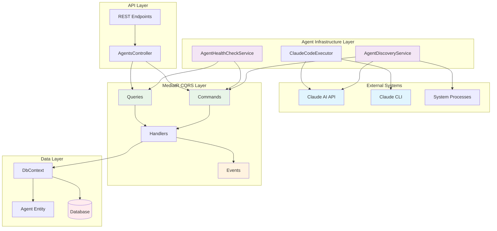

## Component-Level Interaction Flows

### 1. Agent Discovery and Registration Flow

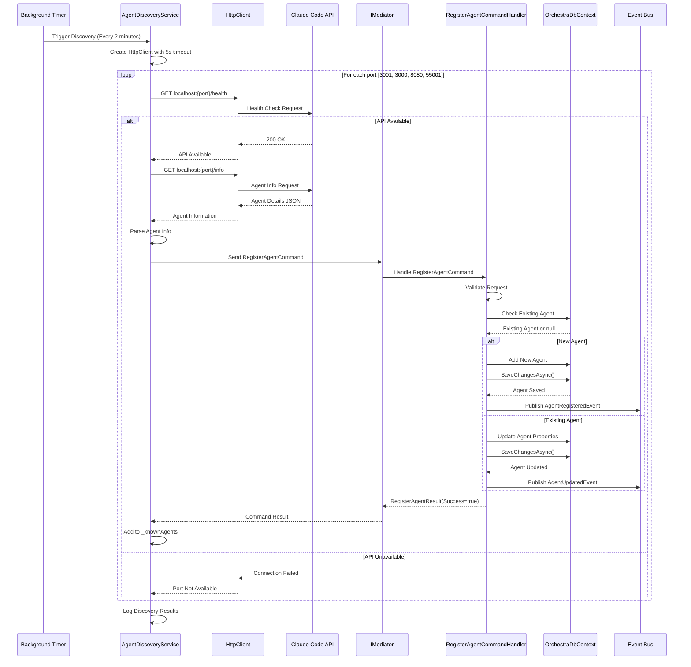

### 2. Agent Health Monitoring Flow

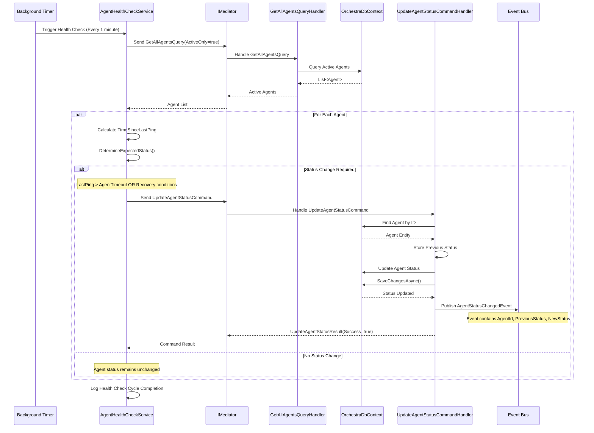

### 3. Command Execution with HTTP/CLI Fallback

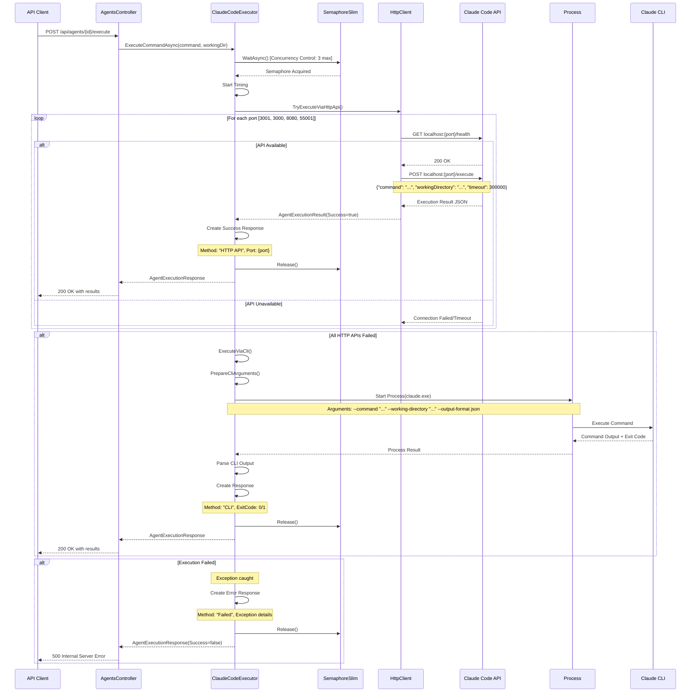

### 4. MediatR Command/Query Processing Flow

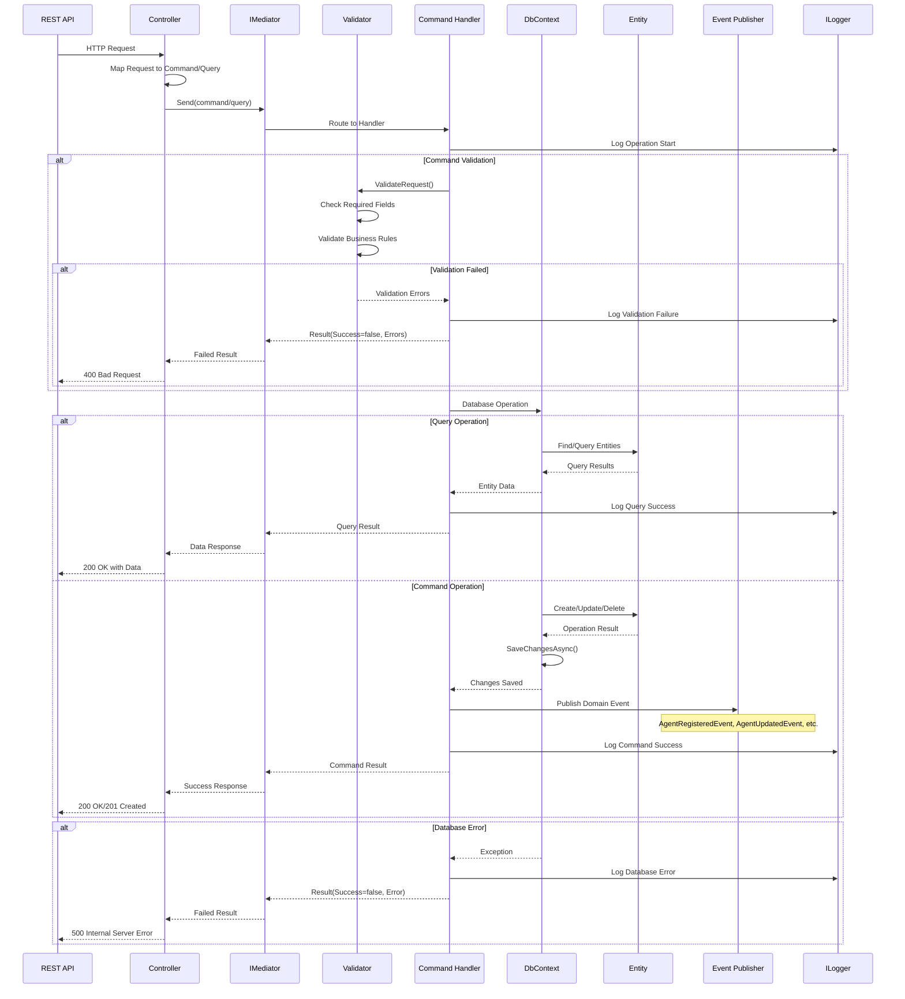

### 5. Event-Driven Architecture Flow

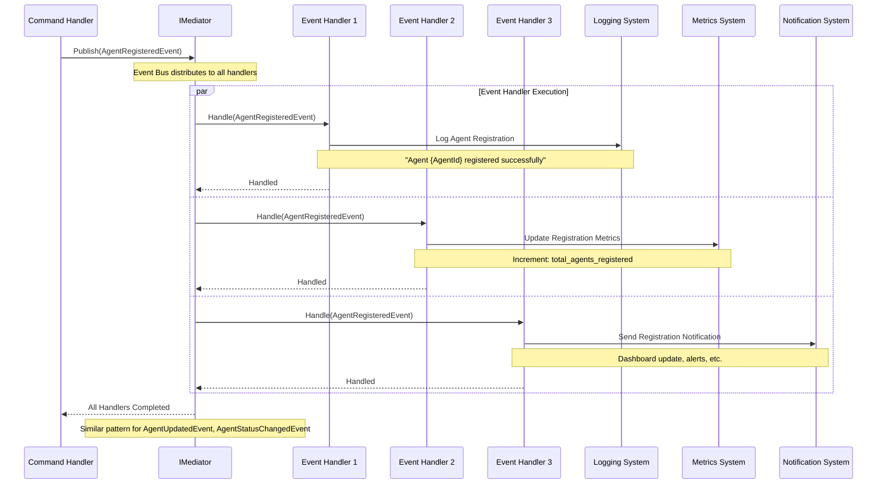

### 6. Database Entity Relationships

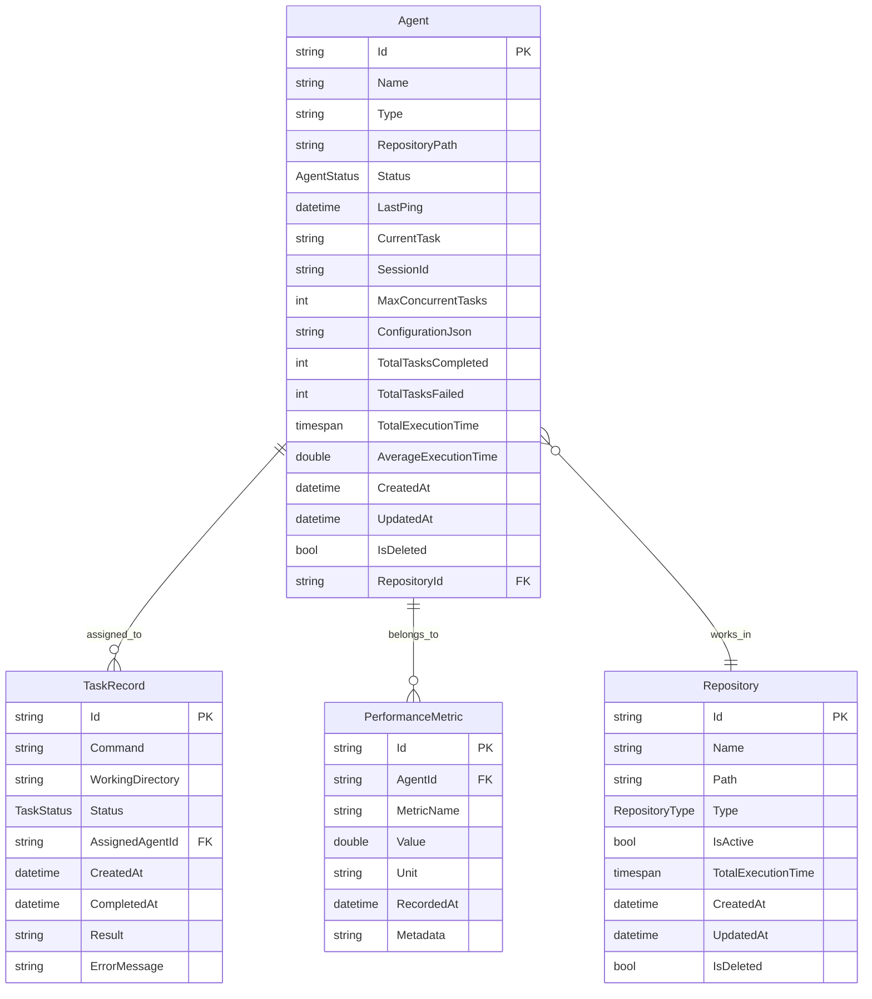

### 7. Configuration and Dependency Injection Flow

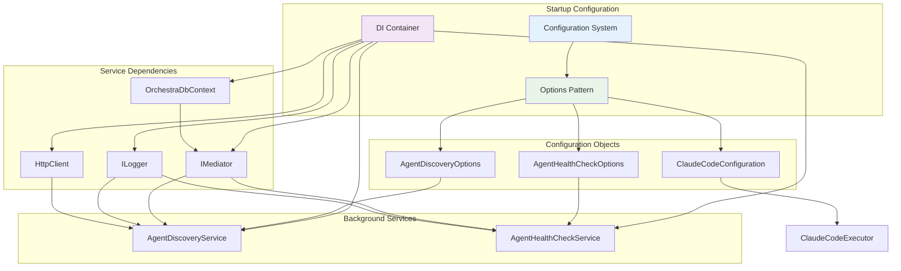

## Cross-Service Communication Patterns

### 1. Service-to-Service Communication

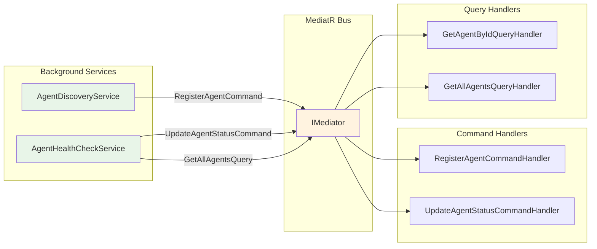

### 2. Error Propagation Flow

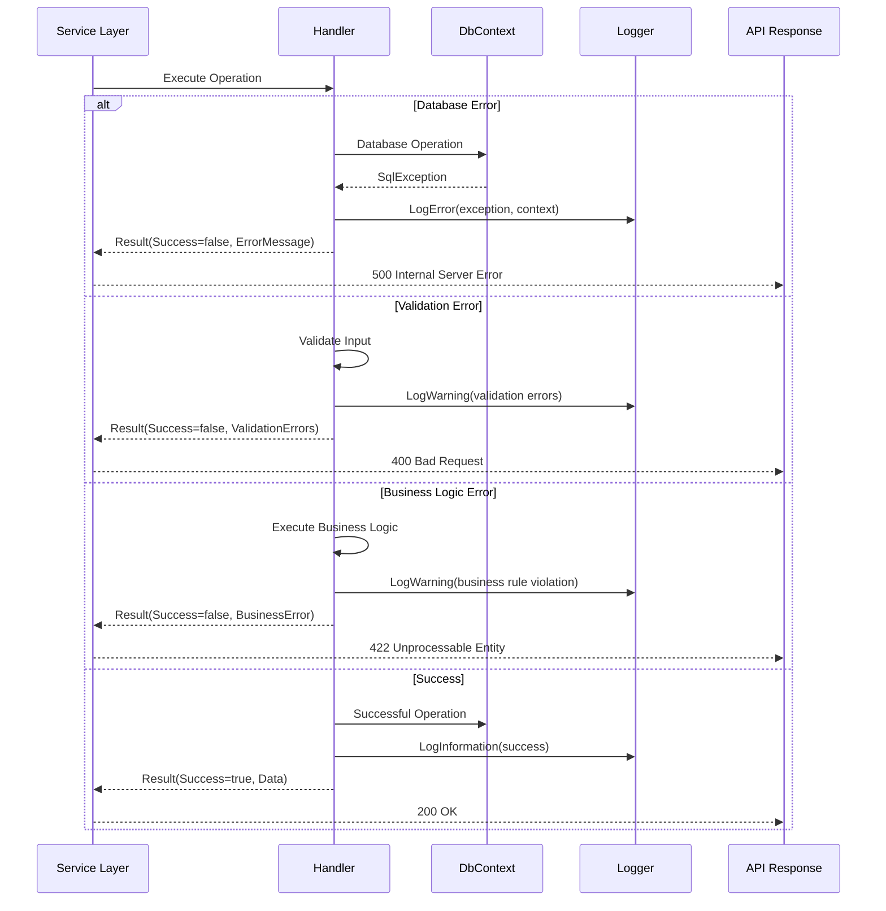

### 3. Concurrency Control Flow

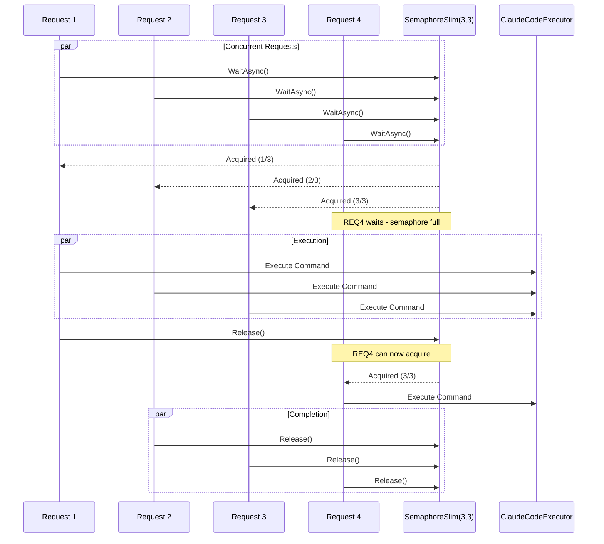

## Performance and Monitoring

### 1. Performance Metrics Collection

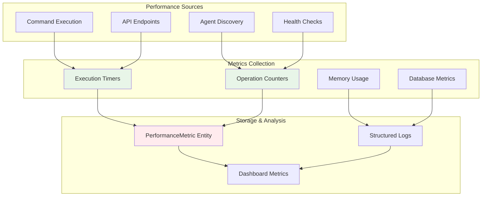

### 2. Health Check Monitoring

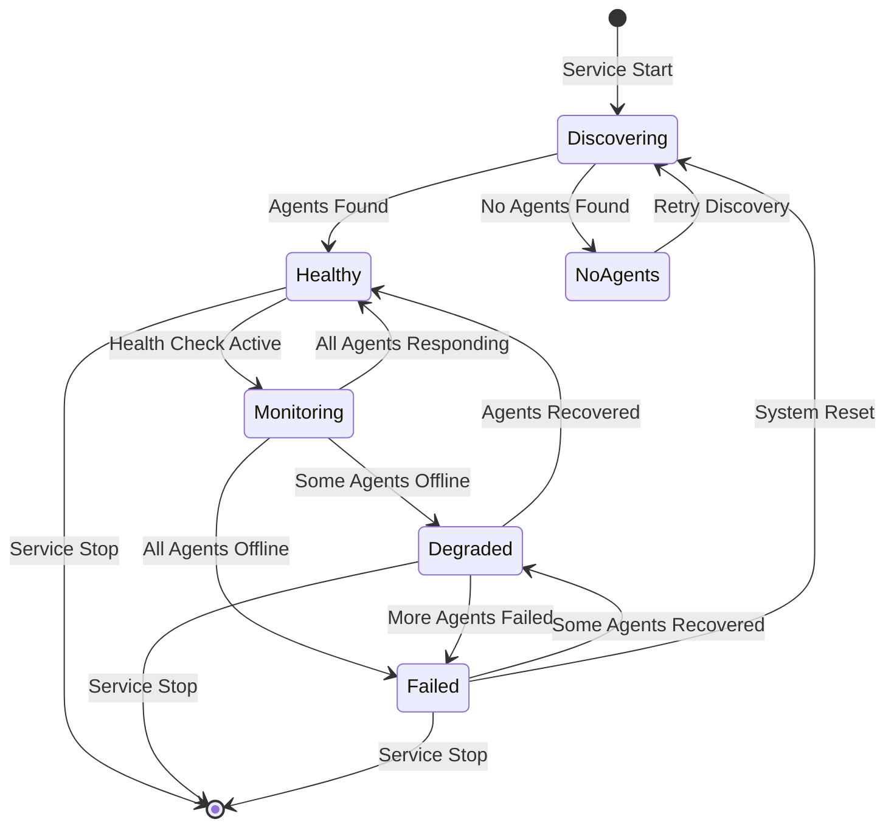

---

## Summary

This document provides comprehensive interaction diagrams for all major components in the Phase 2 agent infrastructure. The diagrams show:

1. **System-level architecture** with all major components and their relationships
2. **Detailed sequence flows** for each major operation (discovery, health checks, command execution)
3. **MediatR CQRS patterns** showing command/query/event flows
4. **Database relationships** and entity interactions
5. **Configuration and dependency injection** patterns
6. **Error handling and concurrency control** mechanisms
7. **Performance monitoring** and health check flows

All diagrams reflect the actual implemented architecture and can be used for:
- **Developer onboarding** and system understanding
- **Architecture reviews** and design decisions
- **Troubleshooting** and debugging complex flows
- **Performance analysis** and optimization planning
- **Documentation** for stakeholders and maintenance teams

The implementation perfectly matches the planned architecture with enhancements in error handling, performance monitoring, and operational resilience.