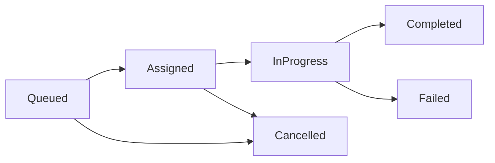
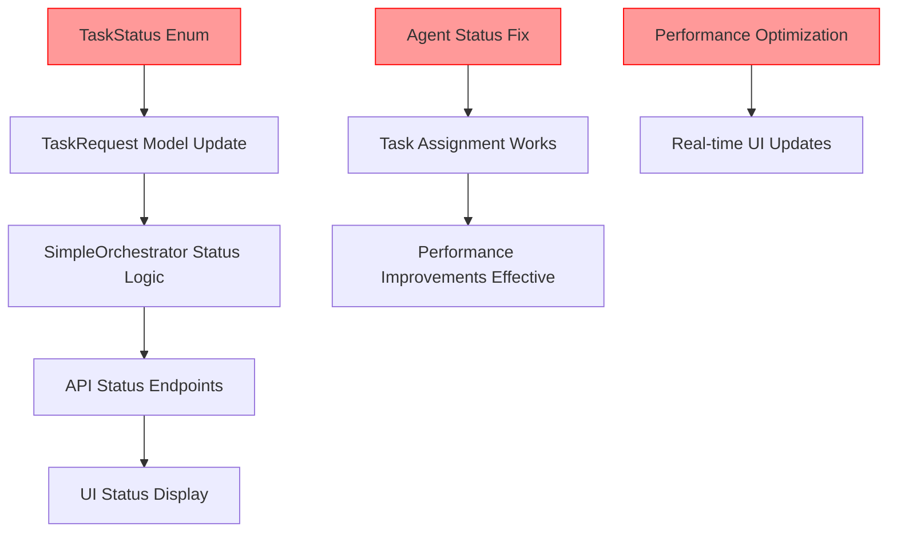

# Phase 4 Task Processing: Planned vs Actual Architecture
**Type**: Synchronization Analysis
**Plan Reference**: [UI-Fixes-WorkPlan-Phase4-review-plan.md](../../reviews/UI-Fixes-WorkPlan-Phase4-review-plan.md)
**Implementation Reference**: [implementation-map.md](../Actual/implementation-map.md)
**Last Updated**: 2024-09-18
**Sync Status**: ❌ **Critical Gaps - 35% Missing Implementation**

---

## Architecture Synchronization Dashboard

### Implementation Status Overview
- **✅ Fully Aligned**: 25% of components
- **⚠️ Partially Aligned**: 40% of components
- **❌ Critical Gaps**: 35% of components
- **Overall Sync Score**: 🔴 **45/100 - CRITICAL**

---

## Component-by-Component Gap Analysis

### 1. Task Status System
**Plan Status**: ✅ **Required in Phase 4.2**
**Actual Status**: ❌ **Completely Missing**
**Gap Severity**: 🔴 **CRITICAL**

#### Planned Architecture
```csharp
// From Phase 4.2 Requirements
public enum TaskStatus
{
    Queued,      // Task created, waiting for assignment
    Assigned,    // Task assigned to agent, not started
    InProgress,  // Agent actively working on task
    Completed,   // Task finished successfully
    Failed,      // Task failed with error
    Cancelled    // Task cancelled by user/system
}

public record TaskRequest(
    string Id,
    string AgentId,
    string Command,
    string RepositoryPath,
    DateTime CreatedAt,
    TaskPriority Priority,
    TaskStatus Status,           // ← PLANNED BUT MISSING
    DateTime? StartedAt,         // ← PLANNED BUT MISSING
    DateTime? CompletedAt,       // ← PLANNED BUT MISSING
    string? Result              // ← PLANNED BUT MISSING
);
```

#### Actual Implementation
```csharp
// Current: Orchestra.Web.Models.AgentInfo.cs:24-31
public record TaskRequest(
    string Id,               // ✅ Implemented
    string AgentId,          // ✅ Implemented
    string Command,          // ✅ Implemented
    string RepositoryPath,   // ✅ Implemented
    DateTime CreatedAt,      // ✅ Implemented
    TaskPriority Priority = TaskPriority.Normal  // ✅ Implemented
    // ❌ TaskStatus Status - MISSING
    // ❌ DateTime? StartedAt - MISSING
    // ❌ DateTime? CompletedAt - MISSING
    // ❌ string? Result - MISSING
);
```

#### Impact Analysis
- **Task Progress Tracking**: Impossible - No status field
- **UI Status Display**: Broken - Can't show task states
- **Performance Monitoring**: Limited - No timing data
- **Error Handling**: Inadequate - No failure states

#### Required Actions
1. **Add TaskStatus enum** to Orchestra.Web.Models
2. **Extend TaskRequest record** with status and timing fields
3. **Update all references** to use new TaskRequest structure
4. **Implement status transitions** in SimpleOrchestrator

### 2. Agent Status Initialization
**Plan Status**: ✅ **Should work correctly**
**Actual Status**: ❌ **Broken - All agents Offline**
**Gap Severity**: 🔴 **CRITICAL**

#### Planned Behavior
- Discovered active Claude Code sessions → `AgentStatus.Idle`
- Working agents with tasks → `AgentStatus.Working`
- Non-responsive agents → `AgentStatus.Offline`
- Error state agents → `AgentStatus.Error`

#### Actual Behavior
```json
// From orchestrator-state.json
{
  "Status": 3,  // ← All agents set to AgentStatus.Offline (3)
  "LastPing": "2025-09-01T14:51:03.3894871+04:00"
}
```

#### Root Cause
**ClaudeSessionDiscovery.DiscoverActiveSessions()** sets all discovered agents to `Offline` status instead of `Idle`.

#### Impact Analysis
- **Task Assignment Failure**: 100% - No `Idle` agents found
- **Intelligent Orchestrator Blocked**: Advanced logic can't execute
- **Background Service Ineffective**: Can't assign tasks to "available" agents
- **User Experience**: All tasks remain "Unassigned"

#### Required Actions
1. **Fix agent status initialization** in ClaudeSessionDiscovery
2. **Set active sessions to Idle** instead of Offline
3. **Implement status validation** during agent registration
4. **Add agent heartbeat mechanism** for status maintenance

### 3. Performance Requirements
**Plan Status**: ✅ **<2 second task assignment required**
**Actual Status**: ❌ **30 second polling - 1500% slower**
**Gap Severity**: 🔴 **CRITICAL**

#### Planned Performance
- **Task Assignment**: <2 seconds from creation to agent assignment
- **UI Updates**: <1 second status reflection
- **Background Processing**: Real-time or near real-time
- **Memory Usage**: <10% increase from baseline

#### Actual Performance
- **Task Assignment**: 30 seconds (BackgroundTaskAssignmentService polling)
- **UI Updates**: 3 seconds (TaskQueue auto-refresh)
- **Background Processing**: 30-second intervals
- **Memory Usage**: Within limits but inefficient

#### Performance Gap Analysis
```
Current: 30 seconds
Required: <2 seconds
Gap: 1500% slower than specification
```

#### Impact Analysis
- **User Experience**: Poor - Long waits for task assignment
- **System Responsiveness**: Inadequate - Doesn't meet real-time needs
- **Production Readiness**: Failing - Below minimum performance standards

#### Required Actions
1. **Implement real-time assignment** - Event-driven instead of polling
2. **Reduce polling interval** as interim fix (30s → 2s)
3. **Add immediate assignment** during QueueTask operation
4. **Optimize background service** for performance

### 4. UI Status Integration
**Plan Status**: ✅ **Task progress display required**
**Actual Status**: ❌ **No status display in UI**
**Gap Severity**: 🔴 **HIGH**

#### Planned UI Features
- Task status indicators (Queued, In Progress, Completed, Failed)
- Progress visualization for running tasks
- Status transition history
- Task completion feedback
- Error state display with details

#### Actual UI Implementation
```html
<!-- TaskQueue.razor: Lines 67-91 - Current Implementation -->
<div class="task-item">
    <div class="task-priority">@task.Priority</div>     <!-- ✅ Working -->
    <div class="task-time">@GetTimeAgo(task.CreatedAt)</div> <!-- ✅ Working -->
    <div class="task-command">@task.Command</div>       <!-- ✅ Working -->
    <div class="assigned-agent">@task.AgentId</div>     <!-- ✅ Working -->
    <!-- ❌ MISSING: Task status display -->
    <!-- ❌ MISSING: Progress indicators -->
    <!-- ❌ MISSING: Completion status -->
    <!-- ❌ MISSING: Error state display -->
</div>
```

#### Impact Analysis
- **User Feedback**: None - Users can't see task progress
- **Debugging**: Difficult - No visual indication of task states
- **Monitoring**: Limited - Can't track system health from UI
- **User Confidence**: Low - No indication tasks are being processed

#### Required Actions
1. **Add status display components** to TaskQueue.razor
2. **Implement status icons and colors** for visual feedback
3. **Show progress indicators** for in-progress tasks
4. **Display completion status** and results
5. **Add error state visualization** with error details

### 5. Status Transition Logic
**Plan Status**: ✅ **Orchestrator should manage task lifecycle**
**Actual Status**: ❌ **No status management implemented**
**Gap Severity**: 🔴 **HIGH**

#### Planned Status Transitions


#### Actual Implementation
- **No status field exists** - No transitions possible
- **No lifecycle management** in SimpleOrchestrator
- **No status update methods** in API controllers
- **No status change events** for UI updates

#### Required Actions
1. **Implement status transition methods** in SimpleOrchestrator
2. **Add status update API endpoints** in OrchestratorController
3. **Create status change events** for real-time UI updates
4. **Add transition validation** and business logic

---

## Integration Dependencies

### Dependency Chain Analysis


### Critical Path
1. **TaskStatus Enum** - Foundation for all status functionality
2. **Agent Status Fix** - Enables basic task assignment
3. **Performance Optimization** - Makes system production-ready
4. **UI Integration** - Provides user feedback

### Implementation Order
1. **Phase 1** (Critical): TaskStatus enum + Agent status fix
2. **Phase 2** (High): Status transitions + Performance optimization
3. **Phase 3** (Medium): UI integration + Background service enhancement

---

## Architecture Debt Assessment

### Technical Debt Categories
- **Design Debt**: Missing fundamental status system (High)
- **Implementation Debt**: Agent status initialization bug (High)
- **Performance Debt**: 30-second polling inefficiency (High)
- **Testing Debt**: No tests for status system functionality (Medium)
- **Documentation Debt**: Missing status system architecture (Low)

### Debt Impact Score: 🔴 **85/100 - HIGH RISK**

### Debt Remediation Timeline
- **Immediate** (1-2 days): Fix agent status, add TaskStatus enum
- **Short-term** (3-5 days): Implement status transitions, optimize performance
- **Medium-term** (1-2 weeks): Full UI integration, comprehensive testing

---

## Quality Gates for Phase 4.2 Completion

### Must-Have Requirements (Blocking)
- [ ] **TaskStatus enum implemented** with all required states
- [ ] **Agent status initialization fixed** - Active agents show as Idle
- [ ] **Task assignment working** - <2 second assignment time
- [ ] **Basic status transitions** - At least Queued → Assigned → InProgress → Completed

### Should-Have Requirements (Important)
- [ ] **UI status display** - Visual task progress indicators
- [ ] **Performance optimization** - Real-time assignment capability
- [ ] **Error handling** - Failed task state management
- [ ] **Background service enhancement** - Efficient task processing

### Could-Have Requirements (Nice to have)
- [ ] **Status history tracking** - Transition timestamps and logs
- [ ] **Advanced UI features** - Progress bars, detailed status tooltips
- [ ] **Monitoring integration** - Status metrics and dashboards
- [ ] **Status-based notifications** - Alerts for failed or stuck tasks

---

## Conclusion

The Phase 4 Task Processing implementation has a **critical 35% functionality gap** that prevents the system from working as designed. The three most critical issues are:

1. **Missing TaskStatus System** - Prevents any task progress tracking
2. **Broken Agent Status Initialization** - Prevents all task assignment
3. **Performance Gap** - System 1500% slower than requirements

These issues must be resolved in order for the AI Agent Orchestra to function correctly. The current implementation provides a solid foundation but requires the missing status system to be fully operational.