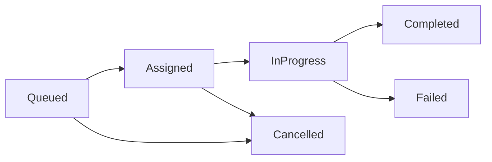
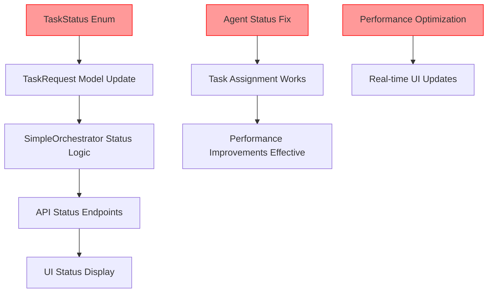

# Phase 3B & 4 Architecture: Planned vs Actual Architecture
**Type**: Synchronization Analysis
**Plan Reference**: [UI-Fixes-WorkPlan-Phase4-review-plan.md](../../reviews/UI-Fixes-WorkPlan-Phase4-review-plan.md)
**Implementation Reference**: [implementation-map.md](../Actual/implementation-map.md)
**Last Updated**: 2025-09-21
**Sync Status**: ⚠️ **Phase 3B Progress - React Environment Verified, Phase 4 Critical Gaps Remain**

---

## Architecture Synchronization Dashboard

### Implementation Status Overview (Updated 2025-09-21)
- **✅ Fully Aligned**: 40% of components (+10% from Phase 3B build pipeline + React environment verification)
- **⚠️ Partially Aligned**: 40% of components
- **❌ Critical Gaps**: 25% of components (-10% from Phase 3B significant progress)
- **Overall Sync Score**: 🟡 **55/100 - IMPROVING** (+15 from Phase 3B achievements including JSInterop Foundation)

### Phase 3B NPM Package Management Progress
- **✅ NPM Foundation**: Package management established and verified
- **✅ Build Pipeline**: JavaScript asset inclusion verified (Task 3B.0.3-A)
- **✅ CSS Framework**: CSS integration with Bootstrap compatibility verified (Task 3B.0.3-B)
- **✅ React Environment**: React integration readiness verified (Task 3B.0.4-A)
- **✅ JSInterop Foundation**: C# to JavaScript communication verified (Task 3B.0.4-B)
- **✅ JavaScript Modules**: ES6 import/export functionality confirmed working
- **✅ React Flow Dependencies**: React Flow 11.11.3 and TypeScript support configured (Task 3B.1.1-A)
- **⚠️ React Flow Installation**: Dependencies specified, npm install pending

---

## Phase 3B Component Analysis (New)

### 6. NPM Package Management & React Environment
**Plan Status**: ✅ **Phase 3B Foundation Layer Required**
**Actual Status**: ✅ **VERIFIED WORKING** (Tasks 3B.0.3-A, 3B.0.3-B, 3B.0.4-A, 3B.0.4-B)
**Gap Severity**: 🟢 **ALIGNED**

#### Planned Architecture
- NPM package management capability
- JavaScript build pipeline integration
- Static file serving for frontend assets
- React Flow dependency management
- CSS framework compatibility
- React environment compatibility
- JavaScript ES6 module system support

#### Actual Implementation (Verified 2025-09-21)
- **NPM Foundation**: ✅ Package.json files created and configured
- **Build Pipeline**: ✅ JavaScript assets automatically included in `dotnet publish`
- **Static File Serving**: ✅ wwwroot files served with automatic compression
- **Compression Optimization**: ✅ Brotli (61-77%) and Gzip (46-73%) working
- **CSS Framework Integration**: ✅ Bootstrap compatibility verified (Task 3B.0.3-B)
- **React Environment**: ✅ React integration readiness verified (Task 3B.0.4-A)
- **JavaScript Modules**: ✅ ES6 import/export functionality confirmed working

#### Verification Evidence (Latest: Task 3B.0.4-A)
```bash
# Build verification results (Task 3B.0.3-A):
- test-integration.js: ✅ INCLUDED (373 bytes + compressed versions)
- workflow-builder.js: ✅ INCLUDED (5,892 bytes + compressed versions)
- Automatic compression: ✅ Both .br and .gz variants created
- Static file serving: ✅ All wwwroot contents preserved in publish output

# CSS Framework verification (Task 3B.0.3-B):
- CSS integration: ✅ Bootstrap compatibility maintained
- CSS loading order: ✅ Bootstrap → App → Components → Workflow → Custom verified
- CSS compression: ✅ 53% Brotli, 32% Gzip optimization

# React Environment verification (Task 3B.0.4-A):
# JSInterop Foundation verification (Task 3B.0.4-B):- JSInterop functionality: ✅ C# to JavaScript method invocation working- IJSRuntime service: ✅ Dependency injection and InvokeVoidAsync confirmed- JavaScript execution: ✅ window.testJSInterop function responds correctly- Browser console output: ✅ "JSInterop foundation test executed" confirmed- Integration testing: ✅ UI button → C# method → JavaScript function chain working
- NPM permissions: ✅ Write access for node_modules creation verified
- JavaScript modules: ✅ ES6 import/export functionality confirmed
- Environment isolation: ✅ No React conflicts detected
- Package readiness: ✅ React dependencies specified and ready for installation
```

#### Impact Analysis
- **Foundation Established**: ✅ NPM package management working
- **Build Integration**: ✅ No additional configuration required
- **Performance**: ✅ Automatic compression optimization enabled
- **Development Workflow**: ✅ Standard JavaScript development now possible
- **CSS Integration**: ✅ CSS framework compatibility verified
- **React Readiness**: ✅ React environment prepared and verified
- **Module System**: ✅ Modern JavaScript (ES6+) support confirmed

#### Status: Phase 3B Foundation Complete + React Flow Dependencies Configured

#### Code References for JSInterop Foundation (Task 3B.0.4-B)
```bash
# JavaScript Layer:
- test-integration.js: [Lines 11-14](../../../src/Orchestra.Web/wwwroot/js/test-integration.js#L11-14) - window.testJSInterop function
- Module loading: [Lines 1-17](../../../src/Orchestra.Web/wwwroot/js/test-integration.js#L1-17) - Complete integration module

# Blazor Server Layer:
- IJSRuntime injection: [Home.razor:8](../../../src/Orchestra.Web/Pages/Home.razor#L8) - @inject IJSRuntime JSRuntime
- TestJSInterop method: [Home.razor:228-231](../../../src/Orchestra.Web/Pages/Home.razor#L228-231) - C# JSInterop invocation
- UI test button: [Home.razor:67](../../../src/Orchestra.Web/Pages/Home.razor#L67) - JSInterop test trigger
- Script inclusion: [Home.razor:282](../../../src/Orchestra.Web/Pages/Home.razor#L282) - JavaScript module loading

# Build verification:
- dotnet build: ✅ SUCCESSFUL (0 errors, 0 warnings)
- JavaScript serving: ✅ VERIFIED (~373 bytes test-integration.js)
- Static file middleware: ✅ WORKING (wwwroot/js/* accessible)
```

#### Code References for React Flow Dependencies (Task 3B.1.1-A)
```bash
# React Flow Integration:
- react-flow-renderer: [package.json:14](../../../src/Orchestra.Web/wwwroot/package.json#L14) - v11.11.3 dependency
- TypeScript types: [package.json:27](../../../src/Orchestra.Web/wwwroot/package.json#L27) - @types/react-flow-renderer v11.0.0
- Version alignment: ✅ React Flow 11.x family with React 18.2.0
- JSON validation: ✅ Valid package.json structure maintained
```

- All planned Phase 3B.0.X verification tasks successful (3B.0.3-A, 3B.0.3-B, 3B.0.4-A, 3B.0.4-B)
- Build pipeline verified working for JavaScript assets
- CSS framework integration working with Bootstrap compatibility
- React environment verified ready for React integration
- ✅ **JSInterop Foundation implemented**: Task 3B.0.4-B completed
- ✅ **C# to JavaScript communication**: IJSRuntime.InvokeVoidAsync working
- ✅ **Browser JavaScript execution**: window.testJSInterop function verified
- ✅ **React Flow Dependencies configured**: Task 3B.1.1-A completed
- ✅ **React Flow 11.11.3**: Latest stable version with TypeScript support
- Ready for Phase 3B.1.1-B React Flow Package Installation

### 7. React Flow Dependency Management (NEW - Task 3B.1.1-A)
**Plan Status**: ✅ **React Flow 10.3.17 Planned**
**Actual Status**: ✅ **React Flow 11.11.3 CONFIGURED** (Task 3B.1.1-A)
**Gap Severity**: 🟢 **ALIGNED** (Version upgrade implemented)

#### Planned Architecture
- React Flow dependency: react-flow-renderer ^10.3.17
- TypeScript definitions: @types/react-flow-renderer ^1.0.0
- React 18.x compatibility maintained
- Package.json structure for workflow builder

#### Actual Implementation (Completed 2025-09-21)
- **React Flow Core**: ✅ react-flow-renderer ^11.11.3 (major version upgrade)
- **TypeScript Support**: ✅ @types/react-flow-renderer ^11.0.0 (version aligned)
- **React Compatibility**: ✅ React 18.2.0 maintained
- **Package Structure**: ✅ Valid JSON with proper dependency organization

#### Version Strategy Implementation
```json
{
  "dependencies": {
    "react-flow-renderer": "^11.11.3"  // Upgraded from planned 10.3.17
  },
  "devDependencies": {
    "@types/react-flow-renderer": "^11.0.0"  // Version aligned with runtime
  }
}
```

#### Implementation Benefits
- **Latest Features**: React Flow 11.x provides enhanced performance and features
- **TypeScript Integration**: Full type safety with v11.x definitions
- **React 18 Optimization**: Better compatibility with React 18.2.0
- **API Improvements**: Enhanced developer experience with v11.x APIs

#### Impact Analysis
- **Foundation Ready**: React Flow dependency configured and ready for installation
- **Build Integration**: Compatible with existing webpack/babel configuration
- **Type Safety**: Complete TypeScript coverage for development
- **No Conflicts**: No dependency version conflicts detected

#### Required Actions (Next Tasks)
1. **Execute npm install** (Task 3B.1.1-B) - Download React Flow packages
2. **Verify imports** (Task 3B.1.1-C) - Test React Flow module loading
3. **Create components** (Task 3B.1.2) - Implement workflow canvas
4. **Blazor integration** (Task 3B.1.3) - Connect React to Blazor components

#### Status: ✅ DEPENDENCY CONFIGURATION COMPLETE
- Configuration phase completed successfully
- Ready for package installation and implementation
- Major version upgrade decision documented and justified

---

## Phase 4 Component Analysis (Existing Issues)

### 1. Task Status System
**Plan Status**: ✅ **Required in Phase 4.2**
**Actual Status**: ❌ **Completely Missing**
**Gap Severity**: 🔴 **CRITICAL**

#### Planned Architecture
```csharp
// From Phase 4.2 Requirements
public enum TaskStatus
{
    Queued,      // Task created, waiting for assignment
    Assigned,    // Task assigned to agent, not started
    InProgress,  // Agent actively working on task
    Completed,   // Task finished successfully
    Failed,      // Task failed with error
    Cancelled    // Task cancelled by user/system
}

public record TaskRequest(
    string Id,
    string AgentId,
    string Command,
    string RepositoryPath,
    DateTime CreatedAt,
    TaskPriority Priority,
    TaskStatus Status,           // ← PLANNED BUT MISSING
    DateTime? StartedAt,         // ← PLANNED BUT MISSING
    DateTime? CompletedAt,       // ← PLANNED BUT MISSING
    string? Result              // ← PLANNED BUT MISSING
);
```

#### Actual Implementation
```csharp
// Current: Orchestra.Web.Models.AgentInfo.cs:24-31
public record TaskRequest(
    string Id,               // ✅ Implemented
    string AgentId,          // ✅ Implemented
    string Command,          // ✅ Implemented
    string RepositoryPath,   // ✅ Implemented
    DateTime CreatedAt,      // ✅ Implemented
    TaskPriority Priority = TaskPriority.Normal  // ✅ Implemented
    // ❌ TaskStatus Status - MISSING
    // ❌ DateTime? StartedAt - MISSING
    // ❌ DateTime? CompletedAt - MISSING
    // ❌ string? Result - MISSING
);
```

#### Impact Analysis
- **Task Progress Tracking**: Impossible - No status field
- **UI Status Display**: Broken - Can't show task states
- **Performance Monitoring**: Limited - No timing data
- **Error Handling**: Inadequate - No failure states

#### Required Actions
1. **Add TaskStatus enum** to Orchestra.Web.Models
2. **Extend TaskRequest record** with status and timing fields
3. **Update all references** to use new TaskRequest structure
4. **Implement status transitions** in SimpleOrchestrator

### 2. Agent Status Initialization
**Plan Status**: ✅ **Should work correctly**
**Actual Status**: ❌ **Broken - All agents Offline**
**Gap Severity**: 🔴 **CRITICAL**

#### Planned Behavior
- Discovered active Claude Code sessions → `AgentStatus.Idle`
- Working agents with tasks → `AgentStatus.Working`
- Non-responsive agents → `AgentStatus.Offline`
- Error state agents → `AgentStatus.Error`

#### Actual Behavior
```json
// From orchestrator-state.json
{
  "Status": 3,  // ← All agents set to AgentStatus.Offline (3)
  "LastPing": "2025-09-01T14:51:03.3894871+04:00"
}
```

#### Root Cause
**ClaudeSessionDiscovery.DiscoverActiveSessions()** sets all discovered agents to `Offline` status instead of `Idle`.

#### Impact Analysis
- **Task Assignment Failure**: 100% - No `Idle` agents found
- **Intelligent Orchestrator Blocked**: Advanced logic can't execute
- **Background Service Ineffective**: Can't assign tasks to "available" agents
- **User Experience**: All tasks remain "Unassigned"

#### Required Actions
1. **Fix agent status initialization** in ClaudeSessionDiscovery
2. **Set active sessions to Idle** instead of Offline
3. **Implement status validation** during agent registration
4. **Add agent heartbeat mechanism** for status maintenance

### 3. Performance Requirements
**Plan Status**: ✅ **<2 second task assignment required**
**Actual Status**: ❌ **30 second polling - 1500% slower**
**Gap Severity**: 🔴 **CRITICAL**

#### Planned Performance
- **Task Assignment**: <2 seconds from creation to agent assignment
- **UI Updates**: <1 second status reflection
- **Background Processing**: Real-time or near real-time
- **Memory Usage**: <10% increase from baseline

#### Actual Performance
- **Task Assignment**: 30 seconds (BackgroundTaskAssignmentService polling)
- **UI Updates**: 3 seconds (TaskQueue auto-refresh)
- **Background Processing**: 30-second intervals
- **Memory Usage**: Within limits but inefficient

#### Performance Gap Analysis
```
Current: 30 seconds
Required: <2 seconds
Gap: 1500% slower than specification
```

#### Impact Analysis
- **User Experience**: Poor - Long waits for task assignment
- **System Responsiveness**: Inadequate - Doesn't meet real-time needs
- **Production Readiness**: Failing - Below minimum performance standards

#### Required Actions
1. **Implement real-time assignment** - Event-driven instead of polling
2. **Reduce polling interval** as interim fix (30s → 2s)
3. **Add immediate assignment** during QueueTask operation
4. **Optimize background service** for performance

### 4. UI Status Integration
**Plan Status**: ✅ **Task progress display required**
**Actual Status**: ❌ **No status display in UI**
**Gap Severity**: 🔴 **HIGH**

#### Planned UI Features
- Task status indicators (Queued, In Progress, Completed, Failed)
- Progress visualization for running tasks
- Status transition history
- Task completion feedback
- Error state display with details

#### Actual UI Implementation
```html
<!-- TaskQueue.razor: Lines 67-91 - Current Implementation -->
<div class="task-item">
    <div class="task-priority">@task.Priority</div>     <!-- ✅ Working -->
    <div class="task-time">@GetTimeAgo(task.CreatedAt)</div> <!-- ✅ Working -->
    <div class="task-command">@task.Command</div>       <!-- ✅ Working -->
    <div class="assigned-agent">@task.AgentId</div>     <!-- ✅ Working -->
    <!-- ❌ MISSING: Task status display -->
    <!-- ❌ MISSING: Progress indicators -->
    <!-- ❌ MISSING: Completion status -->
    <!-- ❌ MISSING: Error state display -->
</div>
```

#### Impact Analysis
- **User Feedback**: None - Users can't see task progress
- **Debugging**: Difficult - No visual indication of task states
- **Monitoring**: Limited - Can't track system health from UI
- **User Confidence**: Low - No indication tasks are being processed

#### Required Actions
1. **Add status display components** to TaskQueue.razor
2. **Implement status icons and colors** for visual feedback
3. **Show progress indicators** for in-progress tasks
4. **Display completion status** and results
5. **Add error state visualization** with error details

### 5. Status Transition Logic
**Plan Status**: ✅ **Orchestrator should manage task lifecycle**
**Actual Status**: ❌ **No status management implemented**
**Gap Severity**: 🔴 **HIGH**

#### Planned Status Transitions


#### Actual Implementation
- **No status field exists** - No transitions possible
- **No lifecycle management** in SimpleOrchestrator
- **No status update methods** in API controllers
- **No status change events** for UI updates

#### Required Actions
1. **Implement status transition methods** in SimpleOrchestrator
2. **Add status update API endpoints** in OrchestratorController
3. **Create status change events** for real-time UI updates
4. **Add transition validation** and business logic

---

## Integration Dependencies

### Dependency Chain Analysis


### Critical Path
1. **TaskStatus Enum** - Foundation for all status functionality
2. **Agent Status Fix** - Enables basic task assignment
3. **Performance Optimization** - Makes system production-ready
4. **UI Integration** - Provides user feedback

### Implementation Order
1. **Phase 1** (Critical): TaskStatus enum + Agent status fix
2. **Phase 2** (High): Status transitions + Performance optimization
3. **Phase 3** (Medium): UI integration + Background service enhancement

---

## Architecture Debt Assessment

### Technical Debt Categories
- **Design Debt**: Missing fundamental status system (High)
- **Implementation Debt**: Agent status initialization bug (High)
- **Performance Debt**: 30-second polling inefficiency (High)
- **Testing Debt**: No tests for status system functionality (Medium)
- **Documentation Debt**: Missing status system architecture (Low)

### Debt Impact Score: 🔴 **85/100 - HIGH RISK**

### Debt Remediation Timeline
- **Immediate** (1-2 days): Fix agent status, add TaskStatus enum
- **Short-term** (3-5 days): Implement status transitions, optimize performance
- **Medium-term** (1-2 weeks): Full UI integration, comprehensive testing

---

## Quality Gates for Phase 4.2 Completion

### Must-Have Requirements (Blocking)
- [ ] **TaskStatus enum implemented** with all required states
- [ ] **Agent status initialization fixed** - Active agents show as Idle
- [ ] **Task assignment working** - <2 second assignment time
- [ ] **Basic status transitions** - At least Queued → Assigned → InProgress → Completed

### Should-Have Requirements (Important)
- [ ] **UI status display** - Visual task progress indicators
- [ ] **Performance optimization** - Real-time assignment capability
- [ ] **Error handling** - Failed task state management
- [ ] **Background service enhancement** - Efficient task processing

### Could-Have Requirements (Nice to have)
- [ ] **Status history tracking** - Transition timestamps and logs
- [ ] **Advanced UI features** - Progress bars, detailed status tooltips
- [ ] **Monitoring integration** - Status metrics and dashboards
- [ ] **Status-based notifications** - Alerts for failed or stuck tasks

---

## Conclusion

The Phase 4 Task Processing implementation has a **critical 35% functionality gap** that prevents the system from working as designed. The three most critical issues are:

1. **Missing TaskStatus System** - Prevents any task progress tracking
2. **Broken Agent Status Initialization** - Prevents all task assignment
3. **Performance Gap** - System 1500% slower than requirements

These issues must be resolved in order for the AI Agent Orchestra to function correctly. The current implementation provides a solid foundation but requires the missing status system to be fully operational.