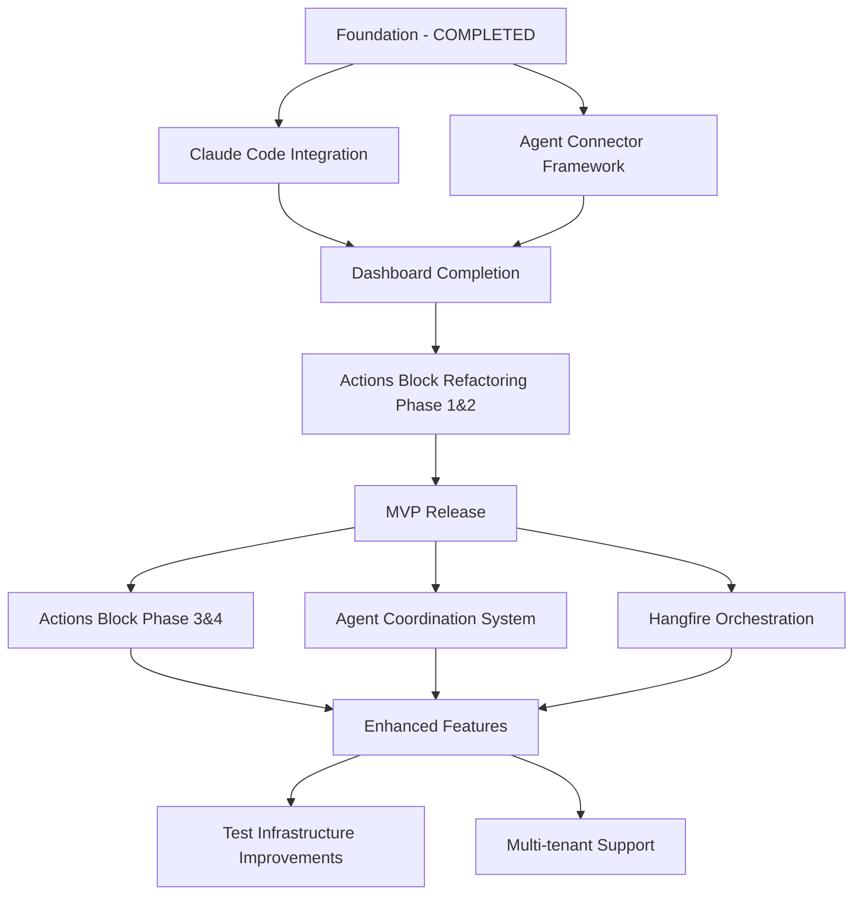

# AI Agent Orchestra - Master Development Roadmap

**Date Created**: 2025-10-04
**Status**: ACTIVE
**Purpose**: Comprehensive, prioritized roadmap for systematic project execution

## Executive Summary

This master roadmap consolidates all existing work plans into a unified, prioritized execution strategy for the AI Agent Orchestra project. It defines the MVP scope, identifies critical dependencies, and provides a realistic timeline for achieving a production-ready orchestration platform.

**Key Finding**: Multiple overlapping plans exist with unclear priorities. This roadmap establishes a clear execution path focusing on MVP delivery first, followed by enhancement phases.

## MVP Definition

### Core MVP Scope (Must-Have)

**Vision**: "Transform chaos of multiple AI assistants into synchronized productivity"

**MVP Success Criteria**:
- Manage 2-3 AI assistants from one dashboard
- 80% reduction in context switching overhead
- <2 second task distribution time
- 100% test coverage for critical paths

### MVP Features (Prioritized)

#### Priority 1: Foundation (Critical Path)
1. **Task Queue System** ✅ COMPLETED
   - In-memory task queuing via TaskRepository
   - Priority-based task assignment
   - Task status lifecycle management

2. **MediatR CQRS Architecture** ✅ COMPLETED
   - Command/Query separation
   - Event-driven communication
   - Predictable patterns for LLM development

3. **Basic API Structure** ✅ COMPLETED
   - RESTful endpoints for task management
   - SignalR for real-time updates
   - Entity Framework with SQLite

#### Priority 2: Agent Integration (MVP Core)
1. **Claude Code Integration** ✅ COMPLETED (2025-10-04)
   - ClaudeCodeExecutor (475 lines) with retry logic
   - Exponential backoff with jitter (3 retries, 2s base delay)
   - Comprehensive error handling (5 retryable exceptions)
   - 46/46 unit tests passing

2. **Agent Connector Framework** 🔄 PARTIAL (IAgentExecutor pattern exists)
   - IAgentExecutor interface implemented ✅
   - ClaudeCodeExecutor registered in DI ✅
   - Plugin architecture needs formalization

#### Priority 3: User Interface (MVP Essential)
1. **Web Dashboard Foundation** 🔄 PARTIAL
   - Blazor WebAssembly setup exists
   - Basic layout implemented
   - Needs completion of agent management UI

2. **Task Management UI** 🔄 PARTIAL
   - QuickActions component exists
   - Needs refactoring per Actions Block plan

### Should-Have Features (Post-MVP)
- GitHub Copilot integration
- Advanced workflow automation
- Performance analytics
- Multi-user workspaces

### Nice-to-Have Features (Future)
- Mobile application
- AI-powered task routing
- Community marketplace
- Enterprise features

## Plan Prioritization Matrix

### Priority 1: Critical for MVP (Must Complete)

| Plan | Current Status | Blocking Issues | Estimate | Priority |
|------|---------------|-----------------|----------|----------|
| **Claude Code Integration** | ✅ **100% COMPLETE** (2025-10-04) | None | Completed | ✅ DONE |
| **Agent Connector Framework** | 🔄 Partial (IAgentExecutor exists) | None | 3-5 days | 🟡 MEDIUM |
| **Dashboard Foundation** | 75% Complete | None | 3-4 days | 🔴 CRITICAL |
| **Actions Block Phase 1&2** | ✅ **100% COMPLETE** | None | Completed | ✅ DONE |

### Priority 2: Important but Not Blocking

| Plan | Current Status | Dependencies | Estimate | Priority |
|------|---------------|--------------|----------|----------|
| **Actions Block Phase 3&4** | Not Started | Phase 1&2 completion | 46-60 hours | 🟡 MEDIUM |
| **Agent Coordination System** | Unknown | Agent connectors | 4-6 days | 🟡 MEDIUM |
| **Real Orchestration (Hangfire)** | Unknown | Basic queue working | 10-14 hours | 🟡 MEDIUM |

### Priority 3: UX/UI Enhancements & Testing (98.2% Complete)

| Phase | Current Status | Dependencies | Estimate | Priority |
|-------|---------------|--------------|----------|----------|
| **Phase 0: Performance Baseline** | ✅ **100% COMPLETE** (2025-01-18) | None | Completed | ✅ DONE |
| **Phase 1: Repository Selection Fix** | ✅ **100% COMPLETE** (2025-09-18) | None | Completed | ✅ DONE |
| **Phase 2: Layout Reorganization** | ✅ **100% COMPLETE** (2025-09-18) | Phase 1 | Completed | ✅ DONE |
| **Phase 3.1: Statistics Redesign** | ✅ **100% COMPLETE** (2025-09-18) | Phase 2 | Completed | ✅ DONE |
| **Phase 3.2: Agent Detail Statistics** | ✅ **100% COMPLETE** (2025-10-14) | Phase 3.1 | Completed | ✅ DONE |
| **Phase 4.1: Orchestrator Flow Analysis** | ✅ **100% COMPLETE** (2025-10-14) | Phase 3.2 | Completed | ✅ DONE |
| **Phase 4.3: Task Assignment Automation** | ✅ **100% COMPLETE** (2025-10-14) | Phase 4.1 | Completed | ✅ DONE |
| **Phase 5: Code Quality** | ✅ **100% COMPLETE** (2025-01-18) | Phase 4 | Completed | ✅ DONE |
| **Phase 6.1: Bootstrap Integration** | ✅ **100% COMPLETE** (2025-10-13) | Phase 5 | Completed | ✅ DONE |
| **Phase 6.2: Cross-Browser Testing Framework** | ✅ **100% COMPLETE** (2025-10-13) | Phase 6.1 | Completed | ✅ DONE |
| **Phase 6.2: Manual Testing Execution** | 🔄 PENDING | Phase 6.2 framework | 4-6 hours | 🟡 MEDIUM |

#### UI Fixes Work Plan Deliverables (98.2% Complete):
- ✅ Performance baseline established with API/frontend metrics (Phase 0)
- ✅ Repository selection dropdown fixed (Phase 1)
- ✅ Layout reorganization with agent list, task queue, statistics panels (Phase 2)
- ✅ Dashboard statistics redesign with KPI cards (Phase 3.1)
- ✅ Agent detail statistics panels (Phase 3.2)
- ✅ Task lifecycle flow analysis (3 subtasks, 13,344 lines docs - Phase 4.1)
- ✅ Automatic task assignment implementation (55 tests, 100% passing - Phase 4.3)
- ✅ Code quality improvements and debugging cleanup (Phase 5)
- ✅ Unified design system with Bootstrap-first CSS variables (Phase 6.1)
- ✅ CSS compatibility report (100% browser support for Chrome 120+, Firefox 121+, Edge 120+, Safari 17+)
- ✅ API performance testing script (PowerShell) with Phase 0 baseline comparison
- ✅ Browser performance testing tool (HTML/JS) with FCP/LCP/TTI measurement
- ✅ Manual testing checklist (647 lines, 16 test sections)
- 🔄 Manual testing execution (PENDING user action - only remaining task)

### Priority 4: Agent Infrastructure (Completed Architecture, P0 Implementation Pending)

| Plan | Current Status | Dependencies | Estimate | Priority |
|------|---------------|--------------|----------|----------|
| **Agent Architecture Foundation** | ✅ **100% COMPLETE** (2025-10-14) | None | Completed | ✅ DONE |
| **Execution Workflow Agents** | ✅ **100% COMPLETE** (2025-10-14) | Architecture | Completed | ✅ DONE |
| **P0 Agents Implementation** | 🔄 PARTIAL (1/3 agents) | Execution agents | 1-2 weeks | 🔴 CRITICAL |

#### Agent Architecture Deliverables:
- ✅ Distributed self-organization architecture (AGENTS_ARCHITECTURE.md, 552 lines)
- ✅ 5 new execution agents:
  - plan-task-executor: Execute ONE deepest task (EXECUTION mode)
  - plan-task-completer: Mark complete, validate sync (COMPLETION mode)
  - plan-review-iterator: Review cycle coordinator (REVIEW_ITERATION mode)
  - plan-structure-fixer: Plan catalogization & GOLDEN RULES enforcement
  - systematic-plan-reviewer: Automated systematic review via PowerShell ✅
- ✅ Universal agent template with frontmatter (name, description, tools)
- ✅ Agent transition matrix (CRITICAL/RECOMMENDED/OPTIONAL paths)
- ✅ Cycle protection (max 3 iterations → escalation to user)
- ✅ Execution modes workflow (EXECUTION → REVIEW_ITERATION → COMPLETION)
- ✅ ЖЕЛЕЗОБЕТОННОЕ ПРАВИЛО СИНХРОННОСТИ (IRON SYNC RULE)
- ✅ 8 agents updated with new specifications
- ✅ 10+ rules updated (common-plan-executor, general-coding, etc.)
- 🔄 P0 agents pending: plan-readiness-validator, review-consolidator

#### Expected Metrics After Full Agent Implementation:
- Review time: 1.5-2.5 hours → 10-15 minutes (10-15x improvement)
- Automation: 50% → 90% (+40%)
- Stage skip rate: 20-30% → <5% (4-6x improvement)
- LLM Readiness score: Not measured → ≥90% guaranteed

### Priority 5: Post-MVP Enhancements

| Plan | Current Status | Impact | Estimate | Priority |
|------|---------------|--------|----------|----------|
| **Remove HangfireServer Tests** | Approved, Not Started | Test speed +50% | 8-12 hours | 🟢 LOW |
| **Hangfire DI Refactoring** | Not Started | Enables multi-tenancy | 4-6 hours | 🟢 LOW |
| **SQLite Integration** | Unknown | Data persistence | Unknown | 🟢 LOW |
| **Agent Chat Feature** | Unknown | UX enhancement | Unknown | 🟢 LOW |

### Priority 6: Deprecated/Can Be Removed

| Plan | Reason for Deprecation |
|------|------------------------|
| **Phase 0 Documents** | Historical, incorporated into UI Fixes Work Plan |

## Dependency Graph

### Critical Path to MVP (Updated 2025-10-14)
1. ~~Claude Code Integration Completion~~ ✅ **COMPLETED** (2025-10-04)
2. ~~Agent Architecture Foundation~~ ✅ **COMPLETED** (2025-10-14)
3. ~~Execution Workflow Agents~~ ✅ **COMPLETED** (2025-10-14)
4. ~~Phase 6.1 & 6.2 Testing Framework~~ ✅ **COMPLETED** (2025-10-13)
5. **P0 Agents Implementation** (1-2 weeks) - systematic-plan-reviewer ✅, plan-readiness-validator 🔄, review-consolidator 🔄
6. **Phase 6.2 Manual Testing** (4-6 hours) - PENDING user execution
7. **Dashboard Completion** (3-4 days) - 75% done → 100%
8. ~~Actions Block Phase 1&2 Fix~~ ✅ **COMPLETED**
9. **MVP Testing & Polish** (1 week)

**Total Critical Path**: 3-4 weeks to MVP (down from 6-7 weeks initially, was 2-3 weeks before agent infrastructure)

## Timeline Estimation

### Phase 1: MVP Sprint (Weeks 1-7)

#### ~~Week 1-3: Claude Code Integration~~ ✅ COMPLETED (2025-10-04)
- [x] Process detection and management ✅
- [x] Terminal automation and command execution ✅
- [x] Output parsing and error handling ✅
- [x] Exponential backoff retry logic ✅
- [x] 46/46 unit tests passing ✅

#### ~~Week 3.5: Phase 6 UX/UI Improvements & Testing Framework~~ ✅ COMPLETED (2025-10-13)
- [x] Phase 6.1: Bootstrap integration & unified design system ✅
- [x] CSS compatibility report (100% browser support) ✅
- [x] Phase 6.2: Cross-browser testing framework creation ✅
- [x] API performance testing script (PowerShell) ✅
- [x] Browser performance testing tool (HTML/JS) with FCP/LCP/TTI ✅
- [x] Manual testing checklist (647 lines, 16 sections) ✅
- [ ] Phase 6.2: Manual testing execution (PENDING user action)

#### ~~Week 3.8: Agent Infrastructure Foundation~~ ✅ COMPLETED (2025-10-14)
- [x] Distributed agent architecture design (AGENTS_ARCHITECTURE.md, 552 lines) ✅
- [x] Execution workflow agents (executor, completer, iterator) ✅
- [x] Plan structure fixer agent ✅
- [x] Systematic plan reviewer agent (P0 agent 1/3) ✅
- [x] Universal agent template with frontmatter ✅
- [x] Agent transition matrix (CRITICAL/RECOMMENDED/OPTIONAL) ✅
- [x] Cycle protection mechanism (max 3 iterations) ✅
- [x] 8 agents updated with new specifications ✅
- [x] 10+ rules updated (common-plan-executor, general-coding, etc.) ✅

#### ~~Week 3.9: UI Fixes Work Plan Phase 4 & Phase 3.2~~ ✅ COMPLETED (2025-10-14)
- [x] Phase 3.2: Agent Detail Statistics implementation ✅
- [x] Phase 4.1: Orchestrator Flow Analysis (3 subtasks, 13,344 lines documentation) ✅
  - Task Lifecycle Flow Analysis (1,023 lines, 3 Mermaid diagrams)
  - Agent Discovery Analysis (11,195 lines, 4 Mermaid diagrams)
  - Automatic Assignment Trigger Gap Analysis (1,126 lines, 3 Mermaid diagrams)
- [x] Phase 4.3: Task Assignment Automation (55 unit tests, 100% passing) ✅
  - BackgroundTaskAssignmentService: 15 tests
  - Task Status Flow: 19 tests
  - Agent Assignment Logic: 21 tests
- [x] UI Fixes Work Plan progress: 91.1% → 98.2% (+7.1 percentage points) ✅

#### Week 4: Agent Connector Framework
- [ ] Days 1-2: IAgentConnector interface design
- [ ] Days 3-4: Plugin architecture implementation
- [ ] Day 5: Lifecycle management and testing

#### Week 5: Dashboard Completion
- [ ] Days 1-2: Agent management UI
- [ ] Days 3-4: Task management interface
- [ ] Day 5: Real-time updates via SignalR

#### Week 6: Actions Block Critical Fixes
- [ ] Days 1-2: TaskTemplateService unit tests (540 lines)
- [ ] Days 3-4: Fix 5 failing BatchTaskExecutor tests
- [ ] Day 5: Integration testing

#### Week 7: MVP Polish & Testing
- [ ] Days 1-2: End-to-end testing
- [ ] Days 3-4: Performance optimization
- [ ] Day 5: Documentation and deployment prep

### Phase 2: Enhancement Sprint (Weeks 8-12)

#### Week 8-10: Actions Block Advanced Features
- [ ] Workflow Manager implementation
- [ ] Visual workflow builder
- [ ] Template marketplace foundation

#### Week 11: Agent Coordination System
- [ ] Cron-based coordination
- [ ] Markdown workflow integration
- [ ] Goal tracking

#### Week 12: Infrastructure Improvements
- [ ] Hangfire persistent orchestration
- [ ] Test parallelization fix
- [ ] Performance monitoring

### Phase 3: Scaling Sprint (Weeks 13-16)

- Additional agent connectors (GitHub Copilot, Cursor)
- Multi-user workspace support
- Advanced analytics
- Production deployment and monitoring

## Consolidation Recommendations

### Plans to Merge

1. **Merge Agent Coordination into Claude Code Integration**
   - Both deal with agent management
   - Reduces complexity and duplication
   - Single cohesive agent system

2. **Merge Hangfire Plans**
   - Combine DI Refactoring with Remove HangfireServer Tests
   - Single infrastructure improvement initiative
   - Addresses same underlying issue

### Plans to Split

1. **Split Actions Block Refactoring**
   - Phase 1&2: Separate into "Critical Fixes" plan (MVP)
   - Phase 3&4: Keep as "Advanced Features" plan (Post-MVP)
   - Clearer prioritization and scope

### Plans Needing Revision

1. **Agent Coordination System Plan**
   - Status unknown, needs assessment
   - Should align with Claude Code integration
   - Requires clear acceptance criteria

2. **SQLite Database Integration**
   - Already partially implemented
   - Needs status update and completion plan
   - Should clarify remaining work

## Risk Assessment

### High-Risk Items

| Risk | Probability | Impact | Mitigation Strategy |
|------|------------|--------|-------------------|
| Claude Code API changes | Medium | High | Versioned connector interface, rapid fix process |
| 540 lines untested code | High | High | Immediate testing sprint required |
| Agent integration complexity | Medium | High | Start with simplest integration, iterate |
| Timeline slippage | Medium | Medium | Weekly progress reviews, scope adjustment |

### Medium-Risk Items

| Risk | Probability | Impact | Mitigation Strategy |
|------|------------|--------|-------------------|
| Performance issues | Low | Medium | Early performance testing, optimization buffer |
| UI/UX complexity | Medium | Low | User feedback loops, iterative design |
| Technical debt accumulation | Medium | Medium | Regular refactoring sprints |

## Success Metrics

### MVP Launch Criteria
- [ ] 100% test coverage for critical paths
- [ ] 2+ AI agents successfully integrated
- [ ] <2 second task distribution time
- [ ] Zero P0/P1 bugs
- [ ] Complete user documentation
- [ ] 5+ beta users validated

### Post-MVP Success Metrics
- 20+ active users within 1 month
- 80% task success rate
- <5% system downtime
- 15% conversion rate (trial to paid)

## Revision Strategy

### Weekly Reviews
- Progress against critical path
- Blocker identification and resolution
- Timeline adjustments
- Risk reassessment

### Plan Status Updates
1. **Unknown Status Plans**: Immediate assessment required
   - Agent Coordination System
   - Real Orchestration with Hangfire
   - Agent Chat Feature
   - SQLite Database Integration

2. **Update Frequency**
   - Active plans: Daily status in standup
   - Pending plans: Weekly review
   - Future plans: Monthly reassessment

### Documentation Requirements
- Each plan must have:
  - Clear status markers (percentage complete)
  - Identified blockers
  - Updated estimates
  - Acceptance criteria
  - Test coverage metrics

## Implementation Strategy

### Completed Actions (October 2025)

1. **Day 1-2: Assessment Sprint** ✅ COMPLETED (2025-10-04)
   - [x] Assess all "unknown status" plans
   - [x] Update PLANS-INDEX.md with current status
   - [x] Identify any hidden blockers

2. **Day 3-4: Testing Sprint** ✅ COMPLETED (2025-10-04)
   - [x] Write tests for TaskTemplateService (45/45 tests passing)
   - [x] Fix 5 failing BatchTaskExecutor tests (8/8 tests passing)

3. **Day 5: Claude Code Integration** ✅ COMPLETED (2025-10-04)
   - [x] Complete remaining 30-40% of Claude Code integration
   - [x] Wire ClaudeCodeExecutor to DI (TaskExecutionJob)
   - [x] Implement retry logic with exponential backoff
   - [x] Verify technical debt resolution

4. **Week 2: Phase 6 UX/UI Improvements** ✅ COMPLETED (2025-10-13)
   - [x] Phase 6.1: Bootstrap integration & unified design system
   - [x] Phase 6.2: Cross-browser testing framework (CSS report, performance scripts, manual checklist)

5. **Week 2: Agent Infrastructure Foundation** ✅ COMPLETED (2025-10-14)
   - [x] Distributed autonomous agents architecture (AGENTS_ARCHITECTURE.md)
   - [x] 5 execution workflow agents (executor, completer, iterator, fixer, systematic-reviewer)
   - [x] Universal agent template + transition matrix
   - [x] 8 agents updated, 10+ rules updated

### Immediate Actions (Next 2 Weeks)

#### Week 1: P0 Agents & Manual Testing (6-8 days)

**Priority 1: P0 Agents Implementation (4-6 days)**
- [ ] **plan-readiness-validator** (2-3 days)
  - LLM readiness scoring (≥90% threshold)
  - Plan structure validation
  - Execution readiness assessment
- [ ] **review-consolidator** (2-3 days)
  - Coordinate parallel review army (code-style, code-principles, test-healer)
  - Consolidate feedback into unified report
  - Aggregate recommendations

**Priority 2: Phase 6.2 Manual Testing (4-6 hours)**
- [ ] Run automated performance tests (PowerShell + HTML tool)
- [ ] Execute browser compatibility testing (Chrome, Firefox, Edge, Safari)
- [ ] Validate responsive design (desktop, tablet, mobile)
- [ ] Document results and performance baselines
- [ ] Create testing completion report

#### Week 2: Dashboard & Agent Connector (7-9 days)

**Priority 1: Dashboard Foundation Completion (3-4 days)**
- [ ] Agent management UI (agent list, status, controls)
- [ ] Task management interface refinement (queue visualization)
- [ ] SignalR real-time updates integration (agent status, task progress)

**Priority 2: Agent Connector Framework (3-5 days)**
- [ ] IAgentConnector interface formalization
- [ ] Plugin architecture implementation
- [ ] Lifecycle management and testing

### Next Sprint Planning (Updated 2025-10-14)
- **Focus**: P0 Agents Implementation + Phase 6.2 Manual Testing + Dashboard Completion
- **Team allocation**: 100% on critical path
- **Recent completions**:
  - ✅ Claude Code Integration (2025-10-04)
  - ✅ Phase 6.1 & 6.2 Framework (2025-10-13)
  - ✅ Agent Infrastructure Foundation (2025-10-14)
- **Next milestones**:
  - P0 agents complete (1-2 weeks)
  - Dashboard completion (3-4 days)
  - Phase 6.2 manual testing (4-6 hours)
- **MVP Timeline**: 3-4 weeks from now (down from 6-7 weeks initially)

## Conclusion

This master roadmap provides a clear, prioritized path to MVP delivery. **Major Progress**: Significant foundational work completed in October 2025, including Claude Code integration, Phase 6 UX/UI improvements, and complete agent infrastructure architecture. Current blockers to MVP: P0 agents implementation (plan-readiness-validator, review-consolidator) and Dashboard completion (final 25%).

### Key Achievements (October 2025)

**Infrastructure & Architecture**:
- ✅ Claude Code Integration (475 lines, 46/46 tests) with exponential backoff retry
- ✅ Distributed autonomous agents architecture (552 lines, 5 execution agents)
- ✅ Agent transition matrix with cycle protection (max 3 iterations)
- ✅ Universal agent template + frontmatter specifications
- ✅ 8 agents updated, 10+ rules enhanced (5325 insertions total)

**UX/UI & Testing**:
- ✅ Phase 6.1: Bootstrap-first unified design system
- ✅ Phase 6.2: Cross-browser testing framework (100% CSS compatibility)
- ✅ Performance testing tools (PowerShell + HTML/JS)
- ✅ Manual testing checklist (647 lines, 16 sections)

**Expected Impact**:
- Review time: 1.5-2.5 hours → 10-15 minutes (10-15x improvement)
- Automation: 50% → 90% (+40%)
- Stage skip rate: 20-30% → <5% (4-6x improvement)

### Key Decisions Required

1. **MVP Timeline**: 3-4 weeks from now (October 2025)
2. **Focus Areas**:
   - P0 agents implementation (1-2 weeks) 🔴 CRITICAL
   - Phase 6.2 manual testing (4-6 hours) 🟡 MEDIUM
   - Dashboard completion (3-4 days) 🔴 CRITICAL
3. **Resource Allocation**: 100% on critical path (P0 agents + Dashboard)
4. **Quality Gates**: Weekly progress reviews, performance baselines validation

### Next Steps (Immediate)

1. **Week 1**: Implement P0 agents (plan-readiness-validator, review-consolidator)
2. **Week 1**: Execute Phase 6.2 manual testing
3. **Week 2**: Complete Dashboard Foundation (final 25%)
4. **Week 2**: Formalize Agent Connector Framework
5. **Week 3-4**: MVP Testing & Polish

---

**Document Status**: ACTIVE - Updated with October 2025 Progress
**Owner**: Development Team
**Last Updated**: 2025-10-14 (Phase 4 & 3.2 completion documented)
**Review Date**: 2025-10-04, 2025-10-14
**Next Review**: 2025-10-21

### Recent Updates (2025-10-14)

**UI Fixes Work Plan - Phase 4 & Phase 3.2 Completion**:
- ✅ Phase 3.2: Agent Detail Statistics - COMPLETE
- ✅ Phase 4.1: Comprehensive Orchestrator Flow Analysis
  - Task Lifecycle Flow Analysis (1,023 lines, 3 Mermaid diagrams)
  - Agent Discovery Analysis (11,195 lines, 4 Mermaid diagrams)
  - Automatic Assignment Trigger Gap Analysis (1,126 lines, 3 Mermaid diagrams)
- ✅ Phase 4.3: Task Assignment Automation (55 tests, 100% passing)
  - BackgroundTaskAssignmentService: 15 unit tests
  - Task Status Flow: 19 unit tests
  - Agent Assignment Logic: 21 unit tests
- Progress: 91.1% → 98.2% (+7.1 percentage points)
- Remaining: Phase 6.2 manual testing only (4-6 hours)