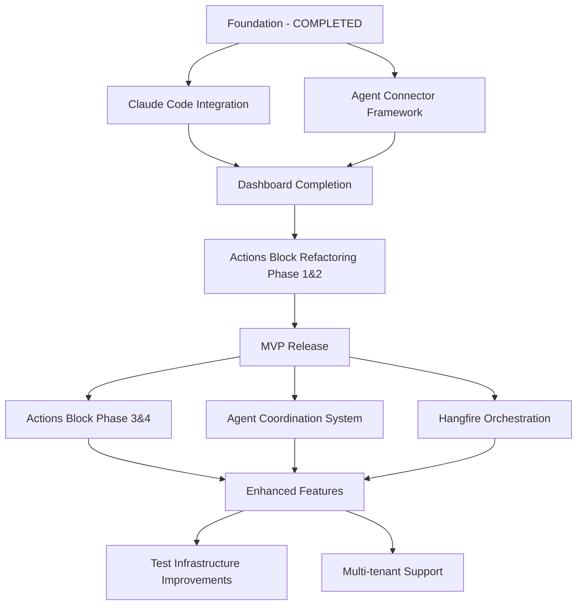

# AI Agent Orchestra - Master Development Roadmap

**Date Created**: 2025-10-04
**Status**: ACTIVE
**Purpose**: Comprehensive, prioritized roadmap for systematic project execution

## Executive Summary

This master roadmap consolidates all existing work plans into a unified, prioritized execution strategy for the AI Agent Orchestra project. It defines the MVP scope, identifies critical dependencies, and provides a realistic timeline for achieving a production-ready orchestration platform.

**Key Finding**: Multiple overlapping plans exist with unclear priorities. This roadmap establishes a clear execution path focusing on MVP delivery first, followed by enhancement phases.

## MVP Definition

### Core MVP Scope (Must-Have)

**Vision**: "Transform chaos of multiple AI assistants into synchronized productivity"

**MVP Success Criteria**:
- Manage 2-3 AI assistants from one dashboard
- 80% reduction in context switching overhead
- <2 second task distribution time
- 100% test coverage for critical paths

### MVP Features (Prioritized)

#### Priority 1: Foundation (Critical Path)
1. **Task Queue System** ✅ COMPLETED
   - In-memory task queuing via TaskRepository
   - Priority-based task assignment
   - Task status lifecycle management

2. **MediatR CQRS Architecture** ✅ COMPLETED
   - Command/Query separation
   - Event-driven communication
   - Predictable patterns for LLM development

3. **Basic API Structure** ✅ COMPLETED
   - RESTful endpoints for task management
   - SignalR for real-time updates
   - Entity Framework with SQLite

#### Priority 2: Agent Integration (MVP Core)
1. **Claude Code Integration** ✅ COMPLETED (2025-10-04)
   - ClaudeCodeExecutor (475 lines) with retry logic
   - Exponential backoff with jitter (3 retries, 2s base delay)
   - Comprehensive error handling (5 retryable exceptions)
   - 46/46 unit tests passing

2. **Agent Connector Framework** 🔄 PARTIAL (IAgentExecutor pattern exists)
   - IAgentExecutor interface implemented ✅
   - ClaudeCodeExecutor registered in DI ✅
   - Plugin architecture needs formalization

#### Priority 3: User Interface (MVP Essential)
1. **Web Dashboard Foundation** 🔄 PARTIAL
   - Blazor WebAssembly setup exists
   - Basic layout implemented
   - Needs completion of agent management UI

2. **Task Management UI** 🔄 PARTIAL
   - QuickActions component exists
   - Needs refactoring per Actions Block plan

### Should-Have Features (Post-MVP)
- GitHub Copilot integration
- Advanced workflow automation
- Performance analytics
- Multi-user workspaces

### Nice-to-Have Features (Future)
- Mobile application
- AI-powered task routing
- Community marketplace
- Enterprise features

## Plan Prioritization Matrix

### Priority 1: Critical for MVP (Must Complete)

| Plan | Current Status | Blocking Issues | Estimate | Priority |
|------|---------------|-----------------|----------|----------|
| **Claude Code Integration** | ✅ **100% COMPLETE** (2025-10-04) | None | Completed | ✅ DONE |
| **Agent Connector Framework** | 🔄 Partial (IAgentExecutor exists) | None | 3-5 days | 🟡 MEDIUM |
| **Dashboard Foundation** | 75% Complete | None | 3-4 days | 🔴 CRITICAL |
| **Actions Block Phase 1&2** | ✅ **100% COMPLETE** | None | Completed | ✅ DONE |

### Priority 2: Important but Not Blocking

| Plan | Current Status | Dependencies | Estimate | Priority |
|------|---------------|--------------|----------|----------|
| **Actions Block Phase 3&4** | Not Started | Phase 1&2 completion | 46-60 hours | 🟡 MEDIUM |
| **Agent Coordination System** | Unknown | Agent connectors | 4-6 days | 🟡 MEDIUM |
| **Real Orchestration (Hangfire)** | Unknown | Basic queue working | 10-14 hours | 🟡 MEDIUM |

### Priority 3: Post-MVP Enhancements

| Plan | Current Status | Impact | Estimate | Priority |
|------|---------------|--------|----------|----------|
| **Remove HangfireServer Tests** | Approved, Not Started | Test speed +50% | 8-12 hours | 🟢 LOW |
| **Hangfire DI Refactoring** | Not Started | Enables multi-tenancy | 4-6 hours | 🟢 LOW |
| **SQLite Integration** | Unknown | Data persistence | Unknown | 🟢 LOW |
| **Agent Chat Feature** | Unknown | UX enhancement | Unknown | 🟢 LOW |

### Priority 4: Deprecated/Can Be Removed

| Plan | Reason for Deprecation |
|------|------------------------|
| **UI Fixes Work Plan (2024-09-18)** | Superseded by Comprehensive Fix Plan |
| **Phase 0 Documents** | Historical, no longer relevant |

## Dependency Graph

### Critical Path to MVP
1. ~~Claude Code Integration Completion~~ ✅ **COMPLETED** (2025-10-04)
2. **Dashboard Completion** (3-4 days) - 75% done
3. **Agent Connector Framework Formalization** (3-5 days) - IAgentExecutor exists
4. ~~Actions Block Phase 1&2 Fix~~ ✅ **COMPLETED**
5. **MVP Testing & Polish** (1 week)

**Total Critical Path**: 2-3 weeks to MVP (was 6-7 weeks, then 3-4 weeks)

## Timeline Estimation

### Phase 1: MVP Sprint (Weeks 1-7)

#### ~~Week 1-3: Claude Code Integration~~ ✅ COMPLETED (2025-10-04)
- [x] Process detection and management ✅
- [x] Terminal automation and command execution ✅
- [x] Output parsing and error handling ✅
- [x] Exponential backoff retry logic ✅
- [x] 46/46 unit tests passing ✅

#### Week 4: Agent Connector Framework
- [ ] Days 1-2: IAgentConnector interface design
- [ ] Days 3-4: Plugin architecture implementation
- [ ] Day 5: Lifecycle management and testing

#### Week 5: Dashboard Completion
- [ ] Days 1-2: Agent management UI
- [ ] Days 3-4: Task management interface
- [ ] Day 5: Real-time updates via SignalR

#### Week 6: Actions Block Critical Fixes
- [ ] Days 1-2: TaskTemplateService unit tests (540 lines)
- [ ] Days 3-4: Fix 5 failing BatchTaskExecutor tests
- [ ] Day 5: Integration testing

#### Week 7: MVP Polish & Testing
- [ ] Days 1-2: End-to-end testing
- [ ] Days 3-4: Performance optimization
- [ ] Day 5: Documentation and deployment prep

### Phase 2: Enhancement Sprint (Weeks 8-12)

#### Week 8-10: Actions Block Advanced Features
- [ ] Workflow Manager implementation
- [ ] Visual workflow builder
- [ ] Template marketplace foundation

#### Week 11: Agent Coordination System
- [ ] Cron-based coordination
- [ ] Markdown workflow integration
- [ ] Goal tracking

#### Week 12: Infrastructure Improvements
- [ ] Hangfire persistent orchestration
- [ ] Test parallelization fix
- [ ] Performance monitoring

### Phase 3: Scaling Sprint (Weeks 13-16)

- Additional agent connectors (GitHub Copilot, Cursor)
- Multi-user workspace support
- Advanced analytics
- Production deployment and monitoring

## Consolidation Recommendations

### Plans to Merge

1. **Merge Agent Coordination into Claude Code Integration**
   - Both deal with agent management
   - Reduces complexity and duplication
   - Single cohesive agent system

2. **Merge Hangfire Plans**
   - Combine DI Refactoring with Remove HangfireServer Tests
   - Single infrastructure improvement initiative
   - Addresses same underlying issue

### Plans to Split

1. **Split Actions Block Refactoring**
   - Phase 1&2: Separate into "Critical Fixes" plan (MVP)
   - Phase 3&4: Keep as "Advanced Features" plan (Post-MVP)
   - Clearer prioritization and scope

### Plans Needing Revision

1. **Agent Coordination System Plan**
   - Status unknown, needs assessment
   - Should align with Claude Code integration
   - Requires clear acceptance criteria

2. **SQLite Database Integration**
   - Already partially implemented
   - Needs status update and completion plan
   - Should clarify remaining work

## Risk Assessment

### High-Risk Items

| Risk | Probability | Impact | Mitigation Strategy |
|------|------------|--------|-------------------|
| Claude Code API changes | Medium | High | Versioned connector interface, rapid fix process |
| 540 lines untested code | High | High | Immediate testing sprint required |
| Agent integration complexity | Medium | High | Start with simplest integration, iterate |
| Timeline slippage | Medium | Medium | Weekly progress reviews, scope adjustment |

### Medium-Risk Items

| Risk | Probability | Impact | Mitigation Strategy |
|------|------------|--------|-------------------|
| Performance issues | Low | Medium | Early performance testing, optimization buffer |
| UI/UX complexity | Medium | Low | User feedback loops, iterative design |
| Technical debt accumulation | Medium | Medium | Regular refactoring sprints |

## Success Metrics

### MVP Launch Criteria
- [ ] 100% test coverage for critical paths
- [ ] 2+ AI agents successfully integrated
- [ ] <2 second task distribution time
- [ ] Zero P0/P1 bugs
- [ ] Complete user documentation
- [ ] 5+ beta users validated

### Post-MVP Success Metrics
- 20+ active users within 1 month
- 80% task success rate
- <5% system downtime
- 15% conversion rate (trial to paid)

## Revision Strategy

### Weekly Reviews
- Progress against critical path
- Blocker identification and resolution
- Timeline adjustments
- Risk reassessment

### Plan Status Updates
1. **Unknown Status Plans**: Immediate assessment required
   - Agent Coordination System
   - Real Orchestration with Hangfire
   - Agent Chat Feature
   - SQLite Database Integration

2. **Update Frequency**
   - Active plans: Daily status in standup
   - Pending plans: Weekly review
   - Future plans: Monthly reassessment

### Documentation Requirements
- Each plan must have:
  - Clear status markers (percentage complete)
  - Identified blockers
  - Updated estimates
  - Acceptance criteria
  - Test coverage metrics

## Implementation Strategy

### Immediate Actions (This Week)

1. **Day 1-2: Assessment Sprint** ✅ COMPLETED
   - [x] Assess all "unknown status" plans
   - [x] Update PLANS-INDEX.md with current status
   - [x] Identify any hidden blockers

2. **Day 3-4: Testing Sprint** ✅ COMPLETED (2025-10-04)
   - [x] Write tests for TaskTemplateService (45/45 tests passing)
   - [x] Fix 5 failing BatchTaskExecutor tests (8/8 tests passing)

3. **Day 5: Claude Code Integration** ✅ COMPLETED (2025-10-04)
   - [x] Complete remaining 30-40% of Claude Code integration
   - [x] Wire ClaudeCodeExecutor to DI (TaskExecutionJob)
   - [x] Implement retry logic with exponential backoff
   - [x] Verify technical debt resolution

4. **Next: Dashboard & MVP Polish**
   - [ ] Dashboard Foundation completion (final 25%)
   - [ ] Agent Connector framework formalization
   - [ ] End-to-end MVP testing

### Next Sprint Planning
- Focus: Dashboard Foundation & MVP Polish ✅ UPDATED (2025-10-04)
- Team allocation: 100% on critical path
- Completed: Claude Code Integration (ahead of schedule)
- Next milestone: Dashboard completion (3-4 days)

## Conclusion

This master roadmap provides a clear, prioritized path to MVP delivery. The critical finding is that significant foundational work is complete, but agent integration remains the primary blocker to MVP launch.

**Key Decisions Required**:
1. Commit to 6-7 week MVP timeline
2. Defer all non-critical work until post-MVP
3. Focus 100% resources on critical path items
4. Implement weekly progress reviews

**Next Steps**:
1. Approve this roadmap with stakeholders
2. Begin immediate assessment sprint
3. Start Claude Code integration planning
4. Update all plan documentation

---

**Document Status**: DRAFT - Requires Review
**Owner**: Development Team
**Review Date**: 2025-10-04
**Next Review**: 2025-10-11