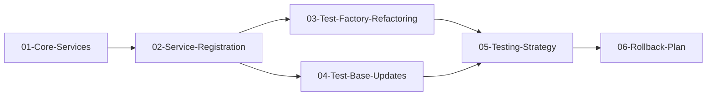

# Hangfire DI Refactoring - Comprehensive Work Plan

**Architectural Documentation**: [hangfire-di-architecture.md](./00-HANGFIRE-DI-REFACTORING/hangfire-di-architecture.md)

## Overview

**Goal**: Refactor Hangfire integration from global singleton (`JobStorage.Current`) to proper Dependency Injection pattern to fix parallel test execution failures.

**Root Problem**: Race condition when test collections run in parallel - both set `JobStorage.Current`, causing ObjectDisposedException when one disposes while other still uses it.

**Success Criteria**:
- ✅ All 582/582 tests passing in parallel execution
- ✅ Zero ObjectDisposedException errors
- ✅ Test collections fully isolated
- ✅ Production behavior unchanged
- ✅ No performance degradation

## Phase Structure

### Phase 1: Infrastructure Foundation
- [ ] [01-Core-Services.md](./00-HANGFIRE-DI-REFACTORING/01-Core-Services.md) - Create abstraction layer
- [ ] [02-Service-Registration.md](./00-HANGFIRE-DI-REFACTORING/02-Service-Registration.md) - DI configuration

### Phase 2: Test Infrastructure Refactoring
- [ ] [03-Test-Factory-Refactoring.md](./00-HANGFIRE-DI-REFACTORING/03-Test-Factory-Refactoring.md) - Update test factories
- [ ] [04-Test-Base-Updates.md](./00-HANGFIRE-DI-REFACTORING/04-Test-Base-Updates.md) - Refactor base classes

### Phase 3: Validation and Rollout
- [ ] [05-Testing-Strategy.md](./00-HANGFIRE-DI-REFACTORING/05-Testing-Strategy.md) - Comprehensive testing
- [ ] [06-Rollback-Plan.md](./00-HANGFIRE-DI-REFACTORING/06-Rollback-Plan.md) - Risk mitigation

## Critical Path Dependencies



## Risk Matrix

| Risk | Probability | Impact | Mitigation |
|------|------------|--------|------------|
| BackgroundJobServer requires JobStorage.Current | Medium | High | Keep setting in production only |
| Dashboard breaks without global storage | Low | Medium | Test dashboard thoroughly |
| Test isolation incomplete | Low | High | Comprehensive parallel testing |
| Performance degradation | Low | Low | Benchmark before/after |

## Implementation Timeline

**Total Estimate**: 4-6 hours

- Phase 1: 1-2 hours (infrastructure setup)
- Phase 2: 2-3 hours (test refactoring)
- Phase 3: 1 hour (validation)
- Buffer: 1 hour (issue resolution)

## Quick Reference Commands

```bash
# Run isolated test collection
dotnet test --filter "FullyQualifiedName~Integration"

# Run parallel test execution
dotnet test --parallel

# Verify no disposal errors
dotnet test 2>&1 | grep -i "ObjectDisposedException"
```

## Verification Checklist

### Pre-Implementation
- [ ] Current failing test count documented (18/582)
- [ ] Backup of current implementation created
- [ ] All JobStorage.Current usages identified

### Post-Implementation
- [ ] All tests passing (582/582)
- [ ] No ObjectDisposedException in logs
- [ ] Parallel execution successful
- [ ] Dashboard functional
- [ ] Background jobs executing

## Next Steps

1. Start with [01-Core-Services.md](./00-HANGFIRE-DI-REFACTORING/01-Core-Services.md)
2. Implement infrastructure foundation
3. Refactor test factories
4. Validate with comprehensive testing
5. Document lessons learned