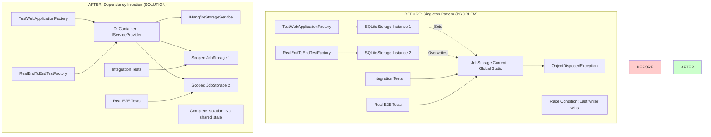
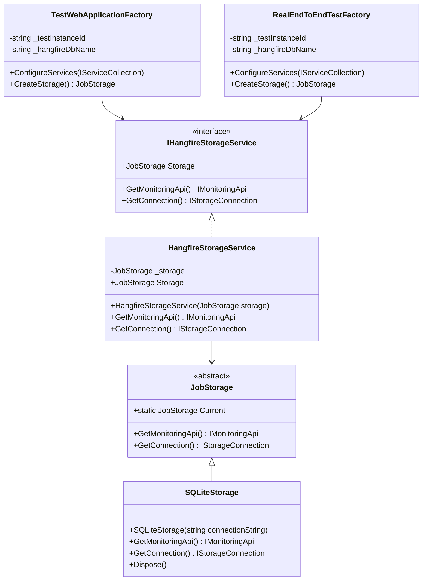
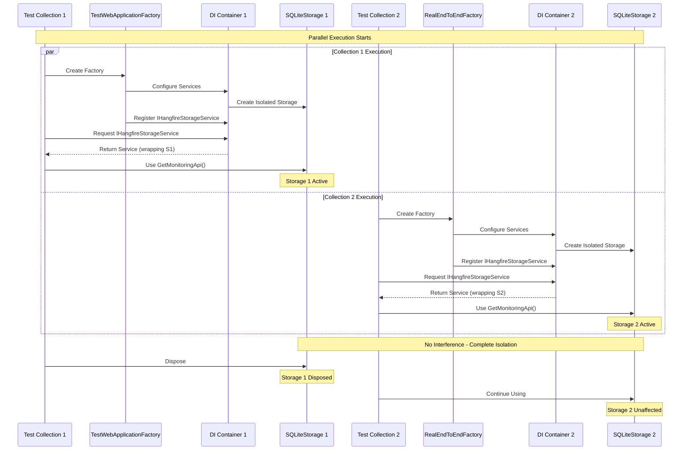
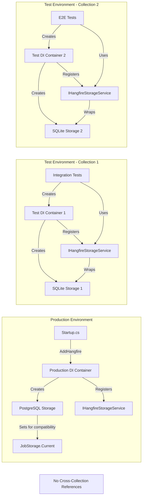
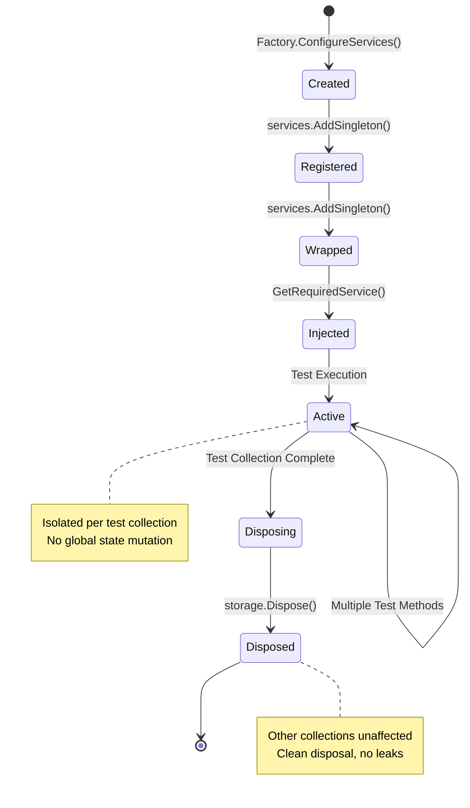
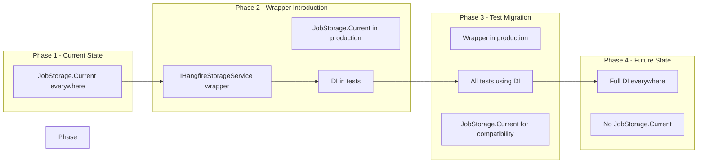

# Hangfire DI Refactoring - Architecture Diagram

## High-Level Architecture Transformation



## Component Architecture



## Sequence Diagram - Test Execution Flow



## Data Flow Architecture



## Storage Lifecycle Management



## Dependency Resolution Flow

```mermaid
graph TD
    subgraph Service Registration Phase
        AddHangfire[services.AddHangfire()]
        CreateStorage[Create JobStorage Instance]
        RegisterStorage[services.AddSingleton JobStorage]
        RegisterWrapper[services.AddSingleton IHangfireStorageService]

        AddHangfire --> CreateStorage
        CreateStorage --> RegisterStorage
        RegisterStorage --> RegisterWrapper
    end

    subgraph Resolution Phase
        RequestService[GetRequiredService IHangfireStorageService]
        ResolveStorage[Resolve JobStorage dependency]
        CreateWrapper[new HangfireStorageService(storage)]
        ReturnService[Return IHangfireStorageService]

        RequestService --> ResolveStorage
        ResolveStorage --> CreateWrapper
        CreateWrapper --> ReturnService
    end

    subgraph Usage Phase
        UseService[storageService.GetMonitoringApi()]
        DelegateToStorage[_storage.GetMonitoringApi()]
        ReturnApi[Return IMonitoringApi]

        UseService --> DelegateToStorage
        DelegateToStorage --> ReturnApi
    end
```

## Migration Path



## Key Architectural Decisions

1. **Wrapper Pattern**: Create IHangfireStorageService to abstract JobStorage access
2. **Gradual Migration**: Keep JobStorage.Current in production for backward compatibility
3. **Test Isolation First**: Focus on fixing test infrastructure before production changes
4. **Scoped Registration**: Use appropriate DI lifetimes for test vs production scenarios
5. **No Breaking Changes**: Ensure all existing code continues to work during migration