# Remove HangfireServer Tests Plan - Architecture

## High-Level Architecture Transformation

### Current Architecture (Phase 1 - Sequential)
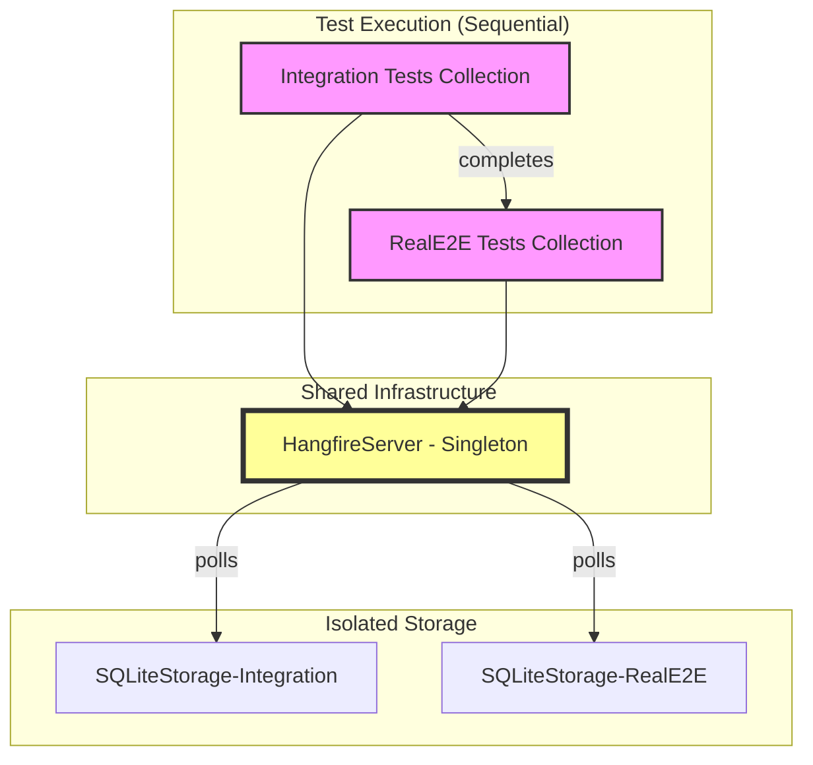

### Target Architecture (Phase 2 - Parallel with Synchronous Execution)
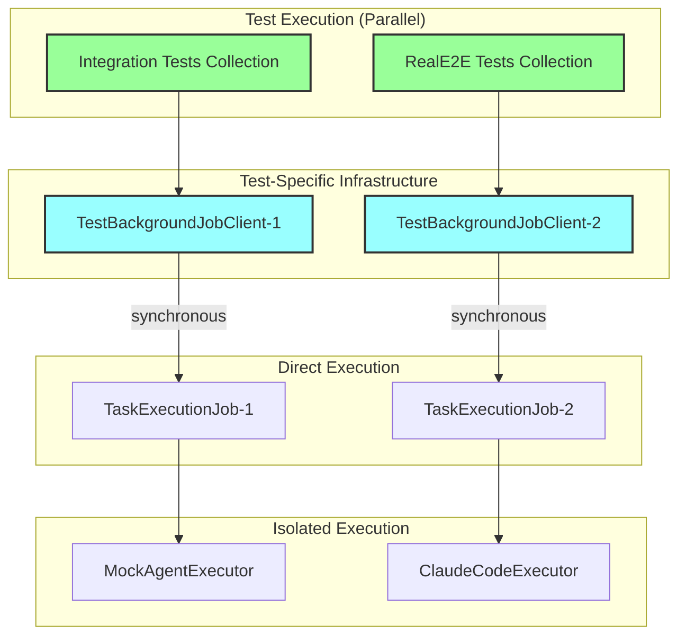

## Detailed Component Architecture

### TestBackgroundJobClient Implementation Flow
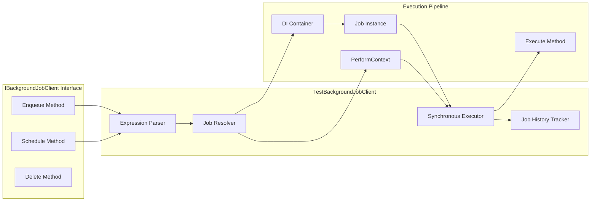

### Job Execution Sequence
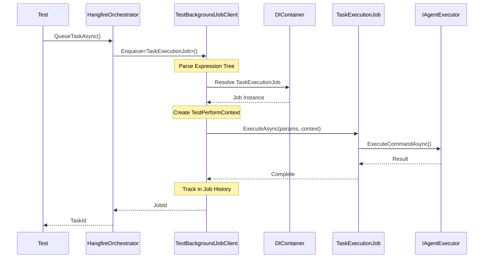

## Key Architectural Components

### 1. TestBackgroundJobClient Class Structure
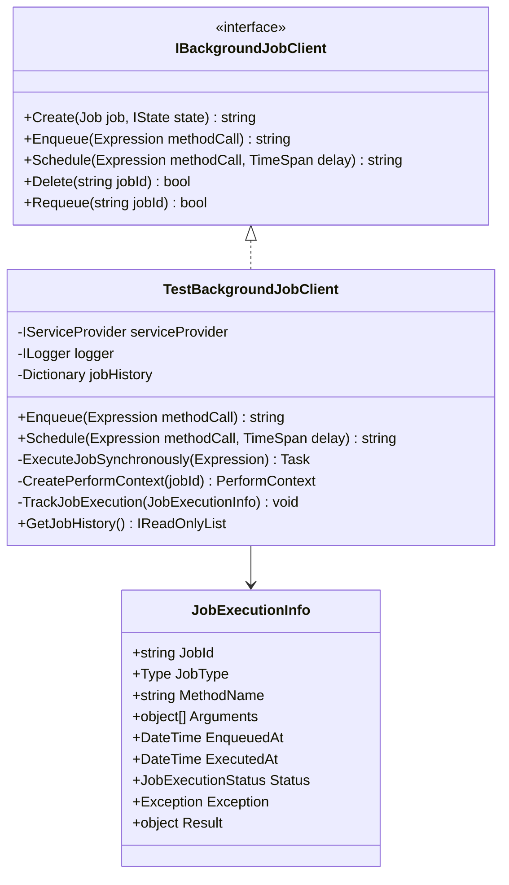

### 2. Expression Parsing Architecture
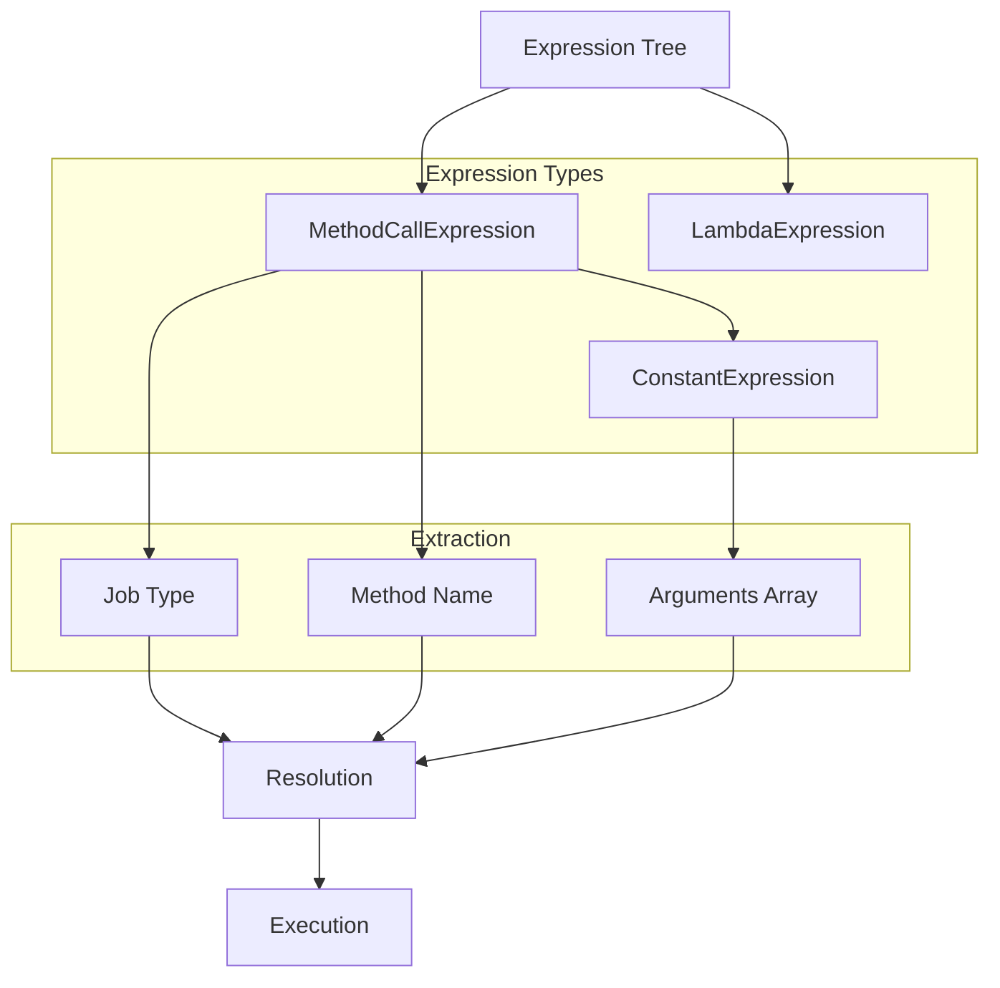

### 3. Dependency Injection Scoping
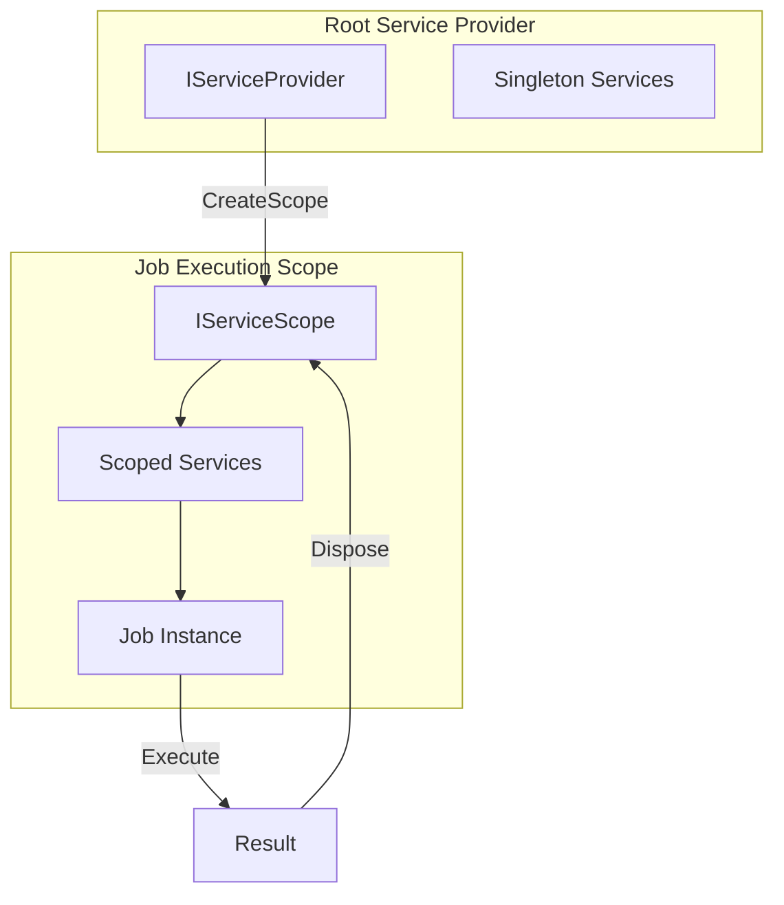

## Integration Points

### Test Factory Configuration Changes
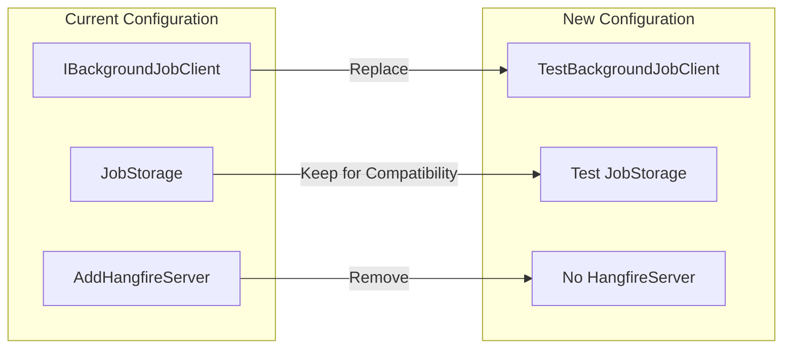

### Parallel Execution Isolation
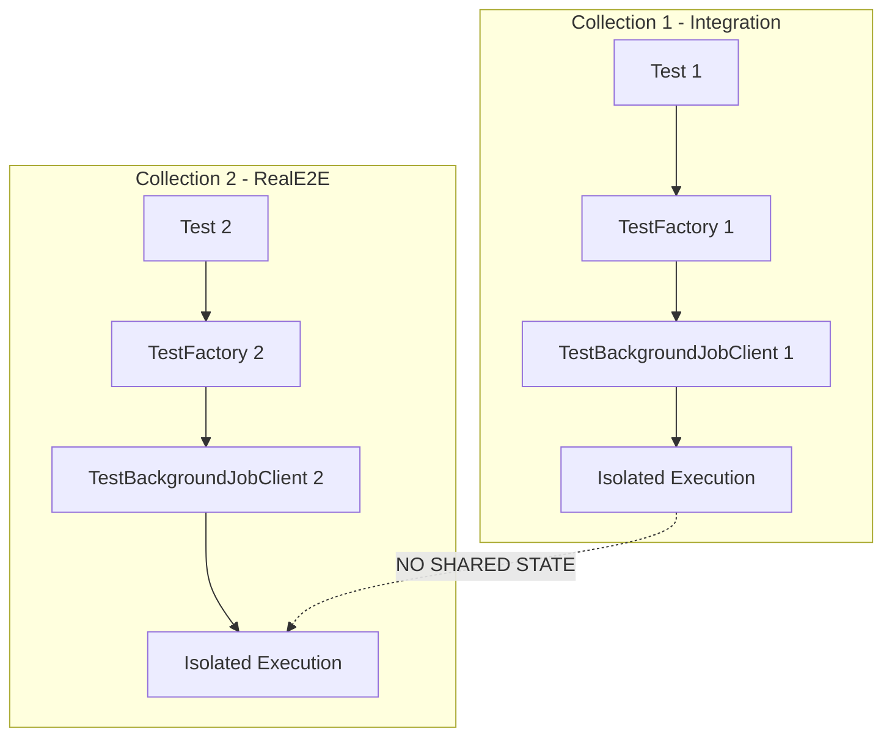

## Data Flow Architecture

### Job State Tracking
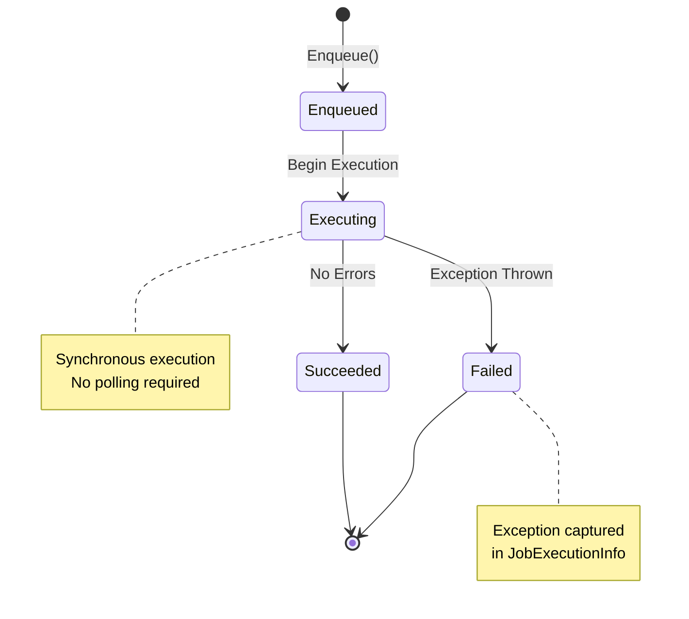

### Test Assertion Flow
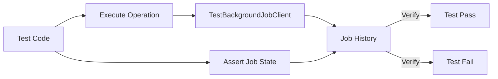

## Performance Characteristics

### Sequential vs Parallel Execution
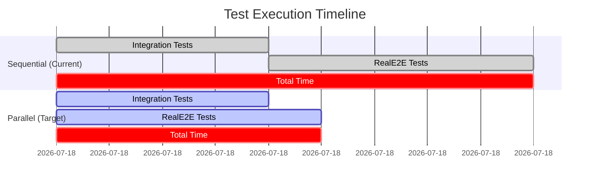

## Error Handling Architecture

### Exception Propagation
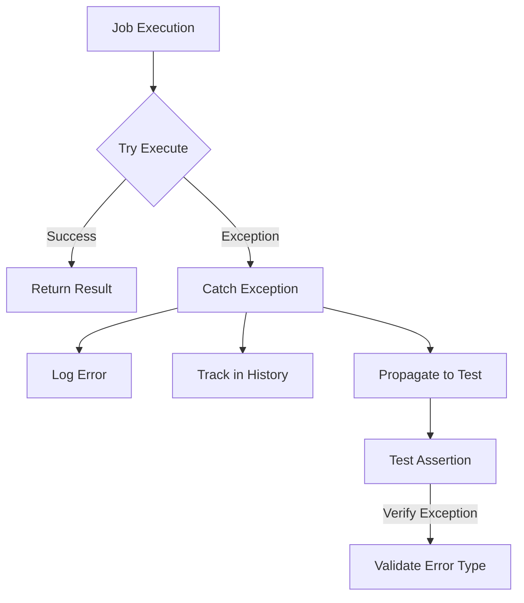

## Migration Path

### Phase-by-Phase Transformation
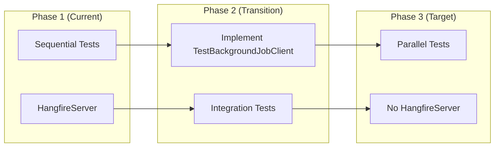

## Dependencies Between Plan Sections

- **Phase 1** → **Phase 2**: Test infrastructure must be complete before integration
- **Phase 2** → **Phase 3**: Test factories must be updated before job execution changes
- **Phase 3** → **Phase 4**: Job execution must work before fixing compatibility
- **Phase 4** → **Phase 5**: All tests must pass before enabling parallelization
- **Phase 5** → **Phase 6**: Parallel execution must be stable before final validation