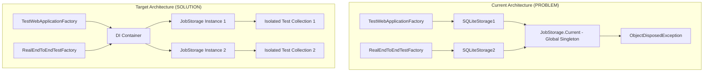

# Hangfire Dependency Injection Refactoring - Work Execution Plan

## Executive Summary

**Problem**: Test collections create separate Hangfire Storage instances and both set `JobStorage.Current` (global singleton), causing race conditions and disposed storage exceptions when tests run in parallel.

**Solution**: Refactor Hangfire integration to use Dependency Injection instead of the global `JobStorage.Current` singleton, enabling proper test isolation.

**Impact**: Fixes 18/582 failing tests caused by "Cannot access a disposed object. SQLiteStorage" errors during parallel test execution.

## Architecture Overview



## Phase 1: Analysis and Preparation

### 1.1 Identify All JobStorage.Current Usages
**Status**: COMPLETED
**Files Using JobStorage.Current**:
- `src/Orchestra.Tests/TestWebApplicationFactory.cs` (line 154)
- `src/Orchestra.Tests/RealEndToEndTests.cs` (line 358)
- `src/Orchestra.Tests/Integration/IntegrationTestBase.cs` (line 178)

**Usage Pattern**: All three usages are for accessing `IMonitoringApi` via `JobStorage.Current.GetMonitoringApi()`

### 1.2 Analyze Hangfire Service Registration
**Current Registration in Startup.cs**:
- Lines 106-141: Conditional Hangfire configuration (InMemory, SQLite, PostgreSQL)
- Lines 143-148: AddHangfireServer configuration
- Note: JobStorage IS registered by AddHangfire() but not explicitly used via DI

### 1.3 Risk Assessment

**Low Risk**:
- Hangfire already supports DI for JobStorage (confirmed by research)
- Change is localized to test infrastructure
- Production code changes minimal

**Medium Risk**:
- BackgroundJobServer might have internal dependencies on JobStorage.Current
- Dashboard monitoring might require global storage

**Mitigation**:
- Keep JobStorage.Current setting in production (Startup.cs)
- Only remove from test infrastructure
- Gradual rollout with comprehensive testing

## Phase 2: Implementation Strategy

### 2.1 Create JobStorage Wrapper Service

```csharp
// New file: src/Orchestra.Core/Services/IHangfireStorageService.cs
public interface IHangfireStorageService
{
    JobStorage Storage { get; }
    IMonitoringApi GetMonitoringApi();
    IStorageConnection GetConnection();
}

// New file: src/Orchestra.Core/Services/HangfireStorageService.cs
public class HangfireStorageService : IHangfireStorageService
{
    private readonly JobStorage _storage;

    public HangfireStorageService(JobStorage storage)
    {
        _storage = storage ?? throw new ArgumentNullException(nameof(storage));
    }

    public JobStorage Storage => _storage;
    public IMonitoringApi GetMonitoringApi() => _storage.GetMonitoringApi();
    public IStorageConnection GetConnection() => _storage.GetConnection();
}
```

### 2.2 Modify Startup.cs for DI Registration

```csharp
// In ConfigureServices method, after AddHangfire:

// Register JobStorage as a service (lines to add after line 141)
services.AddSingleton<JobStorage>(provider =>
{
    // For production, we still set JobStorage.Current for backward compatibility
    // But also return it for DI
    return JobStorage.Current;
});

services.AddSingleton<IHangfireStorageService, HangfireStorageService>();
```

### 2.3 Update Test Infrastructure

#### 2.3A: Modify TestWebApplicationFactory.cs

```csharp
// Replace line 154:
// OLD: var monitoringApi = JobStorage.Current.GetMonitoringApi();
// NEW:
var storageService = scope.ServiceProvider.GetRequiredService<IHangfireStorageService>();
var monitoringApi = storageService.GetMonitoringApi();
```

#### 2.3B: Create Test-Specific Storage Registration

```csharp
// In TestWebApplicationFactory.ConfigureServices (add after line 96):
services.AddSingleton<JobStorage>(provider =>
{
    // Create isolated storage for this test instance
    var configuration = provider.GetRequiredService<IConfiguration>();
    var hangfireConnection = configuration["HANGFIRE_CONNECTION"];

    var storage = new SQLiteStorage(hangfireConnection, new SQLiteStorageOptions
    {
        QueuePollInterval = TimeSpan.FromMilliseconds(100)
    });

    // DO NOT set JobStorage.Current in tests!
    return storage;
});

services.AddSingleton<IHangfireStorageService, HangfireStorageService>();
```

#### 2.3C: Update RealEndToEndTestFactory.cs
- Apply same pattern as TestWebApplicationFactory

#### 2.3D: Update IntegrationTestBase.cs

```csharp
// Replace line 178:
// OLD: var monitoringApi = JobStorage.Current.GetMonitoringApi();
// NEW:
using (var scope = _factory.Services.CreateScope())
{
    var storageService = scope.ServiceProvider.GetRequiredService<IHangfireStorageService>();
    var monitoringApi = storageService.GetMonitoringApi();
    // ... rest of the code
}
```

## Phase 3: Testing and Validation

### 3.1 Test Execution Plan

```bash
# Step 1: Run single test collection (baseline)
dotnet test --filter "FullyQualifiedName~Integration" --logger "console;verbosity=detailed"

# Step 2: Run both collections in parallel
dotnet test --logger "console;verbosity=detailed"

# Step 3: Run stress test (multiple iterations)
for i in {1..10}; do
    echo "Iteration $i"
    dotnet test --no-build
done
```

### 3.2 Validation Criteria

**Success Metrics**:
- ✅ All 582 tests passing
- ✅ No ObjectDisposedException errors
- ✅ Parallel execution successful
- ✅ No performance degradation

**Monitoring Points**:
1. Check Hangfire Dashboard still functional
2. Verify background jobs execute correctly
3. Confirm monitoring API returns correct data
4. Validate storage cleanup after tests

## Phase 4: Rollback Strategy

### 4.1 Quick Rollback (if issues in testing)

```bash
# Revert all changes
git checkout -- src/Orchestra.Tests/TestWebApplicationFactory.cs
git checkout -- src/Orchestra.Tests/RealEndToEndTestFactory.cs
git checkout -- src/Orchestra.Tests/Integration/IntegrationTestBase.cs
```

### 4.2 Partial Rollback (if production affected)

Keep test changes but restore JobStorage.Current usage in specific areas:
1. Re-add JobStorage.Current setting in test factories
2. Keep wrapper service for future migration
3. Document known limitations

## Phase 5: Documentation and Cleanup

### 5.1 Update Documentation

**Files to Update**:
- `Docs/Architecture/test-architecture.md` - Add section on Hangfire isolation
- `README.md` - Note about test execution requirements
- Inline comments in modified files

### 5.2 Code Cleanup

```csharp
// Remove any remaining JobStorage.Current references
// Update XML documentation
// Add deprecation warnings where applicable
```

## Implementation Checklist

### Core Implementation
- [ ] Create IHangfireStorageService interface
- [ ] Implement HangfireStorageService class
- [ ] Register services in Startup.cs
- [ ] Update TestWebApplicationFactory.cs
- [ ] Update RealEndToEndTestFactory.cs
- [ ] Update IntegrationTestBase.cs
- [ ] Remove JobStorage.Current from test code

### Testing
- [ ] Run Integration tests in isolation
- [ ] Run RealE2E tests in isolation
- [ ] Run full test suite in parallel
- [ ] Perform stress testing (10 iterations)
- [ ] Verify Hangfire Dashboard functionality
- [ ] Check memory usage and disposal

### Documentation
- [ ] Update architecture documentation
- [ ] Add migration notes
- [ ] Document test isolation strategy
- [ ] Update troubleshooting guide

## Timeline Estimate

**Total Estimated Time**: 4-6 hours

1. **Phase 1**: Analysis and Preparation - ✅ COMPLETED
2. **Phase 2**: Implementation - 2-3 hours
3. **Phase 3**: Testing and Validation - 1-2 hours
4. **Phase 4**: Documentation - 0.5 hours
5. **Buffer**: Issue resolution - 0.5-1 hour

## Success Verification

```powershell
# Final verification script
$testResults = dotnet test --logger "trx" 2>&1
$failedTests = $testResults | Select-String "Failed: [1-9]"
$disposedErrors = $testResults | Select-String "ObjectDisposedException"

if ($failedTests -or $disposedErrors) {
    Write-Error "Tests still failing or disposal errors present"
    exit 1
} else {
    Write-Host "SUCCESS: All tests passing with proper isolation!" -ForegroundColor Green
    exit 0
}
```

## Notes and Considerations

1. **Hangfire Version Compatibility**: Ensure Hangfire.Core >= 1.7.0 for proper DI support
2. **Thread Safety**: JobStorage implementations should be thread-safe for concurrent test execution
3. **Storage Disposal**: Ensure proper disposal of storage instances in test cleanup
4. **Migration Path**: This refactoring sets foundation for complete removal of static dependencies

## Appendix: Error Analysis

**Original Error Pattern**:
```
System.ObjectDisposedException : Cannot access a disposed object.
Object name: 'SQLiteStorage'.
   at Hangfire.Storage.SQLite.SQLiteStorage.UseConnection[T](DbConnection dedicatedConnection, Func`2 func)
   at Hangfire.Storage.SQLite.SQLiteStorage.UseConnection[T](Func`2 func)
   at Hangfire.Storage.SQLite.SQLiteMonitoringApi.GetStatistics()
```

**Root Cause Chain**:
1. TestWebApplicationFactory creates SQLiteStorage1
2. Sets JobStorage.Current = SQLiteStorage1
3. RealEndToEndTestFactory creates SQLiteStorage2
4. Overwrites JobStorage.Current = SQLiteStorage2
5. TestWebApplicationFactory disposes SQLiteStorage1
6. Any code using JobStorage.Current now accesses disposed SQLiteStorage1
7. ObjectDisposedException thrown

**Solution Verification**:
- Each test collection gets its own JobStorage instance via DI
- No shared global state between test collections
- Proper isolation ensures no disposal conflicts