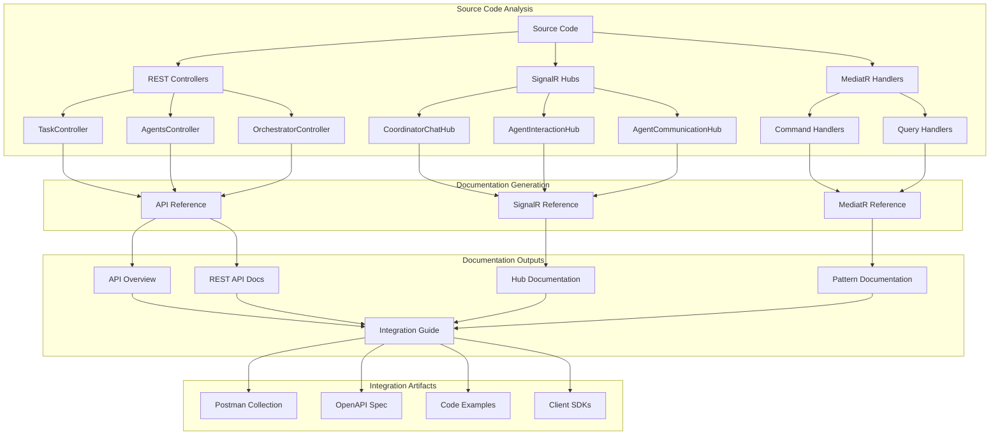
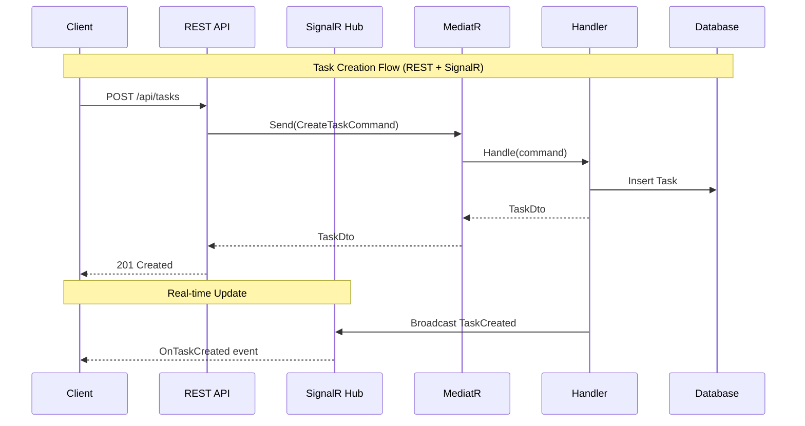
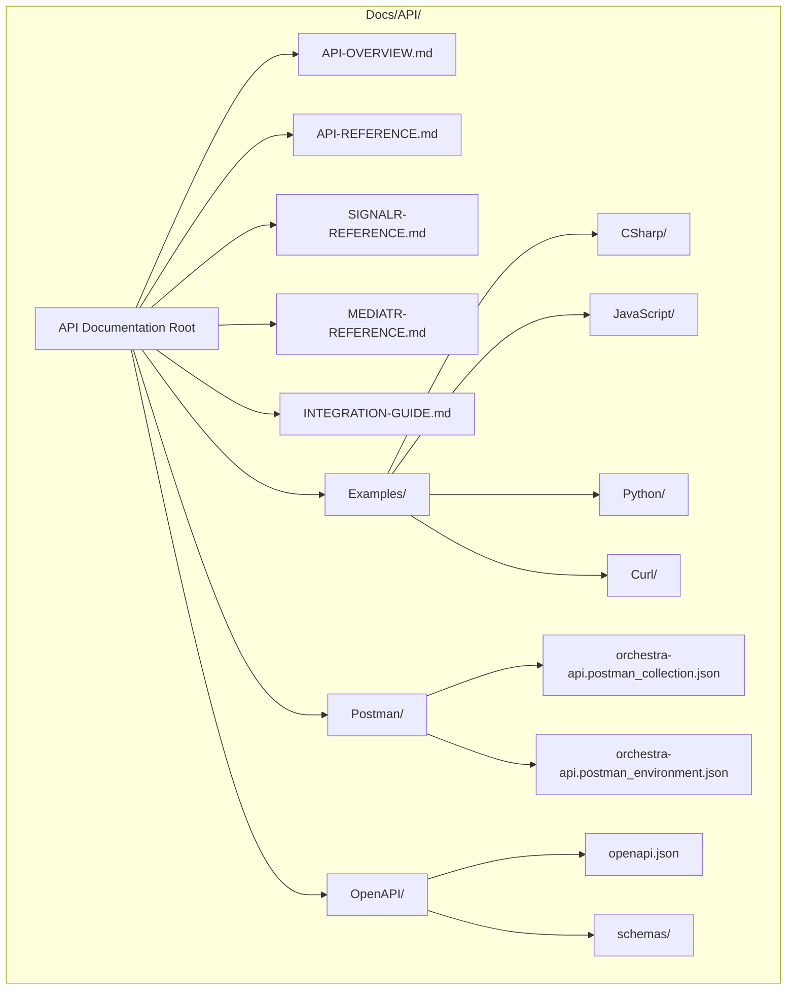
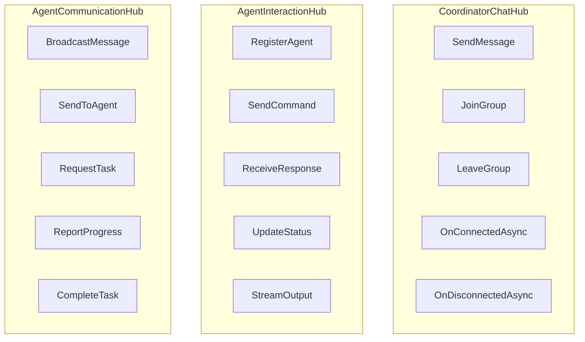
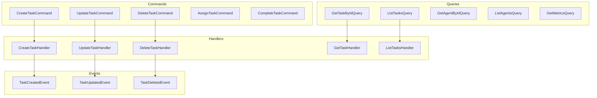
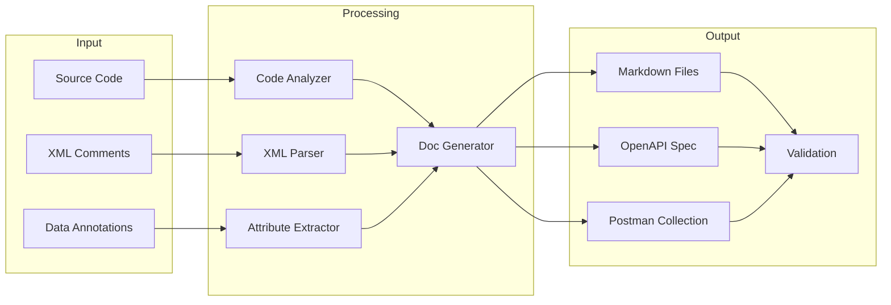
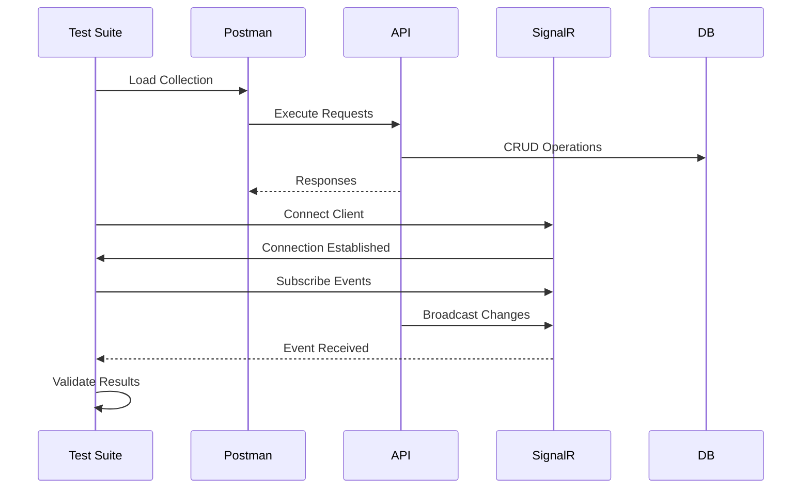
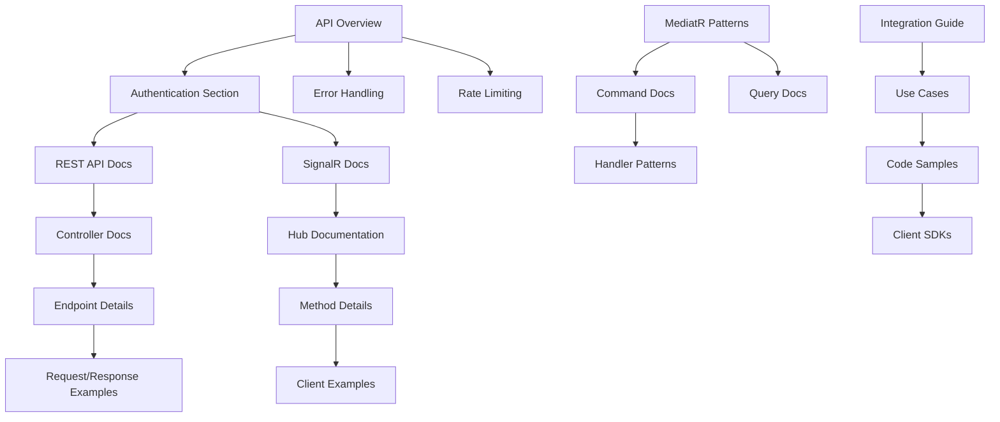
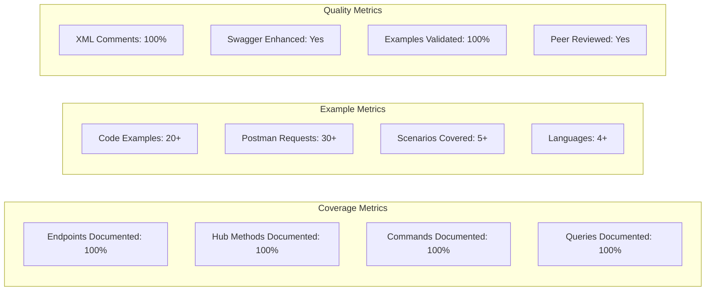

# API Documentation Plan - Architecture Diagram

## High-Level Documentation Architecture



## Documentation Flow and Dependencies

```mermaid
flowchart LR
    subgraph "Phase 1: Analysis"
        A1[Controller Analysis] --> A2[Hub Analysis]
        A2 --> A3[MediatR Analysis]
        A3 --> A4[Structure Planning]
    end

    subgraph "Phase 2: REST API"
        A4 --> R1[API Overview]
        R1 --> R2[Endpoint Docs]
        R2 --> R3[Examples]
    end

    subgraph "Phase 3: SignalR"
        R3 --> S1[SignalR Overview]
        S1 --> S2[Hub Methods]
        S2 --> S3[Client Examples]
    end

    subgraph "Phase 4: MediatR"
        S3 --> M1[Pattern Docs]
        M1 --> M2[Command Catalog]
        M2 --> M3[Query Catalog]
    end

    subgraph "Phase 5: Integration"
        M3 --> I1[Scenarios]
        I1 --> I2[SDK Examples]
        I2 --> I3[Testing]
    end

    subgraph "Phase 6: Enhancement"
        I3 --> E1[XML Comments]
        E1 --> E2[Swagger Config]
        E2 --> E3[Validation]
    end
```



## Component Interaction Documentation



## Documentation Structure



## API Endpoint Matrix

```mermaid
graph LR
    subgraph "TaskController"
        T1[GET /api/tasks]
        T2[GET /api/tasks/{id}]
        T3[POST /api/tasks]
        T4[PUT /api/tasks/{id}]
        T5[DELETE /api/tasks/{id}]
        T6[POST /api/tasks/batch]
    end

    subgraph "AgentsController"
        A1[GET /api/agents]
        A2[GET /api/agents/{id}]
        A3[POST /api/agents]
        A4[PUT /api/agents/{id}]
        A5[DELETE /api/agents/{id}]
        A6[GET /api/agents/{id}/tasks]
    end

    subgraph "OrchestratorController"
        O1[GET /orchestrator/status]
        O2[POST /orchestrator/start]
        O3[POST /orchestrator/stop]
        O4[GET /orchestrator/metrics]
    end
```

## SignalR Hub Methods



## MediatR Command/Query Flow



## Documentation Generation Pipeline



## Integration Testing Flow



## Dependencies Between Documentation Sections



## Documentation Quality Metrics

