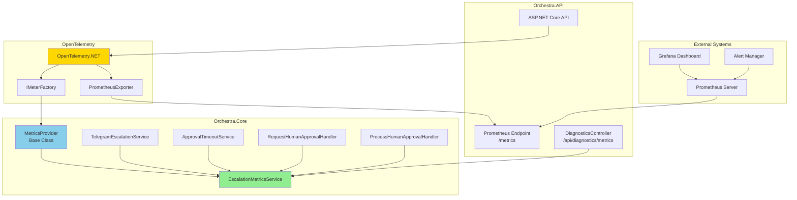
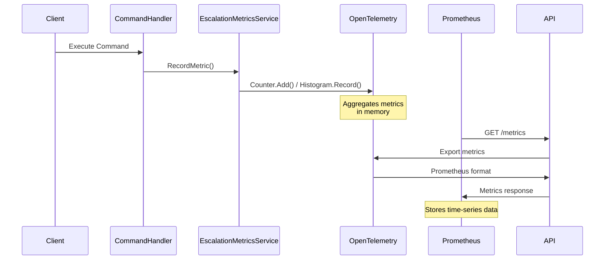
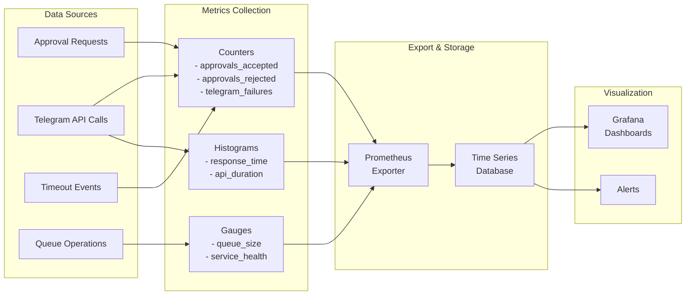
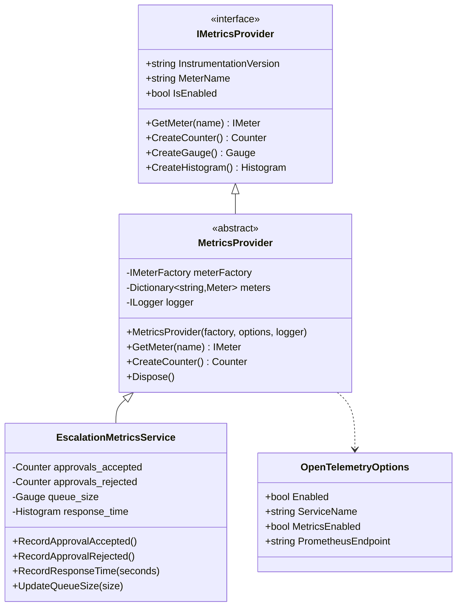

# ClaudeCodeSubprocessConnector Phase 4.3: Monitoring & Metrics Architecture

**Related Plan**: [ClaudeCodeSubprocessConnector-Phase4.3-Monitoring-Metrics.md](./ClaudeCodeSubprocessConnector-Phase4.3-Monitoring-Metrics.md)

## High-Level Architecture



## Component Interactions



## Metrics Data Flow



## Class Hierarchy



## Metric Definitions

### Escalation Queue Metrics

| Metric Name | Type | Unit | Description | Tags |
|------------|------|------|-------------|------|
| `escalation_queue_size` | Gauge | count | Current number of pending approvals | - |
| `escalation_queue_enqueue_rate` | Counter | count | Total items added to queue | - |
| `escalation_queue_dequeue_rate` | Counter | count | Total items removed from queue | - |
| `escalation_queue_depth_histogram` | Histogram | count | Distribution of queue depths | - |

### Approval Metrics

| Metric Name | Type | Unit | Description | Tags |
|------------|------|------|-------------|------|
| `escalation_approvals_accepted` | Counter | count | Total accepted approvals | `session_id` |
| `escalation_approvals_rejected` | Counter | count | Total rejected approvals | `session_id`, `reason` |
| `escalation_approvals_timeout` | Counter | count | Total timed out approvals | `session_id` |
| `escalation_response_time_seconds` | Histogram | seconds | Time from request to decision | `result` |

### Telegram API Metrics

| Metric Name | Type | Unit | Description | Tags |
|------------|------|------|-------------|------|
| `telegram_api_requests` | Counter | count | Total API calls | `endpoint`, `method` |
| `telegram_api_failures` | Counter | count | Failed API calls | `endpoint`, `error_type` |
| `telegram_api_retry_attempts` | Counter | count | Total retry attempts | `endpoint` |
| `telegram_api_duration_seconds` | Histogram | seconds | API call duration | `endpoint`, `status_code` |

### System Health Metrics

| Metric Name | Type | Unit | Description | Tags |
|------------|------|------|-------------|------|
| `approval_timeout_service_health` | Gauge | bool | Service health (1=healthy, 0=unhealthy) | - |
| `telegram_service_health` | Gauge | bool | Telegram connection (1=connected, 0=disconnected) | - |
| `database_connection_pool_active` | Gauge | count | Active database connections | - |
| `database_connection_pool_idle` | Gauge | count | Idle database connections | - |

## Integration Points

### 1. Command Handlers
```csharp
// RequestHumanApprovalCommandHandler
public async Task<string> Handle(RequestHumanApprovalCommand request, CancellationToken cancellationToken)
{
    var approvalId = Guid.NewGuid().ToString();

    // Record metric
    _metricsService.RecordEscalationInitiated(approvalId, request.SessionId);
    _metricsService.UpdateQueueSize(+1);

    // ... rest of handler logic
}
```

### 2. Telegram Service
```csharp
// TelegramEscalationService
public async Task<bool> SendEscalationAsync(string message)
{
    var stopwatch = Stopwatch.StartNew();
    var success = false;
    var retries = 0;

    try
    {
        // ... send logic with Polly retry
        success = true;
    }
    finally
    {
        _metricsService.RecordTelegramCall(
            endpoint: "sendMessage",
            duration: stopwatch.Elapsed.TotalSeconds,
            success: success,
            retries: retries);
    }
}
```

### 3. Timeout Service
```csharp
// ApprovalTimeoutService
private void CheckForTimeouts()
{
    var expired = GetExpiredApprovals();
    foreach (var approval in expired)
    {
        _metricsService.RecordApprovalTimeout(approval.ApprovalId);
        _metricsService.UpdateQueueSize(-1);
        // ... cancellation logic
    }
}
```

## Prometheus Configuration

### Scrape Configuration
```yaml
global:
  scrape_interval: 15s
  evaluation_interval: 15s

scrape_configs:
  - job_name: 'orchestra-api'
    static_configs:
      - targets: ['localhost:5000']
    metrics_path: '/metrics'
    scrape_interval: 10s
```

### Alert Rules
```yaml
groups:
  - name: escalation_alerts
    rules:
      - alert: HighQueueDepth
        expr: escalation_queue_size > 10
        for: 5m
        annotations:
          summary: "High escalation queue depth"
          description: "Queue has {{ $value }} pending approvals"

      - alert: HighFailureRate
        expr: rate(telegram_api_failures[5m]) > 0.1
        for: 2m
        annotations:
          summary: "High Telegram API failure rate"
          description: "Failure rate: {{ $value }} per second"

      - alert: SlowResponseTime
        expr: histogram_quantile(0.95, escalation_response_time_seconds) > 300
        for: 5m
        annotations:
          summary: "Slow approval response time"
          description: "95th percentile response time: {{ $value }} seconds"
```

## Grafana Dashboard Layout

### Row 1: Queue Metrics
- **Panel 1**: Current Queue Size (Gauge)
- **Panel 2**: Queue Operations Rate (Graph)
- **Panel 3**: Queue Depth Heatmap

### Row 2: Approval Statistics
- **Panel 4**: Approval Rate (Accepted vs Rejected)
- **Panel 5**: Response Time Distribution
- **Panel 6**: Timeout Rate

### Row 3: Telegram API Health
- **Panel 7**: API Request Rate
- **Panel 8**: Failure Rate by Error Type
- **Panel 9**: API Call Duration (p50, p95, p99)

### Row 4: System Health
- **Panel 10**: Service Health Status
- **Panel 11**: Database Connection Pool
- **Panel 12**: Retry Attempts Trend

## Performance Considerations

### Metric Recording Overhead
- **Target**: <1ms per metric recording
- **Strategy**: Async recording, in-memory aggregation
- **Batch Size**: 1000 measurements before export

### Memory Usage
- **Cardinality Control**: Limited tag values
- **Retention**: 10,000 metric points in memory
- **Cleanup**: Automatic stale metric removal

### Export Frequency
- **Development**: Every 10 seconds
- **Production**: Every 60 seconds
- **On-demand**: Via /api/diagnostics/metrics

## Security Considerations

### Metrics Endpoint Protection
- **Authentication**: Optional Bearer token
- **Network**: Internal network only recommended
- **Rate Limiting**: 10 requests per minute

### Sensitive Data
- **PII**: No personal information in metrics
- **Session IDs**: Hashed if needed
- **Approval IDs**: Use GUIDs only

## Testing Strategy

### Unit Tests
- MetricsProvider functionality
- EscalationMetricsService operations
- Thread safety validation

### Integration Tests
- End-to-end metric recording
- Prometheus format validation
- Performance benchmarks

### Load Tests
- 1000 approvals/minute
- 10,000 metrics/minute
- Memory stability over 24 hours

## Deployment Checklist

- [ ] OpenTelemetry packages installed
- [ ] Configuration in appsettings.json
- [ ] Prometheus endpoint accessible
- [ ] Grafana dashboard imported
- [ ] Alert rules configured
- [ ] Performance baseline established
- [ ] Documentation updated

## Dependencies

### NuGet Packages
- OpenTelemetry 1.10.0+
- OpenTelemetry.Exporter.Prometheus.AspNetCore 1.10.0-rc.1+
- OpenTelemetry.Instrumentation.AspNetCore 1.10.0+
- OpenTelemetry.Instrumentation.Http 1.10.0+
- OpenTelemetry.Instrumentation.EntityFrameworkCore 1.0.0-rc.1+

### External Systems
- Prometheus 2.40+ (recommended)
- Grafana 9.0+ (recommended)
- AlertManager 0.25+ (optional)