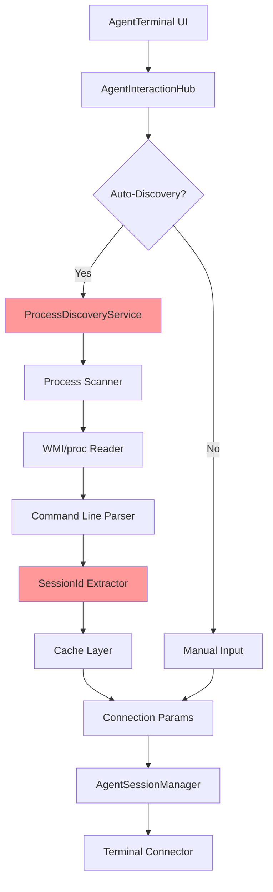

# ProcessDiscoveryService Fix - Architecture Documentation

## System Architecture Overview

The ProcessDiscoveryService Fix introduces enhanced process discovery capabilities with multiple fallback strategies and manual input options. This architecture ensures robust terminal connections even when automatic discovery fails.

## Component Architecture



## Core Components

### 1. ProcessDiscoveryService (Enhanced)
**Location**: `src/Orchestra.Core/Services/ProcessDiscoveryService.cs`
**Responsibilities**:
- Multi-strategy process detection (node.exe, electron.exe, claude.exe, python.exe)
- Command-line extraction with platform-specific optimizations
- Intelligent cache management with sliding expiration
- Diagnostic logging and metrics collection

**Key Methods**:
- `IsClaudeCodeProcess()`: Expanded detection for multiple process types
- `GetCommandLine()`: Enhanced with retry logic and elevated permissions
- `ExtractSessionId()`: Multi-pattern extraction with fallback strategies

### 2. SessionIdExtractionPipeline (New)
**Location**: `src/Orchestra.Core/Services/SessionIdExtractionPipeline.cs`
**Pattern**: Chain of Responsibility
**Responsibilities**:
- Orchestrate multiple SessionId extraction strategies
- Configurable priority ordering
- Fallback mechanism when primary strategies fail

**Extraction Strategies**:
1. **DirectUuidExtractor**: Finds UUID patterns in command line
2. **ParameterExtractor**: Parses --session-id parameter
3. **EnvironmentVariableExtractor**: Checks process environment
4. **WorkingDirectoryExtractor**: Parses working directory path
5. **ConfigurationFileExtractor**: Reads from known config files

### 3. SessionIdMappingService (New)
**Location**: `src/Orchestra.Core/Services/SessionIdMappingService.cs`
**Responsibilities**:
- Map database SessionIds to process identifiers
- Handle SessionId rotation and refresh scenarios
- Provide fallback lookup strategies
- Maintain SessionId lifecycle tracking

### 4. ProcessBrowser Component (New)
**Location**: `src/Orchestra.Web/Components/AgentTerminal/ProcessBrowser.razor`
**Responsibilities**:
- Display discovered Claude processes
- Show process details (PID, SessionId, Status)
- Enable manual process selection
- Provide refresh capability

### 5. ProcessDiscoveryClient (New)
**Location**: `src/Orchestra.Web/Services/ProcessDiscoveryClient.cs`
**Responsibilities**:
- Call diagnostics API endpoints
- Handle response parsing and caching
- Provide process information to UI components

### 6. DiagnosticsController (New)
**Location**: `src/Orchestra.API/Controllers/DiagnosticsController.cs`
**Endpoints**:
- `GET /api/diagnostics/processes`: List all discovered processes
- `POST /api/diagnostics/cache/clear`: Clear process cache
- `GET /api/diagnostics/sessionid/{id}`: Get SessionId extraction details

## Data Flow

### Automatic Discovery Flow
1. User initiates terminal connection
2. AgentInteractionHub requests process discovery
3. ProcessDiscoveryService scans running processes
4. SessionIdExtractionPipeline attempts extraction
5. Cache layer stores successful results
6. Connection parameters returned to hub
7. Terminal connection established

### Manual Fallback Flow
1. User selects "Advanced Options" in UI
2. ProcessBrowser displays available processes
3. User selects process or enters details manually
4. Input validation performed
5. Connection parameters passed directly to hub
6. Terminal connection attempted with manual parameters

### Hybrid Flow
1. Auto-discovery attempted first
2. If fails, UI prompts for manual input
3. User can browse processes or enter details
4. Successful parameters saved for future use
5. Connection history maintained for quick access

## Caching Strategy

### Multi-Level Cache
1. **Process Cache** (2-minute TTL)
   - Stores discovered process information
   - Invalidated on process changes

2. **SessionId Cache** (5-minute TTL)
   - Maps SessionIds to connection parameters
   - Per-SessionId entries with sliding expiration

3. **Connection History** (Local Storage)
   - Last 5 successful connections
   - Associated with AgentId
   - Persistent across sessions

## Error Handling

### Graceful Degradation
1. **Primary**: Automatic discovery with all strategies
2. **Secondary**: Process browser with manual selection
3. **Tertiary**: Direct manual input of parameters
4. **Fallback**: Use last known successful parameters

### Error Categories
- **AccessDenied**: Retry with elevated permissions
- **ProcessNotFound**: Suggest manual input
- **SessionIdNotFound**: Try alternative extraction strategies
- **ConnectionFailed**: Display troubleshooting guide

## Security Considerations

### Process Access
- Request minimum required permissions
- Handle access denied scenarios gracefully
- No storage of sensitive command-line data
- Sanitize all user inputs

### Connection Security
- Validate ProcessId exists and is accessible
- Verify SocketPath/PipeName format
- Prevent injection attacks in manual input
- Audit log all connection attempts

## Performance Optimizations

### Discovery Optimizations
- Async process scanning
- Parallel extraction strategies
- Early exit on first successful extraction
- Background cache refresh

### UI Optimizations
- Lazy loading of process list
- Virtual scrolling for large lists
- Debounced refresh operations
- Optimistic UI updates

## Monitoring & Observability

### Metrics
- Discovery success rate
- Average discovery time
- Cache hit/miss ratio
- Manual fallback usage
- Connection success rate

### Health Checks
- ProcessDiscoveryService availability
- Cache functionality
- Process access permissions
- Extraction pipeline performance

### Logging
- Detailed process discovery logs
- SessionId extraction attempts
- Cache operations
- Connection attempts and outcomes

## Configuration

### AppSettings Configuration
```json
{
  "ProcessDiscovery": {
    "CacheDuration": "00:02:00",
    "EnableAutoDiscovery": true,
    "MaxProcessScanTime": 2000,
    "ExtractionStrategies": [
      "DirectUuid",
      "Parameter",
      "Environment",
      "WorkingDirectory",
      "ConfigFile"
    ]
  }
}
```

### Feature Flags
- `EnableProcessDiscovery`: Master switch for feature
- `EnableManualFallback`: Allow manual input UI
- `EnableProcessBrowser`: Show process browser
- `EnableDiagnostics`: Expose diagnostic endpoints

## Testing Strategy

### Unit Testing
- Mock WMI/proc filesystem
- Test each extraction strategy
- Validate cache behavior
- Error scenario coverage

### Integration Testing
- End-to-end discovery flow
- Manual fallback flow
- SignalR hub integration
- Cross-platform validation

### Performance Testing
- Discovery under load
- Cache performance
- UI responsiveness
- Connection latency

## Deployment Considerations

### Rollout Strategy
1. Feature flag controlled rollout
2. Gradual percentage increase
3. Monitor key metrics
4. Rollback capability

### Platform Support
- Windows 10/11: WMI-based discovery
- Linux: /proc filesystem parsing
- macOS: Process API integration (future)

### Backward Compatibility
- Maintain existing agent data structure
- Support legacy connection methods
- Gradual migration path
- No breaking changes

## Future Enhancements

### Planned Improvements
- Process health monitoring
- Automatic process restart
- Connection pooling
- Process pool management
- Machine learning for pattern detection
- Cross-machine discovery

### Extensibility Points
- Custom extraction strategies
- Platform-specific implementations
- Plugin architecture for discovery
- External process providers