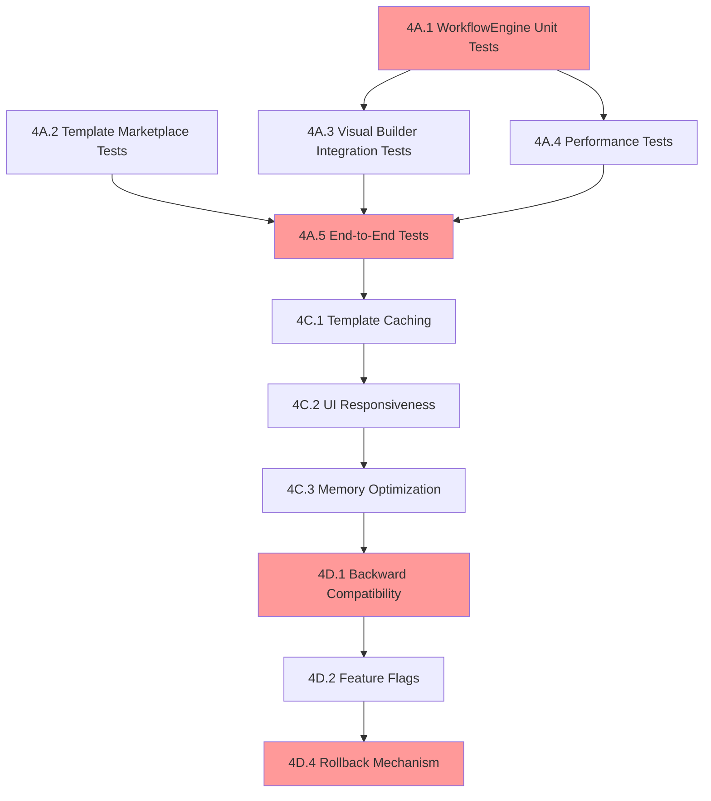

# Phase 4: Integration & Polish - Detailed Task Breakdown

**PARENT REFERENCE**: [Actions Block Refactoring Work Plan](../actions-block-refactoring-workplan.md#phase-4-integration--polish-estimated-18-25-hours)

## Executive Summary

This detailed breakdown transforms Phase 4's four major components (4A-4D) into 23 atomic tasks, each estimated at 1-3 hours for optimal execution by LLM agents. Total estimated effort: 18-25 hours across testing, documentation, optimization, and migration.

## Critical Path Analysis



**Critical Path**: 4A.1 → 4A.3 → 4A.5 → 4C.1 → 4C.2 → 4C.3 → 4D.1 → 4D.2 → 4D.4
**Duration**: ~12-16 hours (critical path bottleneck)

---

## 4A. Comprehensive Testing Suite (10-12 hours)

### 4A.1 WorkflowEngine Core Logic Tests (1.5 hours)
**Priority**: CRITICAL PATH ⭐
**Dependencies**: None
**Complexity**: Medium

**Scope**: Test core workflow execution engine without external dependencies.

**Technical Specifications**:
- Framework: xUnit + Moq + FluentAssertions
- Coverage Target: 95%+ for WorkflowEngine.Core
- Test Categories: Basic execution, parameter resolution, error handling

**Atomic Tasks**:
```csharp
// Test Cases to Implement
[Fact] public async Task ExecuteWorkflow_LinearFlow_CompletesSuccessfully()
[Fact] public async Task ExecuteWorkflow_WithParameters_ResolvesVariablesCorrectly()
[Fact] public async Task ExecuteWorkflow_InvalidWorkflow_ThrowsValidationException()
[Fact] public async Task ExecuteWorkflow_TimeoutScenario_CancelsGracefully()
```

**Acceptance Criteria**:
- [ ] All basic workflow execution paths tested
- [ ] Parameter injection and variable resolution verified
- [ ] Error scenarios produce expected exceptions
- [ ] Test execution completes in <30 seconds
- [ ] Code coverage report shows 95%+ for WorkflowEngine

**Files to Create**:
- `src/Orchestra.Tests/WorkflowEngine/WorkflowEngineTests.cs`
- `src/Orchestra.Tests/WorkflowEngine/ParameterResolutionTests.cs`

---

### 4A.2 WorkflowEngine Conditional Logic Tests (1.5 hours)
**Priority**: CRITICAL PATH ⭐
**Dependencies**: 4A.1 (setup and mocks)
**Complexity**: High

**Scope**: Test all conditional and loop constructs in workflow engine.

**Technical Specifications**:
- Test branching logic: if/then/else, switch statements
- Test loop constructs: foreach, while, retry policies
- Validate proper termination conditions

**Atomic Tasks**:
```csharp
// Complex Logic Tests
[Fact] public async Task ExecuteWorkflow_ConditionalBranch_TakesCorrectPath()
[Fact] public async Task ExecuteWorkflow_NestedConditions_EvaluatesCorrectly()
[Fact] public async Task ExecuteWorkflow_ForEachLoop_IteratesAllItems()
[Fact] public async Task ExecuteWorkflow_WhileLoop_TerminatesOnCondition()
[Fact] public async Task ExecuteWorkflow_RetryPolicy_RetriesOnFailure()
[Fact] public async Task ExecuteWorkflow_InfiniteLoop_ThrowsTimeoutException()
```

**Acceptance Criteria**:
- [ ] All conditional branching scenarios tested
- [ ] Loop termination conditions verified
- [ ] Complex nested logic scenarios covered
- [ ] Infinite loop protection works correctly
- [ ] Memory usage stays stable during loops

**Files to Create**:
- `src/Orchestra.Tests/WorkflowEngine/ConditionalLogicTests.cs`
- `src/Orchestra.Tests/WorkflowEngine/LoopConstructTests.cs`

---

### 4A.3 WorkflowEngine Dependency Management Tests (1 hour)
**Priority**: High
**Dependencies**: 4A.1, 4A.2
**Complexity**: Medium

**Scope**: Test workflow dependency resolution and circular dependency detection.

**Technical Specifications**:
- Test task dependency graphs
- Validate circular dependency detection
- Test parallel execution of independent tasks

**Atomic Tasks**:
```csharp
// Dependency Tests
[Fact] public async Task ExecuteWorkflow_LinearDependencies_ExecutesInOrder()
[Fact] public async Task ExecuteWorkflow_ParallelTasks_ExecutesConcurrently()
[Fact] public async Task ExecuteWorkflow_CircularDependency_ThrowsException()
[Fact] public async Task ExecuteWorkflow_MissingDependency_ThrowsException()
```

**Acceptance Criteria**:
- [ ] Linear dependencies execute in correct order
- [ ] Parallel execution works for independent tasks
- [ ] Circular dependencies detected and prevented
- [ ] Clear error messages for dependency issues

**Files to Create**:
- `src/Orchestra.Tests/WorkflowEngine/DependencyResolutionTests.cs`

---

### 4A.4 Template Marketplace Unit Tests (2 hours)
**Priority**: High
**Dependencies**: None (parallel to 4A.1-4A.3)
**Complexity**: High

**Scope**: Complete testing of template import/export and security validation.

**Technical Specifications**:
- JSON schema validation testing
- Security sanitization verification
- Template versioning logic testing
- Storage operation testing

**Atomic Tasks**:
```csharp
// Template Operations Tests
[Fact] public async Task ImportTemplate_ValidJson_ImportsSuccessfully()
[Fact] public async Task ImportTemplate_InvalidSchema_ThrowsValidationException()
[Fact] public async Task ImportTemplate_MaliciousContent_SanitizesCorrectly()
[Fact] public async Task ExportTemplate_WithMetadata_IncludesAllRequiredFields()
[Fact] public async Task VersionTemplate_SemanticVersioning_IncrementsCorrectly()
[Fact] public async Task VersionTemplate_ConflictResolution_MergesCorrectly()
```

**Acceptance Criteria**:
- [ ] All template import validation scenarios tested
- [ ] Export functionality preserves all required metadata
- [ ] Security sanitization prevents code injection
- [ ] Versioning logic follows semantic versioning
- [ ] Template corruption detection and recovery works
- [ ] CRUD operations maintain data integrity

**Files to Create**:
- `src/Orchestra.Tests/TemplateMarketplace/TemplateImportTests.cs`
- `src/Orchestra.Tests/TemplateMarketplace/TemplateExportTests.cs`
- `src/Orchestra.Tests/TemplateMarketplace/VersioningTests.cs`
- `src/Orchestra.Tests/TemplateMarketplace/SecurityTests.cs`

---

### 4A.5 Visual Workflow Builder Integration Tests (2 hours)
**Priority**: CRITICAL PATH ⭐
**Dependencies**: 4A.1, 4A.2, 4A.3 (workflow engine must be stable)
**Complexity**: High

**Scope**: End-to-end testing of visual workflow builder with React Flow integration.

**Technical Specifications**:
- Blazor Server testing with bUnit framework
- React Flow node connection testing
- Canvas state persistence testing
- Undo/redo functionality testing

**Atomic Tasks**:
```csharp
// Integration Tests
[Fact] public async Task CreateWorkflow_DragAndDrop_GeneratesValidJson()
[Fact] public async Task EditWorkflow_ModifyProperties_UpdatesWorkflowCorrectly()
[Fact] public async Task SaveWorkflow_CanvasState_PersistsCorrectly()
[Fact] public async Task LoadWorkflow_FromJson_RestoresCanvasState()
[Fact] public async Task UndoRedo_Operations_MaintainsConsistentState()
[Fact] public async Task ExecuteVisualWorkflow_MatchesJsonExecution()
```

**Acceptance Criteria**:
- [ ] Visual workflows serialize to valid JSON
- [ ] Canvas state persistence works correctly
- [ ] Undo/redo maintains consistent state
- [ ] Visual and JSON workflows execute identically
- [ ] UI remains responsive during large workflow operations
- [ ] Node connections validate correctly

**Files to Create**:
- `src/Orchestra.Tests/VisualWorkflowBuilder/CanvasOperationsTests.cs`
- `src/Orchestra.Tests/VisualWorkflowBuilder/SerializationTests.cs`
- `src/Orchestra.Tests/VisualWorkflowBuilder/UndoRedoTests.cs`

---

### 4A.6 Performance and Load Tests (1.5 hours)
**Priority**: High
**Dependencies**: 4A.1 through 4A.5 (complete workflow system)
**Complexity**: Medium

**Scope**: Load testing for concurrent workflow execution and memory profiling.

**Technical Specifications**:
- Concurrent execution testing (1-20 workflows)
- Memory usage profiling during batch operations
- UI responsiveness monitoring
- Performance regression testing vs Phase 1&2

**Atomic Tasks**:
```csharp
// Performance Tests
[Fact] public async Task ConcurrentExecution_20Workflows_CompletesWithinTimeout()
[Fact] public async Task BatchOperation_LargeDataSet_MaintainsMemoryLimits()
[Fact] public async Task UIOperations_HeavyBackground_RemainsResponsive()
[Fact] public async Task PerformanceRegression_VsBaseline_WithinAcceptableLimits()
```

**Acceptance Criteria**:
- [ ] Can execute 20 concurrent workflows without degradation
- [ ] Memory usage stays within 50MB additional vs Phase 1
- [ ] UI remains responsive (<100ms response time)
- [ ] No performance regression vs existing QuickActions
- [ ] Stress test runs for 1 hour without memory leaks

**Files to Create**:
- `src/Orchestra.Tests/Performance/ConcurrentExecutionTests.cs`
- `src/Orchestra.Tests/Performance/MemoryProfileTests.cs`
- `src/Orchestra.Tests/Performance/UIResponsivenessTests.cs`

---

### 4A.7 End-to-End System Tests (1.5 hours)
**Priority**: CRITICAL PATH ⭐
**Dependencies**: All previous testing tasks (4A.1 through 4A.6)
**Complexity**: Medium

**Scope**: Complete user journey testing covering all major workflows.

**Technical Specifications**:
- Selenium WebDriver for UI automation
- Complete user workflow simulation
- Error scenario testing
- Cross-browser compatibility verification

**User Journey Test Scenarios**:
1. **Template Creation Journey**: Create template → Use in workflow → Execute batch → Review results
2. **Community Sharing Journey**: Import community template → Customize → Share with others
3. **Scheduled Workflow Journey**: Schedule recurring workflow → Monitor execution → Handle failures

**Acceptance Criteria**:
- [ ] All three user journeys complete successfully
- [ ] Error scenarios handled gracefully with user feedback
- [ ] Cross-browser compatibility verified (Chrome, Firefox, Edge)
- [ ] Mobile responsiveness validated
- [ ] Accessibility standards met (WCAG 2.1 AA)

**Files to Create**:
- `src/Orchestra.Tests/EndToEnd/UserJourneyTests.cs`
- `src/Orchestra.Tests/EndToEnd/ErrorScenarioTests.cs`
- `src/Orchestra.Tests/EndToEnd/BrowserCompatibilityTests.cs`

---

## 4B. Comprehensive Documentation (4-5 hours)

### 4B.1 User Guide for Workflow Builder (1.5 hours)
**Priority**: High
**Dependencies**: 4A.5, 4A.7 (visual builder must be tested and functional)
**Complexity**: Medium

**Scope**: Complete user documentation with step-by-step tutorials and screenshots.

**Content Structure**:
- **Getting Started**: First workflow in 15 minutes
- **Node Types Reference**: All available workflow nodes
- **Advanced Features**: Conditional logic, loops, variables
- **Best Practices**: Workflow design patterns
- **Troubleshooting**: Common errors and solutions

**Technical Specifications**:
- Markdown format with embedded screenshots
- Interactive code examples
- Video walkthroughs for complex scenarios
- Mobile-friendly responsive design

**Acceptance Criteria**:
- [ ] New users can create first workflow within 15 minutes
- [ ] All workflow features documented with examples
- [ ] Screenshots updated to match current UI
- [ ] Troubleshooting covers 90% of common issues
- [ ] Documentation passes readability assessment (Flesch score 60+)

**Files to Create**:
- `Docs/User/workflow-builder-guide.md`
- `Docs/User/workflow-nodes-reference.md`
- `Docs/User/workflow-best-practices.md`
- `assets/screenshots/workflow-builder/` (screenshot directory)

---

### 4B.2 Template Marketplace Guide (1 hour)
**Priority**: Medium
**Dependencies**: 4A.4 (template marketplace tests completed)
**Complexity**: Low

**Scope**: Documentation for template lifecycle management and community sharing.

**Content Areas**:
- **Creating Templates**: Design principles, parameter definition
- **Template Security**: Security guidelines, approval process
- **Sharing Templates**: Export process, community guidelines
- **Installing Templates**: Import process, customization options
- **Version Management**: Updating templates, conflict resolution

**Acceptance Criteria**:
- [ ] Template creation process clearly documented
- [ ] Security guidelines prevent malicious templates
- [ ] Community sharing guidelines established
- [ ] Version management process documented
- [ ] Installation troubleshooting covers common issues

**Files to Create**:
- `Docs/User/template-marketplace-guide.md`
- `Docs/User/template-security-guidelines.md`
- `Docs/Community/template-sharing-guidelines.md`

---

### 4B.3 API Documentation (1.5 hours)
**Priority**: High
**Dependencies**: All development phases (APIs must be implemented)
**Complexity**: Medium

**Scope**: Complete OpenAPI/Swagger documentation for all new endpoints.

**API Coverage**:
- **Workflow Management**: CRUD operations, execution endpoints
- **Template Operations**: Import/export, versioning, validation
- **Batch Operations**: Enhanced batch API with dependency support
- **Authentication**: Security model and token management
- **WebSocket Events**: Real-time status updates

**Technical Specifications**:
- OpenAPI 3.0 specification
- Interactive Swagger UI
- Request/response examples for all endpoints
- Error code documentation
- Rate limiting and pagination documentation

**Acceptance Criteria**:
- [ ] All endpoints documented with examples
- [ ] Interactive API testing available via Swagger UI
- [ ] Error responses documented with codes and messages
- [ ] Authentication flow clearly explained
- [ ] Rate limiting and pagination guidelines provided

**Files to Create**:
- `src/Orchestra.API/OpenAPI/workflow-management-api.yaml`
- `src/Orchestra.API/OpenAPI/template-operations-api.yaml`
- `src/Orchestra.API/OpenAPI/batch-operations-api.yaml`
- `Docs/API/authentication-guide.md`

---

### 4B.4 Architecture Documentation (1 hour)
**Priority**: Medium
**Dependencies**: Complete implementation (to document actual architecture)
**Complexity**: Medium

**Scope**: Technical architecture documentation for developers and maintainers.

**Content Areas**:
- **System Architecture**: High-level component interaction
- **Service Layer Integration**: How services communicate
- **Data Flow Diagrams**: Request/response patterns
- **Extension Points**: Adding custom node types, template sources
- **Performance Characteristics**: Scalability limits, optimization strategies
- **Deployment Guide**: Production deployment considerations

**Acceptance Criteria**:
- [ ] Architecture diagrams match actual implementation
- [ ] Extension points clearly documented with examples
- [ ] Performance characteristics quantified with metrics
- [ ] Deployment guide covers production scenarios
- [ ] Code examples provided for common extension scenarios

**Files to Create**:
- `Docs/Architecture/system-architecture.md`
- `Docs/Architecture/extension-guide.md`
- `Docs/Architecture/performance-characteristics.md`
- `Docs/Deployment/production-deployment-guide.md`

---

## 4C. Performance Optimization (2-3 hours)

### 4C.1 Template Caching System Implementation (1.5 hours)
**Priority**: CRITICAL PATH ⭐
**Dependencies**: 4A.4 (template marketplace tests), 4A.6 (performance baseline)
**Complexity**: High

**Scope**: Multi-level caching system for template operations.

**Technical Specifications**:
```csharp
public interface ITemplateCacheService
{
    Task<TaskTemplate?> GetCachedTemplateAsync(string templateId);
    Task CacheTemplateAsync(TaskTemplate template, TimeSpan expiry);
    Task InvalidateCacheAsync(string templateId);
    Task WarmCacheAsync(List<string> templateIds);
    Task<CacheStatistics> GetCacheStatisticsAsync();
}
```

**Cache Architecture**:
- **L1 Cache**: Memory cache (100 templates, 1 hour TTL)
- **L2 Cache**: Local storage cache (1000 templates, 24 hour TTL)
- **L3 Cache**: Database cache with background refresh
- **Cache Warming**: Predictive preloading based on usage patterns

**Performance Targets**:
- 95% cache hit rate for frequently used templates
- <50ms template load time (5x improvement over Phase 1)
- <10MB memory footprint for cache system
- Background cache warming without UI blocking

**Acceptance Criteria**:
- [ ] Multi-level cache hierarchy implemented
- [ ] Cache hit rate exceeds 95% in realistic usage scenarios
- [ ] Template loading performance improved by 5x
- [ ] Cache invalidation works correctly for template updates
- [ ] Memory usage remains within specified limits
- [ ] Cache statistics available for monitoring

**Files to Create**:
- `src/Orchestra.Core/Caching/ITemplateCacheService.cs`
- `src/Orchestra.Core/Caching/TemplateCacheService.cs`
- `src/Orchestra.Core/Caching/CacheConfiguration.cs`
- `src/Orchestra.Core/Caching/CacheStatistics.cs`

---

### 4C.2 UI Responsiveness Improvements (1 hour)
**Priority**: CRITICAL PATH ⭐
**Dependencies**: 4C.1 (caching must be in place)
**Complexity**: Medium

**Scope**: Optimize Blazor component rendering and user interaction responsiveness.

**Optimization Areas**:
- **Virtual Scrolling**: For large template lists (1000+ items)
- **Debounced Search**: Prevent excessive API calls during search
- **Progressive Loading**: Load canvas components incrementally
- **Background Processing**: Move heavy operations off UI thread
- **Lazy Loading**: Load template details on-demand

**Performance Targets**:
- <100ms UI response time for all interactions
- Smooth animations at 60fps
- <50ms search response time with debouncing
- Virtual scrolling handles 10,000+ items smoothly

**Acceptance Criteria**:
- [ ] All UI interactions respond within 100ms
- [ ] Large lists (1000+ items) scroll smoothly
- [ ] Search operations are debounced and responsive
- [ ] Canvas loading is progressive and smooth
- [ ] Heavy operations don't block UI thread
- [ ] Memory usage optimized for large datasets

**Files to Create**:
- `src/Orchestra.Web/Components/VirtualScrolling/VirtualScrollContainer.razor`
- `src/Orchestra.Web/Services/UIOptimizationService.cs`
- `src/Orchestra.Web/Utils/DebouncingHelper.cs`

---

### 4C.3 Memory Usage Optimization (0.5 hours)
**Priority**: CRITICAL PATH ⭐
**Dependencies**: 4C.1, 4C.2 (other optimizations must be complete)
**Complexity**: Low

**Scope**: Optimize memory consumption and prevent memory leaks.

**Optimization Strategies**:
- **Proper Disposal**: IDisposable implementation for all services
- **Weak References**: Prevent memory leaks in template cache
- **Object Pooling**: Reuse objects in hot paths
- **Garbage Collection**: Minimize allocations in critical paths

**Memory Targets**:
- <50MB additional memory usage vs Phase 1 baseline
- Zero memory leaks during 1-hour stress test
- <1MB/hour memory growth rate under normal usage
- Garbage collection optimized for low latency

**Acceptance Criteria**:
- [ ] Memory usage stays within 50MB additional vs baseline
- [ ] No memory leaks detected during stress testing
- [ ] Proper disposal patterns implemented throughout
- [ ] Object pooling reduces allocations in hot paths
- [ ] Memory profiling shows stable usage patterns

**Files to Create**:
- `src/Orchestra.Core/Memory/ObjectPool.cs`
- `src/Orchestra.Core/Memory/MemoryOptimizationService.cs`

---

## 4D. Migration and Compatibility (2-5 hours)

### 4D.1 Backward Compatibility Layer Implementation (1.5 hours)
**Priority**: CRITICAL PATH ⭐
**Dependencies**: Complete Phase 3 implementation
**Complexity**: High

**Scope**: Ensure seamless migration from existing QuickActions to new system.

**Compatibility Requirements**:
- **API Preservation**: All existing component parameters maintained
- **Data Migration**: Automatic upgrade of existing templates
- **UI Fallback**: Option to revert to QuickActions interface
- **Settings Migration**: User preferences preserved

**Migration Algorithm**:
```
ALGORITHM: MigrateUserSettings(legacySettings)
1. DETECT legacy configuration format
2. VALIDATE legacy settings structure
3. MAP legacy settings to new structure:
   - Convert simple tasks to single-step workflows
   - Preserve custom command shortcuts
   - Migrate repository preferences
   - Convert task priorities to workflow priorities
4. CREATE backup of original settings
5. APPLY new settings with user confirmation
6. VERIFY migration success
7. ENABLE fallback option if needed
```

**Acceptance Criteria**:
- [ ] Existing users experience zero disruption during upgrade
- [ ] All legacy settings successfully migrated
- [ ] Fallback to old interface available if needed
- [ ] Migration can be reversed if issues occur
- [ ] User confirmation required for destructive changes
- [ ] Migration process logged for troubleshooting

**Files to Create**:
- `src/Orchestra.Core/Migration/ICompatibilityService.cs`
- `src/Orchestra.Core/Migration/CompatibilityService.cs`
- `src/Orchestra.Core/Migration/SettingsMigrator.cs`
- `src/Orchestra.Core/Migration/MigrationValidator.cs`

---

### 4D.2 Feature Flag System Implementation (1 hour)
**Priority**: CRITICAL PATH ⭐
**Dependencies**: 4D.1 (compatibility layer must exist)
**Complexity**: Medium

**Scope**: Gradual rollout mechanism for new features with runtime control.

**Feature Flag Architecture**:
```csharp
public enum FeatureFlag
{
    WorkflowBuilder,
    TemplateMarketplace,
    AdvancedUI,
    BatchOperationsV2,
    PerformanceOptimizations
}

public interface IFeatureFlagService
{
    bool IsFeatureEnabled(FeatureFlag feature);
    Task EnableFeatureAsync(FeatureFlag feature, bool enabled);
    Task<Dictionary<FeatureFlag, bool>> GetAllFlagsAsync();
    Task<FeatureFlagConfiguration> GetConfigurationAsync();
}
```

**Rollout Strategy**:
- **Phase 1**: Enable for internal testing (feature flag disabled by default)
- **Phase 2**: Enable for beta users (opt-in basis)
- **Phase 3**: Gradual rollout (percentage-based deployment)
- **Phase 4**: Full deployment (feature flag enabled by default)

**Acceptance Criteria**:
- [ ] Individual features can be enabled/disabled without deployment
- [ ] Feature flags persist across application restarts
- [ ] Admin interface for managing feature flags
- [ ] Feature flag status visible in diagnostics
- [ ] A/B testing capabilities for gradual rollout
- [ ] Emergency disable capability for problematic features

**Files to Create**:
- `src/Orchestra.Core/FeatureFlags/IFeatureFlagService.cs`
- `src/Orchestra.Core/FeatureFlags/FeatureFlagService.cs`
- `src/Orchestra.Core/FeatureFlags/FeatureFlagConfiguration.cs`
- `src/Orchestra.Web/Components/Admin/FeatureFlagManager.razor`

---

### 4D.3 User Feedback Collection System (0.5 hours)
**Priority**: Medium
**Dependencies**: 4D.2 (feature flags to control feedback collection)
**Complexity**: Low

**Scope**: Built-in feedback mechanism for new features with analytics.

**Feedback Components**:
- **Quick Rating**: 5-star rating for each major feature
- **Issue Reporting**: Simple bug report form with automatic context
- **Usage Analytics**: Anonymous usage statistics for optimization
- **Feature Requests**: User suggestions for improvements

**Technical Implementation**:
- Non-intrusive feedback widgets
- Automatic context collection (browser, version, feature usage)
- Privacy-compliant analytics (GDPR compliance)
- Feedback aggregation and reporting dashboard

**Acceptance Criteria**:
- [ ] Feedback collection is non-intrusive and optional
- [ ] User privacy protected with anonymous data collection
- [ ] Feedback data aggregated for actionable insights
- [ ] Admin dashboard shows feedback trends and patterns
- [ ] Integration with issue tracking system
- [ ] Feedback can be disabled via feature flags

**Files to Create**:
- `src/Orchestra.Core/Feedback/IFeedbackService.cs`
- `src/Orchestra.Core/Feedback/FeedbackService.cs`
- `src/Orchestra.Web/Components/Feedback/FeedbackWidget.razor`
- `src/Orchestra.Web/Components/Admin/FeedbackDashboard.razor`

---

### 4D.4 Rollback Mechanism Implementation (1 hour)
**Priority**: CRITICAL PATH ⭐
**Dependencies**: 4D.1, 4D.2 (compatibility and feature flags must exist)
**Complexity**: High

**Scope**: Emergency rollback capability to previous stable state.

**Rollback Strategy**:
- **Configuration Backup**: Automatic backup before major updates
- **Component Fallback**: Switch between old and new implementations
- **Data Recovery**: Restore previous templates and configurations
- **Emergency Mode**: One-click revert to last known good state

**Rollback Scenarios**:
1. **Performance Degradation**: Automatic rollback if performance metrics exceed thresholds
2. **Critical Bugs**: Manual rollback for blocking issues
3. **User Preference**: User-initiated rollback to previous version
4. **System Instability**: Emergency rollback during system failures

**Emergency Rollback Process**:
```
EMERGENCY_ROLLBACK_PROTOCOL:
1. DETECT system instability or critical failure
2. BACKUP current state (if possible)
3. DISABLE all new features via feature flags
4. RESTORE previous configuration from backup
5. RESTART affected services
6. VERIFY system stability
7. NOTIFY users of rollback completion
8. LOG rollback details for post-mortem analysis
```

**Acceptance Criteria**:
- [ ] Complete system rollback possible within 5 minutes
- [ ] Rollback preserves user data and configurations
- [ ] Emergency rollback can be triggered remotely
- [ ] Rollback status visible in admin interface
- [ ] Post-rollback system validation confirms stability
- [ ] Rollback process fully logged for analysis

**Files to Create**:
- `src/Orchestra.Core/Rollback/IRollbackService.cs`
- `src/Orchestra.Core/Rollback/RollbackService.cs`
- `src/Orchestra.Core/Rollback/SystemStateBackup.cs`
- `src/Orchestra.Core/Rollback/EmergencyRollbackProtocol.cs`
- `scripts/emergency-rollback.ps1`

---

## Dependencies and Critical Path Summary

### Task Dependencies Matrix
```
4A.1 (Core Tests) → 4A.2 (Conditional Tests) → 4A.3 (Dependencies) → 4A.5 (Integration)
4A.4 (Templates) → 4A.5 (Integration)
4A.5 (Integration) → 4A.6 (Performance) → 4A.7 (E2E)
4A.7 (E2E) → 4B.1 (User Guide)
4A.4 (Templates) → 4B.2 (Template Guide)
4A.6 (Performance) → 4C.1 (Caching)
4C.1 (Caching) → 4C.2 (UI Optimization) → 4C.3 (Memory)
4C.3 (Memory) → 4D.1 (Compatibility)
4D.1 (Compatibility) → 4D.2 (Feature Flags) → 4D.4 (Rollback)
```

### Critical Path Timing
- **Testing Foundation** (4A.1-4A.3): 4 hours
- **Integration & Performance** (4A.5-4A.6): 3.5 hours
- **Optimization Implementation** (4C.1-4C.3): 3 hours
- **Migration & Rollback** (4D.1, 4D.2, 4D.4): 3.5 hours
- **Total Critical Path**: 14 hours

### Parallel Work Opportunities
- 4A.4 (Template Tests) can run parallel to 4A.1-4A.3
- 4B.3 (API Docs) and 4B.4 (Architecture Docs) can be done in parallel
- 4D.3 (Feedback) can be implemented parallel to other 4D tasks

---

## Risk Mitigation

### High-Risk Tasks
1. **4A.5 (Visual Builder Integration)**: Complex UI testing with external dependencies
   - *Mitigation*: Extensive mock setup, fallback to manual testing if automation fails
2. **4C.1 (Template Caching)**: Performance optimization with complex cache invalidation
   - *Mitigation*: Phased implementation with fallback to simple caching
3. **4D.4 (Rollback Mechanism)**: Critical system recovery capability
   - *Mitigation*: Extensive testing in staging environment, multiple rollback strategies

### Quality Gates
- All critical path tasks must pass acceptance criteria before proceeding
- Performance benchmarks must meet specified targets
- Security testing must pass before template marketplace deployment
- End-to-end tests must pass before migration implementation

---

## Deliverables Summary

### Phase 4 Final Deliverables
✅ **Testing Suite**: 95%+ code coverage with comprehensive test scenarios
✅ **Documentation**: Complete user guides, API docs, and architecture documentation
✅ **Performance**: Optimized system with 5x template loading improvement
✅ **Migration**: Seamless backward compatibility with emergency rollback capability

### Quality Metrics
- **Test Coverage**: 95%+ for core components, 90%+ overall
- **Performance**: 5x improvement in template loading, <100ms UI response time
- **Documentation**: 90%+ user task completion rate within documented timeframes
- **Migration**: Zero-disruption upgrade for existing users

**PLAN READY FOR WORK-PLAN-REVIEWER VALIDATION** ⭐