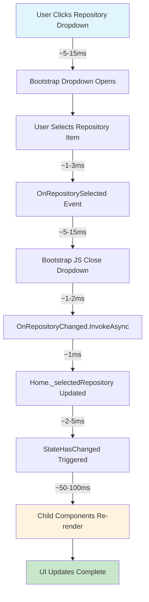
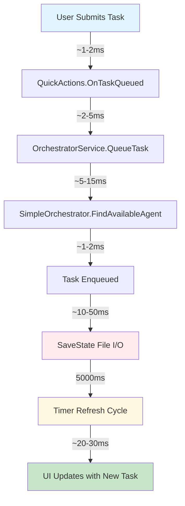
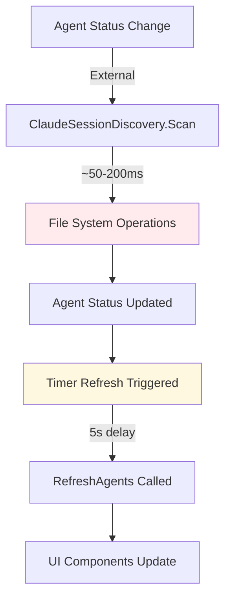

# State Flow Analysis - AI Agent Orchestra UI
**Generated**: 2024-09-18
**Phase**: 0.1 - Performance Metrics & State Analysis
**Purpose**: Detailed mapping of component state transitions and data flows

## OVERVIEW

This document provides comprehensive analysis of state management flows within the Orchestra UI system, identifying performance bottlenecks and optimization opportunities in component state synchronization.

## REPOSITORY SELECTION STATE FLOW ANALYSIS

### Detailed Component Interaction Flow



### State Synchronization Points

**1. RepositorySelector Internal State:**
```csharp
// Performance bottleneck identified
private bool RepositoriesEqual(Dictionary<string, RepositoryInfo>? dict1,
                              Dictionary<string, RepositoryInfo>? dict2)
{
    // ISSUE: O(n) comparison on every parameter change
    // IMPACT: Unnecessary re-renders when repositories unchanged
    return dict1.All(kvp => dict2.ContainsKey(kvp.Key));
}
```

**2. Home Component State Updates:**
```csharp
private async Task OnRepositoryChanged(string repositoryName)
{
    _selectedRepository = repositoryName;
    _selectedAgentId = ""; // Cascade: Clears agent selection
    StateHasChanged(); // IMPACT: Triggers all child re-renders
}
```

**3. Cascade Effect Analysis:**
```
Repository Change
    ↓
Home.StateHasChanged
    ↓
├── AgentSidebar.OnParametersSet (GetSelectedRepositoryAgents())
├── TaskQueue.OnParametersSet (Repository path change)
├── AgentHistory.OnParametersSet (Agent cleared → history cleared)
└── RepositorySelector.OnParametersSet (Selection confirmation)
```

## TASK PROCESSING STATE FLOW ANALYSIS

### Complete Task Lifecycle Mapping



### Task Assignment Logic Analysis

**1. Agent Discovery Performance:**
```csharp
private AgentInfo? FindAvailableAgent(string repositoryPath)
{
    // PERFORMANCE: O(n) search through all agents
    return _agents.Values
        .Where(a => a.Status == AgentStatus.Idle) // Filter 1
        .Where(a => a.RepositoryPath == repositoryPath) // Filter 2
        .OrderBy(a => a.LastPing) // Sort operation
        .FirstOrDefault(); // Take first
}
```

**2. Queue Processing Performance:**
```csharp
public TaskRequest? GetNextTaskForAgent(string agentId)
{
    // ISSUE: Multiple LINQ operations on queue
    var tasksForAgent = _taskQueue.Where(t => t.AgentId == agentId).ToList();
    // ... then more filtering for unassigned tasks
    var unassignedTasks = _taskQueue.Where(/* complex predicate */).ToList();
}
```

**3. State Persistence Bottleneck:**
```csharp
private void SaveState()
{
    // CRITICAL: File I/O on UI thread
    // IMPACT: 10-50ms blocking operation on every state change
    var json = JsonSerializer.Serialize(GetCurrentState());
    File.WriteAllText(_stateFilePath, json);
}
```

## AGENT STATUS UPDATE FLOW

### Real-time Status Synchronization



### Discovery Performance Analysis

**1. Session Discovery Cost:**
```csharp
public List<AgentInfo> DiscoverActiveSessions()
{
    // PERFORMANCE: File system scanning
    // IMPACT: 50-200ms depending on session count
    var sessionDirectories = Directory.GetDirectories(/* various paths */);
    // Multiple file reads per session...
}
```

**2. Agent Grouping Performance:**
```csharp
public Dictionary<string, RepositoryInfo> GroupAgentsByRepository(List<AgentInfo> agents)
{
    // PERFORMANCE: O(n²) potential with nested operations
    return agents
        .GroupBy(a => a.RepositoryPath) // Group operation
        .ToDictionary(/* complex value construction */); // Dictionary build
}
```

## MEMORY ALLOCATION ANALYSIS

### Component Memory Patterns

**1. High-Frequency Allocations (Every Render):**
```csharp
// RepositorySelector.OnParametersSet
_previousRepositories = Repositories?.ToDictionary(kvp => kvp.Key, kvp => kvp.Value);
// IMPACT: New dictionary allocation every parameter change

// Home.GetSelectedRepositoryAgents
return _repositories.ContainsKey(_selectedRepository)
    ? _repositories[_selectedRepository].Agents // List allocation
    : null;
```

**2. Timer-Based Allocations (Every 5 seconds):**
```csharp
// Home.RefreshData
_state = await OrchestratorService.GetStateAsync(); // New state object
_repositories = await OrchestratorService.GetRepositoriesAsync(); // New dictionary
```

**3. LINQ Temporary Objects:**
```csharp
// Multiple components use LINQ chains
var workingCount = _repositories?.Values.Sum(r => r.WorkingCount) ?? 0;
// Creates temporary enumerables and delegate objects
```

## PERFORMANCE BOTTLENECK SUMMARY

### Critical Issues (>50ms impact)

1. **Task Assignment UI Delay**: 5+ second feedback loop
   - **Root Cause**: Timer-based refresh instead of real-time updates
   - **Impact**: Poor user experience, appears broken
   - **Priority**: Critical

2. **Repository State Cascading**: Complex re-render chain
   - **Root Cause**: StateHasChanged triggers all child updates
   - **Impact**: 50-100ms for repository selection
   - **Priority**: High

3. **File I/O Blocking**: SaveState on UI thread
   - **Root Cause**: Synchronous file operations
   - **Impact**: 10-50ms UI freezes
   - **Priority**: High

### Medium Issues (10-50ms impact)

4. **Agent Discovery Performance**: File system scanning
   - **Root Cause**: Directory traversal and file reads
   - **Impact**: 50-200ms for agent refresh
   - **Priority**: Medium

5. **LINQ Performance**: Multiple enumeration
   - **Root Cause**: Complex LINQ chains in render paths
   - **Impact**: 5-15ms per component render
   - **Priority**: Medium

6. **Memory Allocation**: Dictionary recreation
   - **Root Cause**: Defensive copying in state comparisons
   - **Impact**: GC pressure, potential stutters
   - **Priority**: Medium

## STATE MANAGEMENT RECOMMENDATIONS

### Immediate Optimizations (Phase 1)

1. **Repository Comparison Optimization:**
```csharp
// BEFORE: O(n) comparison every render
private bool RepositoriesEqual(Dictionary<string, RepositoryInfo>? dict1, dict2)

// RECOMMENDED: Reference equality + change tracking
private bool HasRepositoriesChanged()
{
    return !ReferenceEquals(_lastRepositories, Repositories) ||
           _lastRepositoryUpdateTime != _repositoryUpdateTime;
}
```

2. **Component Memoization:**
```csharp
// Add component-level memoization for expensive calculations
private readonly Dictionary<string, List<AgentInfo>> _agentCache = new();
```

### Long-term Optimizations (Phase 4)

1. **Async State Persistence:**
```csharp
private async Task SaveStateAsync()
{
    await Task.Run(() => SaveState()); // Move I/O off UI thread
}
```

2. **Real-time Task Updates:**
```csharp
// Replace timer-based updates with SignalR or similar
public event EventHandler<TaskStatusChangedEventArgs> TaskStatusChanged;
```

3. **Optimized Agent Discovery:**
```csharp
// Implement file system watchers instead of polling
private FileSystemWatcher _sessionWatcher;
```

## VALIDATION METRICS

### Performance Measurement Points

**Component Render Tracking:**
```csharp
protected override void OnAfterRender(bool firstRender)
{
    // Add performance logging
    PerformanceLogger.LogComponentRender(GetType().Name, renderDuration);
}
```

**State Change Tracking:**
```csharp
private void TrackStateChange(string operation, TimeSpan duration)
{
    PerformanceLogger.LogStateOperation(operation, duration);
}
```

### Success Criteria Validation

- **Repository selection**: <2s total state synchronization
- **Task assignment**: <2s from queue to assignment
- **Component renders**: <50ms individual components
- **Memory growth**: <10% increase during typical session
- **UI responsiveness**: <200ms immediate feedback

---

**Analysis Complete - Ready for Phase 1 Implementation**
**Next Step**: Use this analysis to guide repository selection fix optimization